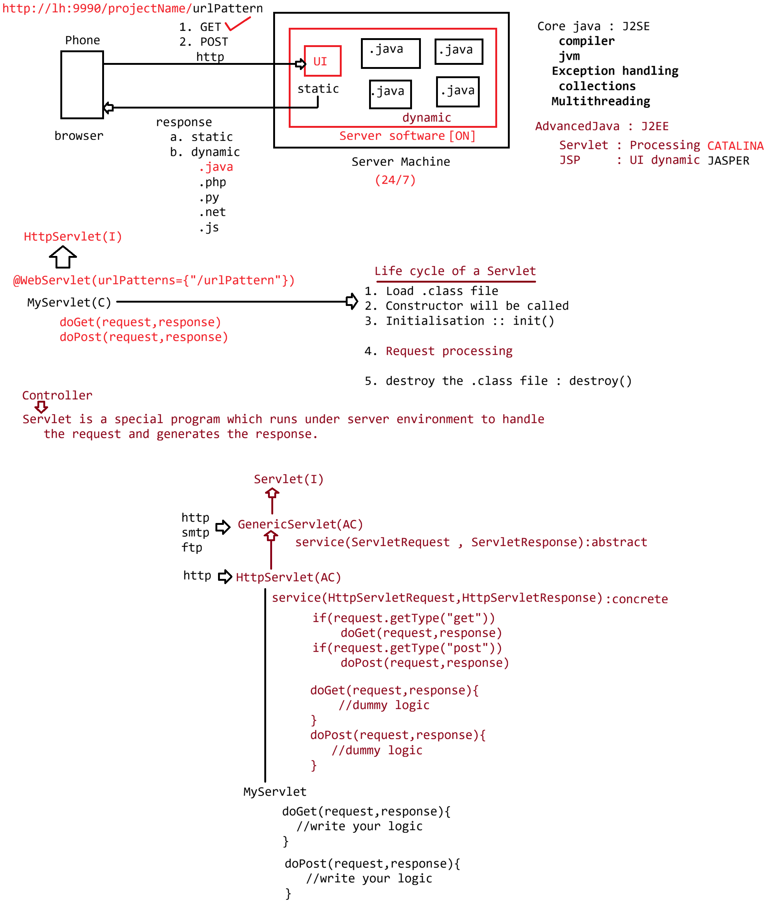

# Day-01 — 24-02-2026 — Introduction to Servlet

---

## 🧩 Introduction to Servlet

This lecture date has image material only (no textual mentor `.txt` note).

Topic identified from filename/image: **Introduction to Servlet** — foundational overview of what a Servlet is and how it fits into Java web applications.

Do not invent mentor lecture prose.

---

## 🤖 AI Points

1. **Production consideration:** Treat early Servlet concepts as the runtime contract under every Java web stack—even when you later hide them behind Spring MVC or Spring Boot.
2. **Industry practice:** Teams still deploy WAR/EAR artifacts to Servlet containers (Tomcat, Jetty, Undertow); understanding the container’s role prevents “it works in IDE only” failures.
3. **Common mistake:** Confusing a Servlet with a plain Java `main` program—Servlets are lifecycle-managed by the container, not started by you.
4. **Interview insight:** Be ready to define a Servlet as a server-side component that generates a dynamic response for an HTTP request under the Servlet specification.
5. **Modern Spring Boot connection:** `@RestController` endpoints ultimately ride on the same request/response model that classic Servlets introduced.

---

## 💻 My Codes

  
## 🖼️ Image

