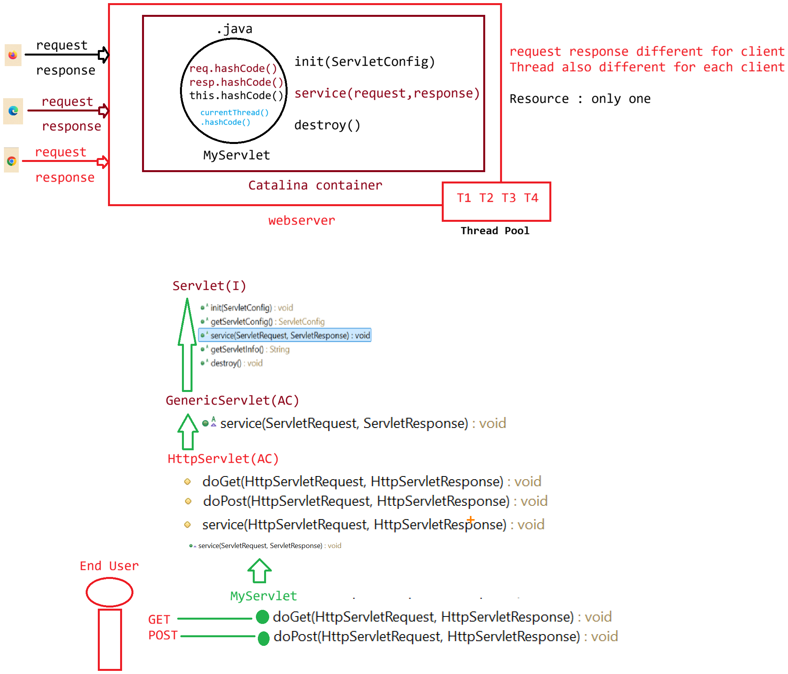

# Day-02 — 25-02-2026 — Servletlifecycleprogram

---

## 🧩 What is a Servlet?

A Servlet is a program which would be executed by the container to generate a **dynamic response**.

It is created by taking the help of `javax.servlet.http.*`.

---

## 🧬 HttpServlet Lifecycle Flow

```text
HttpServlet
  |  url = http://lh:9999/projName/urlPattern
  @WebServlet(urlPatterns={"/urlPattern"})
  MyServlet :: life cycle actions
        a. load the .class file
        b. create an object [ constructor ]
        c. call life cycle methods
              a. init(ServletConfig config)
              b. service(request,response)
                    a. doPost(request,response)
                    b. doGet(request,response)
              c. destroy()
        d. unloading the .class file
```

---

## 💻 FirstServlet Lifecycle Demo Program

```java
package in.pw.ioi.controller;

import java.io.IOException;
import java.io.PrintWriter;

import javax.servlet.ServletException;
import javax.servlet.annotation.WebServlet;
import javax.servlet.http.HttpServlet;
import javax.servlet.http.HttpServletRequest;
import javax.servlet.http.HttpServletResponse;

@WebServlet(urlPatterns = "/first", loadOnStartup = 1)
public class FirstServlet extends HttpServlet {
	private static final long serialVersionUID = 1L;

	static {
		System.out.println("FirstSerlvet.class file is loading...");
	}

	/**
	 * @see HttpServlet#HttpServlet()
	 */
	public FirstServlet() {
		System.out.println("FirstServlet class is instantiation....");
	}

	/**
	 * @see HttpServlet#doGet(HttpServletRequest request, HttpServletResponse
	 *      response)
	 */
	public void doGet(HttpServletRequest request, HttpServletResponse response) throws ServletException, IOException {
		System.out.println("Request Type is : " + request.getMethod());

		// Setting the MIME type
		response.setContentType("text/html");

		// Getting the Writer object to write the response
		PrintWriter out = response.getWriter();

		try {
			Thread.sleep(5000);
		} catch (Exception e) {
			e.printStackTrace();
		}

		// Writing the response in HTML language
		out.println("<html><head><title>OUTPUT</title></head>");
		out.println("<body>");
		// logic
		out.println("<h1>Request  Object hashCode is : " + request.hashCode() + "</h1>");
		out.println("<h1>Response Object hashCode is : " + response.hashCode() + "</h1>");
		out.println("<h1>Servlet  Object hashCode is : " + this.hashCode() + "</h1>");
		out.println("<h1>Thread   Object hashCode is : " + Thread.currentThread().hashCode() + "</h1>");
		out.println("</body>");
		out.println("</html>");

		// Closing the writer object
		out.close();
	}

	@Override
	public void destroy() {
		System.out.println("First Servlet DeInstantiated....");
	}

}
```

### Key observations from this demo

- Static block prints when the `.class` file is **loading**.
- Constructor prints when the Servlet is **instantiated**.
- `doGet` prints request method, sets MIME type `text/html`, sleeps 5 seconds, then prints hash codes of request, response, servlet (`this`), and current thread.
- `destroy()` prints when the Servlet is **de-instantiated**.
- `loadOnStartup = 1` makes lifecycle actions happen at server start rather than only on first request.

---

## 🤖 AI Points

1. **Production consideration:** Printing hash codes of request/response/servlet/thread is a teaching probe for the single-instance multi-threaded model—one servlet object, many concurrent request threads.
2. **Industry practice:** Prefer `loadOnStartup` only for Servlets that must warm up expensive resources at boot; otherwise keep lazy loading to speed container startup.
3. **Common mistake:** Closing `PrintWriter` too early in filters/wrappers or forgetting MIME type (`setContentType`) before writing HTML.
4. **Interview insight:** Order of lifecycle: load → instantiate (constructor) → `init` → `service`/`doGet`/`doPost` → `destroy` → unload.
5. **Real-world connection:** The 5-second `Thread.sleep` demonstrates blocking a request thread—production APIs avoid long sleeps on container threads and use async or worker pools instead.

---

## 💻 My Codes


  
## 🖼️ Image


