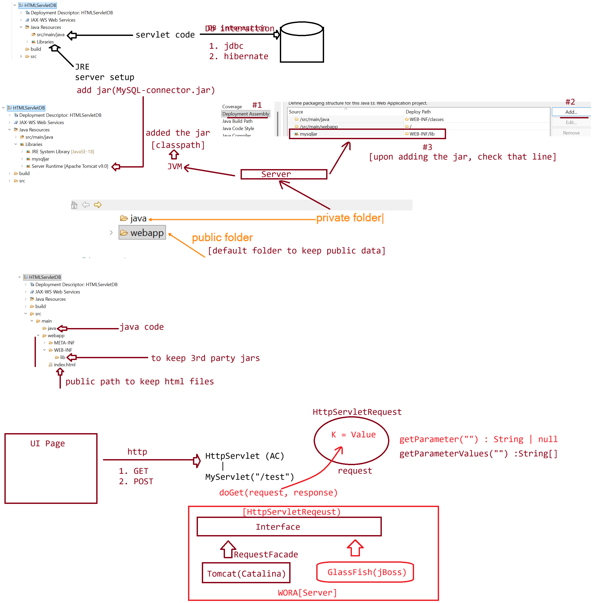

# Day-03 — 02-03-2026 — HTML Servlet DB Integration

---

## 🧩 HTML + Servlet + Database Integration

This lecture date has image material only (no textual mentor `.txt` note).

Topic identified from filename/image: **HTML Servlet DB Integration** — wiring an HTML form to a Servlet that talks to a database.

Do not invent mentor lecture prose.

---

## 🤖 AI Points

1. **Production consideration:** Never hard-code DB credentials in Servlet source; use environment config, JNDI DataSource, or secrets management.
2. **Industry practice:** Keep HTML as the presentation entry, Servlet as controller/B.L., and JDBC/ORM for persistence—classic three-tier web flow.
3. **Common mistake:** Mixing SQL and HTML string concatenation in one `doPost` without validation, encoding, or prepared statements (SQL injection / XSS risk).
4. **Interview insight:** Explain the end-to-end path: browser form → HTTP POST → Servlet → JDBC → DB → dynamic HTML response.
5. **Modern Spring Boot connection:** The same flow maps to Thymeleaf/HTML form → `@Controller` → Spring Data repository, with connection pooling via auto-configured DataSource.

---

## 💻 My Codes

  
## 🖼️ Image

