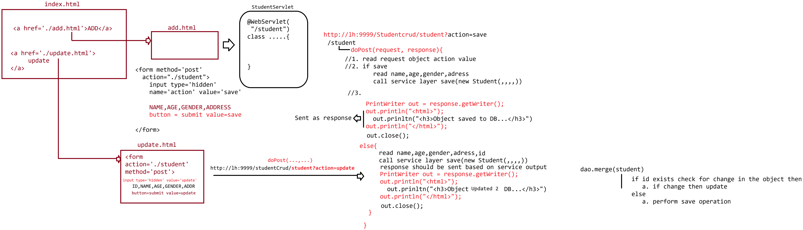

# Day-04 — 03-03-2026 — Servlet CRUD Operation

---

## 🧩 Servlet CRUD Operation

This lecture date has image material only (no textual mentor `.txt` note).

Topic identified from filename/image: **Servlet CRUD Operation** — Create, Read, Update, Delete flows implemented with Servlets against a database.

Do not invent mentor lecture prose.

---

## 🤖 AI Points

1. **Production consideration:** Map each CRUD action to the correct HTTP verb (GET for read/list, POST for create, PUT/PATCH for update, DELETE for delete) even if older demos overuse GET/POST only.
2. **Industry practice:** Use prepared statements, transactions for multi-step updates, and separate list vs detail views for maintainable CRUD UIs.
3. **Common mistake:** Using GET links for delete/update mutations—bookmarks and crawlers can trigger destructive actions.
4. **Interview insight:** CRUD in Servlets typically means multiple URL patterns or method branches (`doGet`/`doPost`) coordinating JDBC insert/select/update/delete.
5. **Modern Spring Boot connection:** Spring Data REST / `@RestController` CRUD endpoints replace hand-written JDBC Servlets while preserving the same resource-oriented design.

---

## 💻 My Codes

  
## 🖼️ Image

