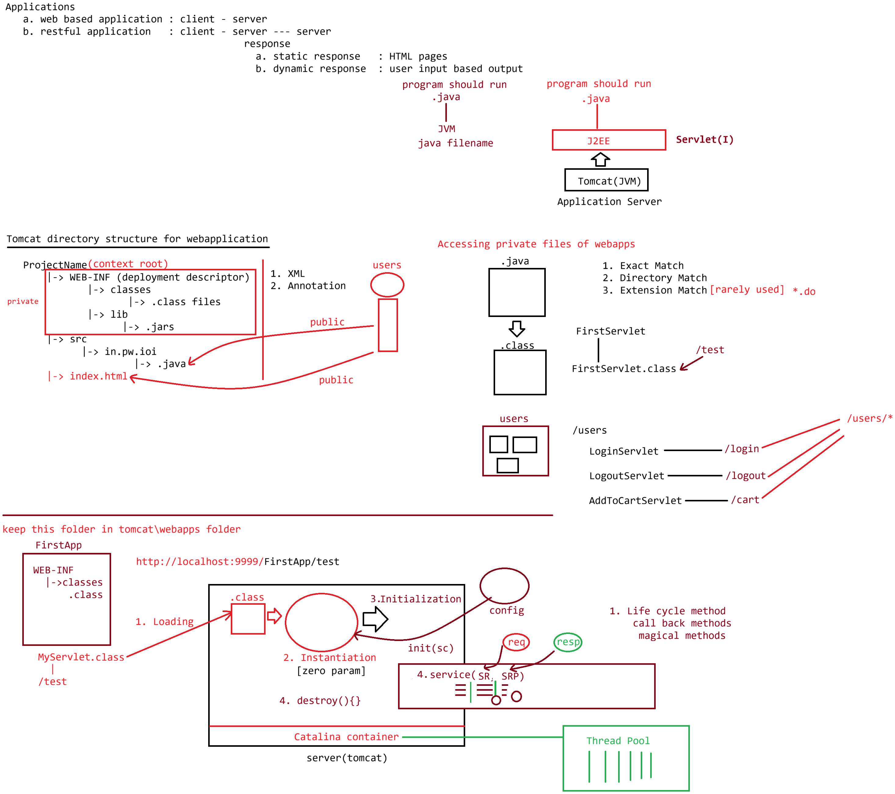

# Day-05 — 27-04-2026 — Servlet Introduction

---

## 🌱 Spring Ecosystem Context

```text
Spring
  |-> Spring core[ Core java]
  |-> Spring Data jpa[ JDBC,ORM : hibernate]
  |-> Spring MVC [Servlet, JSP | Thymeleaf]
  |-> Spring AOP
  |-> Spring Rest [ Spring MVC , Microservices: Spring Security and Distributed logging]
```

---

## 🧩 Servlet and JSP

### Servlet

It is a special program which would run by server to generate **dynamic response** to the user upon request.

---

## 🛠️ How to Create a Servlet?

`Servlet` is an interface:

```java
interface Servlet {
	public void init(ServletConfig config) throws ServletException

	public void service(ServletRequest req, ServletResponse resp)
			throws ServletException, IOException

	public void destroy()

	public ServletConfig getServletConfig()

	public String getServletInfo()
}
```

### Implementing Servlet directly

```java
import javax.servlet.*; // servlet-api.jar [Tomcat : lib]
import javax.servlet.annotation.*; // servlet-api.jar [Tomcat : lib]

@WebServlet(urlPattern = "/test")
public class MyServlet implements Servlet {

	public void init(ServletConfig config) throws ServletException {

	}

	public void service(ServletRequest req, ServletResponse resp)
			throws ServletException, IOException {

	}

	public void destroy() {

	}

	public ServletConfig getServletConfig() {

	}

	public String getServletInfo() {

	}
}
```

> **Correction:** Annotation attribute is typically `urlPatterns` / `value` (plural/array form), not `urlPattern`. Import package is `javax.servlet.annotation.*` (not `java.servlet.annotation`).

---

## 🗂️ Path vs Classpath

What is the difference between `path` and `classpath` environment variables?

| Variable | Purpose |
|----------|---------|
| `path` | Set the JDK supplied libraries (e.g. `java`, `javac` on PATH) |
| `classpath` | Set the third-party supplied libraries |

```bash
set path = c:\jdk\java1.8\bin
set classpath = c:\tomcat\lib\servlet-api.jar
```

```bash
javac MyServlet.java
	 |
      MyServlet.class ------> /test
```

**Run:**

```text
http://localhost:9999/ProjectName/urlPattern
```

---

## 🤖 AI Points

1. **Production consideration:** Compile against `servlet-api.jar` from the target container version so method signatures match runtime Tomcat/Jetty APIs.
2. **Industry practice:** Implementing `Servlet` directly is rare; teams extend `HttpServlet`. Still know the five interface methods for interviews and legacy code.
3. **Common mistake:** Mixing up `PATH` (JDK tools) with `CLASSPATH` (third-party jars)—missing `servlet-api.jar` on classpath causes compile errors for Servlet types.
4. **Interview insight:** Servlet interface lifecycle trio: `init`, `service`, `destroy`, plus `getServletConfig` and `getServletInfo`.
5. **Modern Spring Boot connection:** Spring MVC sits on the Servlet model; Boot embeds Tomcat/Jetty so you rarely set Tomcat classpath manually, but the same request lifecycle still applies.

---

## 💻 My Codes


  
## 🖼️ Image


