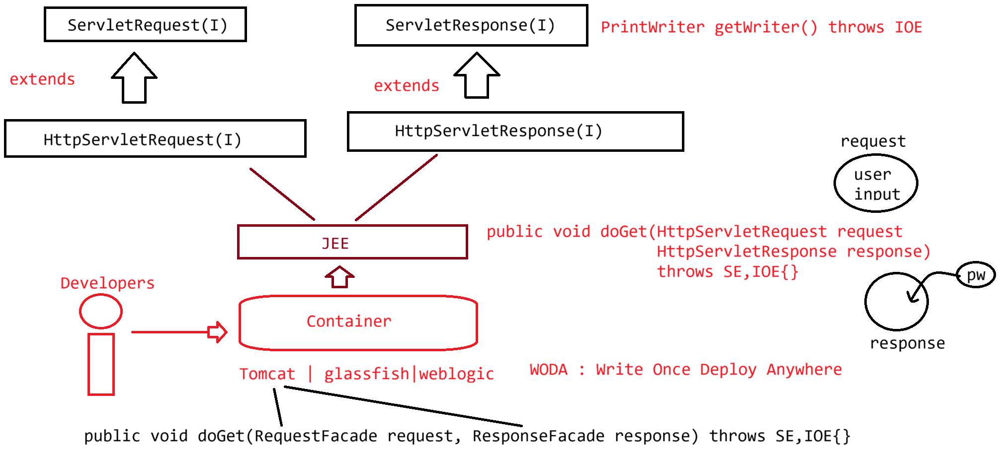

# Day-08 — 05-05-2026 — Sr Hsr Sresp Hsresp Images Httpservletclass

---

## 🧩 Servlet Recap

A Servlet is a program which runs in a server environment to generate a dynamic response.

- Servlet would be executed by the **Catalina** container.
- To run a servlet program we use the Servlet specification given by the SUN/MS team.

```text
Servlet(I)
   |
GenericServlet(AC) :: Adapter Design Pattern
   |
HttpServlet(AC)    :: Template Design Pattern
```

---

## 🔄 Method Call Flow

```text
 init(SC)
 init() : programmer defined logic   :: GenericServlet
 public void service(SR, SResp) throws SE, IOE
 protected void service(HSR, HSResp) throws SE, IOE
 protected void doXXX(HSR, HSResp) throws SE, IOE :: HttpServlet
 public void destroy()
```

---

## 🧬 Lifecycle of HttpServlet

```text
 a. Loading
 b. Instantiation   : Zero param constructor : Class.forName("").newInstance()
 c. Initialization  ::
                        init(SC)
                        init() : programmer defined logic   :: GenericServlet

 d. Request Processing ::
        public void service(SR, SResp) throws SE, IOE
        protected void service(HSR, HSResp) throws SE, IOE
        protected void doXXX(HSR, HSResp) throws SE, IOE : programmer defined logic
                                :: HttpServlet

 e. DeInstantiation ::
        public void destroy()
```

---

## 🧪 Override Cases — Which Method Runs?

### Case-1

If our servlet class contains `public service(SR, SR)` method then for **any** type of request (like get, post etc.) that method handles processing (protocol-level `service` short-circuits before HTTP `doXXX`).

### Case-2

If our servlet class contains both:

- `public service(SR, SR)` and
- `protected service(HSR, HSResp)`

→ `public service(SR, SResp)` will execute for both GET and POST.

### Case-3

If our servlet class contains:

- `protected service(HSR, HSResp)` :: request processing
- `doGet()` method

→ request type GET | POST :: `protected service(HSR, HSResp)` (your override of HTTP `service` decides; may not call `doGet` unless you invoke it).

### Case-4

If our servlet class contains `doPost()` method and request type is **GET**:

→ `HttpServlet` class `doGet(HSR, HSResp)` returns an **error page response**.

### Case-5

If our servlet class contains `doGet()` method and request type is **POST**:

→ `HttpServlet` class `doPost(HSR, HSResp)` returns an **error page response**.

### Case-6 — Shared handler for GET and POST

```java
public void doGet(HSR, HSResp) throws SE, IO {
	this.useMe(HSR, HSResp);
}
public void doPost(HSR, HSResp) throws SE, IO {
	this.useMe(HSR, HSResp);
}

public void useMe(HSR, HSResp) throws SE, IO {
	System.out.println("Response generated");
}
```

- request type GET and POST  
- GET → Response Generated  
- POST → Response Generated  

---

## 🛠️ Compile into WEB-INF/classes

```bash
javac -cp "C:\Tomcat 9.0\lib\servlet-api.jar" -d WEB-INF/classes MyServlet.java
```

---

## 💻 Example 1 — Shared `useMe` Handler

```java
import javax.servlet.*;
import javax.servlet.annotation.*;
import javax.servlet.http.*;
import java.io.*;

@WebServlet(urlPatterns = "/test")
public class MyServlet extends HttpServlet {
	static {
		System.out.println("Loading...");
	}

	public void init() {
		System.out.println("Initialziation");
	}

	public MyServlet() {
		System.out.println("Servlet Instantiation");
	}

	public void doGet(HttpServletRequest request, HttpServletResponse response) throws ServletException, IOException {
		useMe(request, response);
	}

	public void doPost(HttpServletRequest request, HttpServletResponse response) throws ServletException, IOException {
		useMe(request, response);
	}

	public void useMe(HttpServletRequest request, HttpServletResponse response) throws ServletException, IOException {
		System.out.println("Request Processing : Response generated....");
	}

	public void destroy() {
		System.out.println("<<<<DEINSTANTIATION>>>>");
	}
}
```

---

## 💻 Example 2 — HTML Response + loadOnStartup

```java
import javax.servlet.*;
import javax.servlet.annotation.*;
import javax.servlet.http.*;
import java.io.*;

@WebServlet(urlPatterns = "/test", loadOnStartup = 5)
public class MyServlet extends HttpServlet {
	static {
		System.out.println("Loading...");
	}

	public void init() {
		System.out.println("Initialziation");
	}

	public MyServlet() {
		System.out.println("Servlet Instantiation");
	}

	public void doGet(HttpServletRequest request, HttpServletResponse response) throws ServletException, IOException {
		System.out.println("GET Request type...");
		useMe(request, response);
		System.out.println("Request object : " + request.getClass().getName());
		System.out.println("Response object : " + response.getClass().getName());
	}

	public void doPost(HttpServletRequest request, HttpServletResponse response) throws ServletException, IOException {
		System.out.println("POST Request type...");
		useMe(request, response);
	}

	public void useMe(HttpServletRequest request, HttpServletResponse response) throws ServletException, IOException {

		response.setContentType("text/html");

		System.out.println("Request Processing : Response generated....");

		PrintWriter out = response.getWriter();
		out.println("<html><head><title>Output</title></head>");
		out.println("<body><h1>Response from Servlet</h1></body>");
		out.println("</html>");
		out.close();

	}

	public void destroy() {
		System.out.println("<<<<DEINSTANTIATION>>>>");
	}
}
```

```text
request  : GET http://localhost:9999/SecondSevletApp/test
response : Response from Servlet
```

---

## 🤖 AI Points

1. **Production consideration:** Overriding `service(ServletRequest, ServletResponse)` bypasses HTTP method routing—use only when you intentionally want protocol-agnostic handling.
2. **Industry practice:** Factor shared GET/POST logic into a private helper (`useMe`) to avoid duplicated response writing.
3. **Common mistake:** Implementing only `doGet` then POSTing from a form → 405/error page from default `HttpServlet.doPost`.
4. **Interview insight:** Trace the chain SR/SResp → HSR/HSResp → `doXXX`; know which override wins in each of the six cases.
5. **Real-world connection:** Logging `request.getClass().getName()` reveals Tomcat’s concrete request/response implementation classes behind the interfaces.

---

## 💻 My Codes


  
## 🖼️ Image


