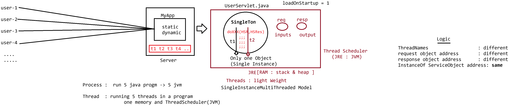

# Day-09 — 06-05-2026 — Hot Deployment and Servlet Model

---

## 🧩 Servlet Hierarchy Recap

```text
Servlet
  Servlet(I)
     | Adapter design pattern
  GenericServlet(AC)   :: service(SR, SRes) throws SE, IOE
     | Template design pattern
  HttpServlet(AC)      :: protected void doXXXX(HSR, HSResp) throws SE, IOE
```

---

## 📦 Creating a WAR File

**WAR** = Web Application Archive File

```text
webapplication = dynamic response + static response
                   (.java)           (html, css, js, images, ...)
```

---

## ❄️ Cold Deployment vs 🔥 Hot Deployment

### Cold Deployment

- Took the code, copy the code in `webapps` folder
- Start the server and send the request
- If logic changed: **stop** the server, change and compile and keep it back in `webapps` folder, then start and send the request again

### Hot Deployment

- Server is **running**
- Create one WAR file of another project and deploy it in the server
- Server automatically loads the services of the newly created WAR file

---

## 🛠️ How to Create a WAR File?

```bash
jar -cvf MyApp.war fileneedtoadded
```

### Example project layout

```text
FirstServletApp
    |-> MyServlet.java
    |-> WEB-INF
          |-> classes
                 |-> MyServlet.class [/test]

    |-> index.html [entry point]
    |-> css
          |-> index.css
    |-> js
          |-> index.js
```

From inside the app folder under `webapps`:

```bash
jar -cvf MyApp.war WEB-INF index.html css js
```

Now open Tomcat as admin and deploy the WAR as **HOT Deployment**.

---

## 👤 Tomcat Manager Login Setup

1. Open `conf/tomcat-users.xml`
2. Identify and do the change:

```xml
<user username="root" password="root123" roles="manager-gui,admin-gui" />
```

3. Open Tomcat: `http://localhost:9999/`
4. Click on **Manager App** and provide login as mentioned above
5. Login would be successful to deploy the WAR as **HOT Deployment**

Example console after deploy/load:

```text
***ThirdServletLoading...****
***ThirdServlet Instantiation...****
***ThirdServlet Initialziation...***
```

### Request syntax

```text
http://localhost:9999/warfilename/urlPattern
```

```text
request  : http://localhost:9999/MyApp/user
response : ***ThirdServlet RequestProcessing****
```

---

## 🧵 How Servlet Technology Works?

**Answer:** `SingleInstanceMultiThreadedModel`

---

## 🤖 AI Points

1. **Production consideration:** Hot deploy is convenient in lab/dev; production often prefers immutable deploys (new container/image) to avoid classloader leaks and stale static resources.
2. **Industry practice:** Package static assets + `WEB-INF` into a WAR; context path often matches WAR name (`MyApp.war` → `/MyApp`).
3. **Common mistake:** Forgetting `manager-gui` role in `tomcat-users.xml` and failing Manager App login for hot deploy.
4. **Interview insight:** Cold deploy = stop/replace/start; Hot deploy = deploy WAR while container keeps running.
5. **Real-world connection:** Servlet model is **single instance, multi-threaded**—one servlet object serves many concurrent clients via threads (covered next lecture).

---

## 💻 My Codes


  
## 🖼️ Image


