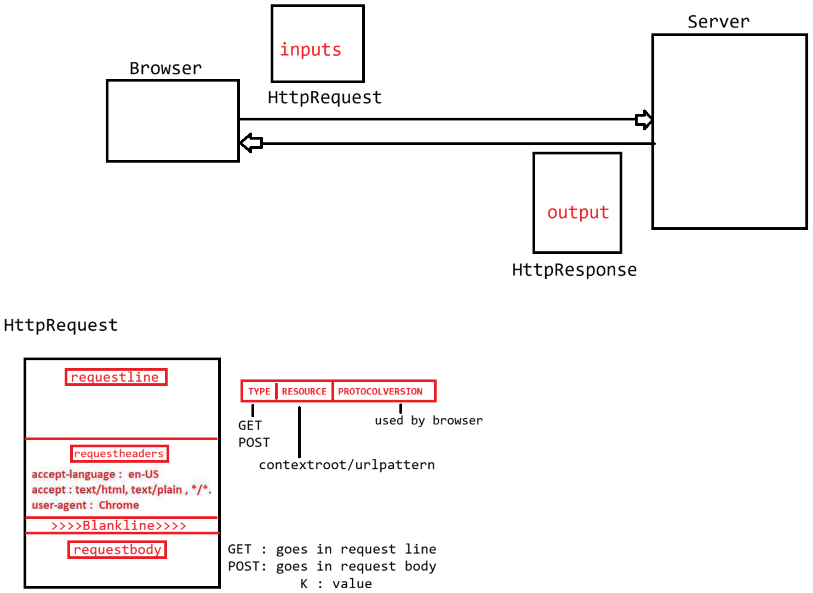

# Day-10 — 07-05-2026 — Servletmodel Processthread Servlet Thread HttpServletRequest Methods

---

## 🧩 Servlet Technology Model

⇒ **Single Instance Multithreaded Model**

### Service Provider view

```text
Service Provider
        a. Servlet :: Only Object
        b. client  :: each client represent one thread
                        input  : HttpServletRequest  object
                        output : HttpServletResponse object
```

---

## 🧵 Thread vs Process

### Thread

- a. Light weight
- b. Share the same memory
- c. Managed by JVM [ThreadScheduler]

### Process

- a. Heavy weight
- b. Share different memory
- c. Managed by OS [PCB]

**Conclusion:** Thread creation and managing is very simple compared to managing the process.

---

## 💻 Example 1 — Creating Many Threads

```java
package in.pw.ioi.test;

public class TestApp {

	public static void main(String[] args) throws Exception {
		long start = System.currentTimeMillis();

		for (int i = 0; i < 100; i++) {
			// new ProcessBuilder("notepad").start();

			new Thread(() -> {

			}).start();

		}

		long end = System.currentTimeMillis();
		System.out.println("Total time taken is : " + (end - start) + "ms");
	}

}
```

---

## 💻 Example 2 — Sharing Data by Threads

```java
package in.pw.ioi.test;

class SharedData {
	int value;
}

public class TestApp {

	public static void main(String[] args) throws Exception {
		SharedData sharedData = new SharedData();
		new Thread(() -> {
			System.out.println("Thread-1 is writing the data to object");
			sharedData.value = 100;
		}).start();

		new Thread(() -> {
			System.out.println("Thread-2 is reading the data from object...");
			System.out.println("Reading object data : " + sharedData.value);
		}).start();
	}
}
```

---

## 🧪 Demonstration of SingleInstanceMultiThread Model

```java
PrintWriter out = response.getWriter();
System.out.println("**********Request Processing ************");
String name = Thread.currentThread().getName();
out.println("<h1>1. Processed by Thread :: " + name + "</h1><br/>");
out.println("<h3>2. Request  object for thread : " + name + " is :: " + request + "</h3><br/>");
out.println("<h3>3. Response object for thread : " + name + " is :: " + response + "</h3><br/>");
out.println("<h2>4. Served by Object for thread: " + name + " is :: " + this.hashCode() + "<h2/>");

try {
	Thread.sleep(30000);
} catch (InterruptedException e) {
	// TODO Auto-generated catch block
	e.printStackTrace();
}

out.close();
```

Expected teaching point: different threads / request / response instances, **same** servlet `this.hashCode()` while concurrent requests sleep.

---

## 📥 HttpServletRequest Object

- It holds user inputs
- It holds data by taking the help of the `HttpRequest` object of the Browser

### POST request shape

```text
request URL :: POST
    request line   : http://localhost:9999/FirstServletApp/login
    request header :
    request body   : K : V
```

### GET request shape

```text
request URL :: GET
    request line   : http://localhost:9999/FirstServletApp/login? K1=V1 & K2=V2 &
    request header :
    request body   :
                                                     |
                                          HttpServletRequest[API]
                                                     |
                                                     |
SpringMVC                                            |
  K1 = V & K2 = V <----------------------------------+
Student
   String name
   Integer age
```

---

## 🤖 AI Points

1. **Production consideration:** Instance fields on a Servlet are shared across threads—mutable servlet state needs synchronization or must be avoided (prefer request/session scope).
2. **Industry practice:** Container thread pools bound concurrency; long `Thread.sleep` in `doGet` starves the pool under load.
3. **Common mistake:** Assuming each request gets a new Servlet instance—only request/response are per-request; servlet object is typically one.
4. **Interview insight:** Single Instance Multi-Threaded Model = one servlet object, one thread per concurrent client request.
5. **Modern Spring Boot connection:** Controllers are still singletons by default; the same thread-safety rules apply to injected beans holding mutable fields.

---

## 💻 My Codes


  
## 🖼️ Image


