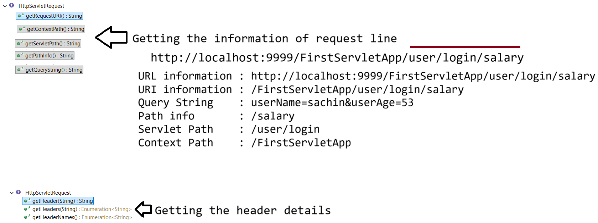

# Day-11 — 08-05-2026 — ServletRequest Methods

---

## 📚 API Hierarchy

```text
API
===
ServletRequest(I)
      |
HttpServletRequest(I)
      |
    tomcat
```

---

## 📨 HttpRequest Structure

```text
HttpRequest
  a. REQUEST LINE    : URL with data for [GET]
  b. REQUEST HEADER  : internal information of browser
  c. REQUEST BODY    : inputs [ POST ]
```

---

## 🧭 URI / Path Breakdown Examples

### Example A

```text
request : http://localhost:9999/FirstServletApp/user/login/*

URI information : /FirstServletApp/user/login/*
Query String    : null
Path info       : /*
Servlet Path    : /user/login
Context Path    : /FirstServletApp
```

### Example B

```text
request : http://localhost:9999/FirstServletApp/user/login/test/test

Context Path    : /FirstServletApp
URI information : /FirstServletApp/user/login/test/test
Query String    : null
Path info       : /test/test
Servlet Path    : /user/login
Context Path    : /FirstServletApp
```

### Example C — With query string

```text
request : http://localhost:9999/FirstServletApp/user/login/salary?userName=sachin&userAge=53

Context Path    : /FirstServletApp
URI information : /FirstServletApp/user/login/salary
Query String    : userName=sachin&userAge=53
Path info       : /salary
Servlet Path    : /user/login
Context Path    : /FirstServletApp
```

### Summary of pieces

```text
URL information : http://localhost:9999/FirstServletApp/user/login/salary
URI information : /FirstServletApp/user/login/salary
Query String    : userName=sachin&userAge=53
Path info       : /salary
Servlet Path    : /user/login
Context Path    : /FirstServletApp
```

---

## 🧾 Header Details

```java
Enumeration<String> headerNames = request.getHeaderNames();
while (headerNames.hasMoreElements()) {
	String headerName = (String) headerNames.nextElement();
	System.out.println(headerName + "---> " + request.getHeader(headerName));
}

PrintWriter out = response.getWriter();
out.println("HTML LOGICS");
```

### Sample header dump from lecture

```text
host---> localhost:9999
connection---> keep-alive
sec-ch-ua---> "Google Chrome";v="147", "Not.A/Brand";v="8", "Chromium";v="147"
sec-ch-ua-mobile---> ?0
sec-ch-ua-platform---> "Windows"
upgrade-insecure-requests---> 1
user-agent---> Mozilla/5.0 (Windows NT 10.0; Win64; x64) AppleWebKit/537.36 (KHTML, like Gecko) Chrome/147.0.0.0 Safari/537.36
accept---> text/html,application/xhtml+xml,application/xml;q=0.9,image/avif,image/webp,image/apng,*/*;q=0.8,application/signed-exchange;v=b3;q=0.7
sec-fetch-site---> none
sec-fetch-mode---> navigate
sec-fetch-user---> ?1
sec-fetch-dest---> document
accept-encoding---> gzip, deflate, br, zstd
accept-language---> en-US,en;q=0.9
cookie---> Webstorm-1e567889=70072c84-97cb-41c1-acaa-7986fd0dbde4
```

---

## 🔗 HTML → Servlet → Database Flow (Need for JSP)

```text
HTML ---id---> SERVLET ---id----------> Database
                         Query(id)          select query will run (id)
                                                RECORD
                OBJECT---RECORD
                  |
                  V
                 HTML[static]

           .java
              B.L + write HTML code (presentation)

        NEED : HTML :: instruction to read the java object data
             : JSP  :: instruction written in html + java code data to read the data [Servlet]
                                added to HTML [Automatically]
```

---

## 📥 Taking Data from the Request

### a. Query String / form data — Parameters

- Key : Value

**Parameter** — collecting the values:

- a. Datatype : `String`
- b. MODE : **ReadOnly**

```java
String getParameter("KeyName")
```

### b. Attribute

- Attribute : ******** (covered further in later lectures — developer-managed request/session/context attributes)

---

## 🤖 AI Points

1. **Production consideration:** Distinguish `contextPath`, `servletPath`, `pathInfo`, and `queryString` when writing reverse proxies, security filters, or logging correlation IDs.
2. **Industry practice:** Prefer reading headers via `getHeader`/`getHeaderNames` for content negotiation, auth tokens, and client metadata—not by parsing raw request lines.
3. **Common mistake:** Confusing URL (scheme+host+port+path) with URI (path within the server) when debugging routing.
4. **Interview insight:** `getParameter` returns String and is read-only; attributes are the mutable developer store for request-scoped objects.
5. **Modern Spring Boot connection:** `@RequestParam` / `@PathVariable` / `@RequestHeader` map onto the same ServletRequest APIs under DispatcherServlet.

---

## 💻 My Codes


  
## 🖼️ Image


