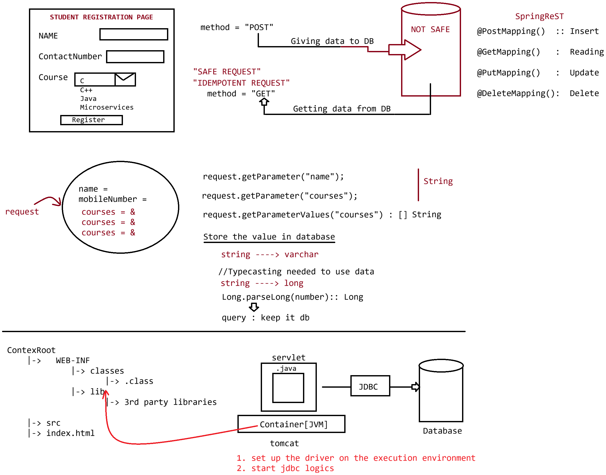

# Day-12 — 11-05-2026 — Request Object and Connecting Servlet to Database

---

## 🧩 Servlet Hierarchy Recap

```text
Servlet
 => which runs on server environment to generate dynamic response

Servlet(I) :: 5 abstract methods
GenericServlet(AC) : public void service(SR, SResp) throws SE, IOE
HttpServlet(AC)    : protected void doXXX(HSR, HSResp) throws SE, IOE
```

---

## 📥 ServletRequest / HttpServletRequest

```text
Note:
ServletRequest(I)
       | extends
HttpServletRequest(I)
                HttpRequest
                        a. RequestLine   : URL, resource, protocol
                        b. RequestHeader : K:V [browser]
                        c. RequestBody   : queryString [POST]
```

> **Correction:** For **GET**, query parameters travel on the request line (`?k=v`); for **POST**, form fields typically travel in the **request body** (mentor note labeled body as `queryString[POST]` meaning the K:V payload).

---

## 🧰 HttpServletRequest Methods

```text
HttpServletRequest
==================
request.getParameter(variableName) : String
        SpringMVC : @RequestParam("keyName") Datatype variableName


request.getParameterValues(variableName) : [] String
                 SpringMVC : @RequestParam("keyName") List<String> variableName
                                          String[] variableName
```

---

## 📁 Project Layout Sketch

```text
contextRoot
   |-> src
         |-> in.pw.ioi.controller
                    |-> UserRegistrationController.java (/user)
                                doPost(HttpServletRequest request, HttpServletResponse response){
                                        // read the data from request object
                                        // send the response in the form of table
                                }
   |-> index.html
       (public resource)
```

### index.html form posting to servlet

```html
<form method='POST' action='./user'>
</form>
```

`UserRegistrationController` mapped to `/user` reads POST parameters in `doPost` and can render a table response (and later integrate with DB as shown in lecture images).

---

## 🤖 AI Points

1. **Production consideration:** Validate and sanitize every `getParameter` value before JDBC use; prefer `PreparedStatement` when connecting servlet to database.
2. **Industry practice:** Use `getParameterValues` for multi-select checkboxes/radios that share one name; Spring’s `@RequestParam List<String>` mirrors this.
3. **Common mistake:** Reading POST body fields with GET-only assumptions, or using GET for registration forms that mutate data.
4. **Interview insight:** `getParameter` → single String; `getParameterValues` → String[] for multi-valued keys.
5. **Modern Spring Boot connection:** Form POST to `/user` becomes `@PostMapping` + `@RequestParam` or `@ModelAttribute` binding to a DTO/entity.

---

## 💻 My Codes


  
## 🖼️ Image


