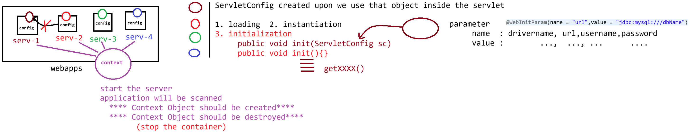

# Day-13 — 12-05-2026 — ServletContext and ServletConfig Object

---

## 🧩 Recap — Reading Form Data

```text
HttpServlet(AC)

ServletRequest(I)
    |
HttpServletRequest(I)
```

### Read the form data from the end user

- a. `String getParameter()`
- b. `String[] getParameterValues()`

---

## 🗄️ Servlet + DB Integration Placement

```text
Servlet + DB integration
========================
  a. WEB-INF/lib     ----> .jar
  b. WEB-INF/classes ----> .class
```

JDBC driver jars go under `WEB-INF/lib`; compiled servlet classes under `WEB-INF/classes`.

---

## ⚖️ ServletContext(I) vs ServletConfig(I)

### ServletContext(I)

- It is **one per application**
- It gets created upon the **server startup** (application deployment)

### ServletConfig(I)

- It is specific to servlet (**one per servlet**)
- It gets created during the **initialisation** phase
- Programmer should supply the value to initialize the ServletConfig object via:

```java
@WebInitParam(name = "", value = "")
```

- To read the parameter data from ServletConfig Object we use:

```java
getInitParameter("KeyName") : String
```

- To get the ServletConfig object we use:

```java
getServletConfig() : ServletConfig
```

- Similarly to get ServletContext Object we use:

```java
getServletContext() : ServletContext
                        |-> setAttribute("", V:anytype)
                        |-> getAttribute("") : Object
```

---

## 🤖 AI Points

1. **Production consideration:** Put shared config that every servlet needs in application scope (`ServletContext`); keep servlet-specific init params in `ServletConfig` / `@WebInitParam`.
2. **Industry practice:** Ship JDBC drivers in `WEB-INF/lib` (or container lib / JNDI DataSource) and never commit passwords into init-param annotations for real environments.
3. **Common mistake:** Calling `getInitParameter` on the wrong object—ServletConfig params ≠ ServletContext params ≠ request parameters.
4. **Interview insight:** One `ServletContext` per web app; one `ServletConfig` per servlet instance configuration.
5. **Modern Spring Boot connection:** `@Value` / `application.properties` replace many init-params; `ServletContext` attributes map loosely to application-scoped beans.

---

## 💻 My Codes


  
## 🖼️ Image


