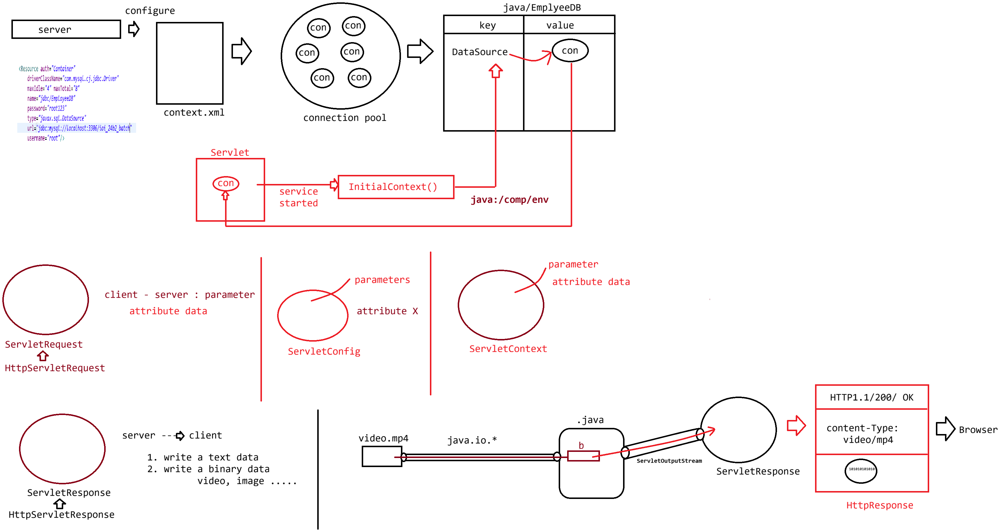

# Day-15 — 14-05-2026 — Connection Pooling in Tomcat and ServletResponse Sending Video File Type

---

## 📄 context.xml Resource Definition

```xml
<Resource name="jdbc/dbName"
            auth="Container"
            type="javax.sql.DataSource"
            username="root"
            password="root123"
            driverClassName="com.mysql.cj.jdbc.Driver"
            url="jdbc:mysql://localhost:3306/ioi_24b2_batch"
            maxTotal="8"
            maxIdle="4"/>
```

---

## 💻 TestDBServlet — JNDI DataSource Lookup + Query

```java
package in.pw.ioi.controller;

import java.io.IOException;
import java.sql.Connection;
import java.sql.PreparedStatement;
import java.sql.ResultSet;
import java.sql.SQLException;

import javax.naming.InitialContext;
import javax.naming.NamingException;
import javax.servlet.ServletException;
import javax.servlet.annotation.WebServlet;
import javax.servlet.http.HttpServlet;
import javax.servlet.http.HttpServletRequest;
import javax.servlet.http.HttpServletResponse;
import javax.sql.DataSource;


@WebServlet(urlPatterns = "/test")
public class TestDBServlet extends HttpServlet {
	private static final long serialVersionUID = 1L;

	private DataSource ds;

	static {
		System.out.println("TestDBServlet loading...");
	}

	public TestDBServlet() {
		System.out.println("TestDBServlet instantiation...");
	}

	public void init() {
		System.out.println("TestDBServlet Initialisation...");

		// start the service to access the connection pool
		try {
			InitialContext context = new InitialContext();
			ds = (DataSource) context.lookup("java:/comp/env/jdbc/EmployeeDB");
		} catch (NamingException e) {
			e.printStackTrace();
		}

	}

	/**
	 * @see HttpServlet#doGet(HttpServletRequest request, HttpServletResponse response)
	 */
	public void doGet(HttpServletRequest request, HttpServletResponse response) throws ServletException, IOException {
		System.out.println("***Request Processing*********");
		Connection connection = null;
		PreparedStatement pstmt = null;
		ResultSet resultSet = null;

		try {
			connection = ds.getConnection();
			System.out.println(connection);

			pstmt = connection.prepareStatement("select * from product");
			resultSet = pstmt.executeQuery();
			while (resultSet.next()) {
				System.out.println(resultSet.getString("pname") + "---> " + resultSet.getString("price"));
			}
		} catch (SQLException e) {
			e.printStackTrace();
		} finally {
			try {
				resultSet.close();
				pstmt.close();
				connection.close();
			} catch (SQLException e) {
				// TODO Auto-generated catch block
				e.printStackTrace();
			}

		}

	}

}
```

Lookup name in code: `java:/comp/env/jdbc/EmployeeDB` (must match the JNDI `name` configured for the Resource).

---

## 📤 Writing Response — ServletResponse / HttpServletResponse

```text
Writing response to the client using ServletResponse and HttpServletResponse
============================================================================
  ServletResponse
      |->  PrintWriter getWriter() ------------------> text based output  ----> UI(browser)
                                                                                |-> .html
                                                                                |-> .pdf, .txt,.xls

      |->  ServletOutputStream getOutputStream() ----> binary based output


      |->  void setContentType(String mimetype)
```

### Common MIME types

| MIME type | Response kind |
|-----------|---------------|
| `text/html` | Html text as response |
| `application/pdf` | pdf file as response |
| `application/msword` | msword file as response |
| `application/vnd.ms-excel` | excel file as response |
| `image/jpeg` | jpeg image file as response |
| `video/mp4` | mp4 video file as response |

---

## 🎬 Logic — Stream an MP4 Video

```java
response.setContentType("video/mp4");

ServletOutputStream os = response.getOutputStream();

String path = getServletContext().getRealPath("video.mp4");
System.out.println(path);

File file = new File(path);
FileInputStream fis = new FileInputStream(file);
byte[] b = new byte[(int) file.length()];
fis.read(b);

os.write(b);
os.flush();
```

- Use `getWriter()` for text; `getOutputStream()` for binary (video/image).
- Resolve deployed file path via `ServletContext.getRealPath(...)`.

---

## 🤖 AI Points

1. **Production consideration:** Loading an entire video into a `byte[]` blows heap for large files—prefer chunked streaming / ranged responses in real systems.
2. **Industry practice:** Obtain `DataSource` once in `init()`, borrow connections per request in `doGet`/`doPost`, always close in `finally` (or try-with-resources).
3. **Common mistake:** Calling both `getWriter()` and `getOutputStream()` on the same response—illegal state; choose text vs binary path.
4. **Interview insight:** MIME type via `setContentType` tells the browser how to interpret bytes (`video/mp4`, `text/html`, etc.).
5. **Modern Spring Boot connection:** `Resource` / `StreamingResponseBody` / static resource handlers replace manual `FileInputStream` + `ServletOutputStream` for media delivery.

---

## 💻 My Codes


  
## 🖼️ Image


