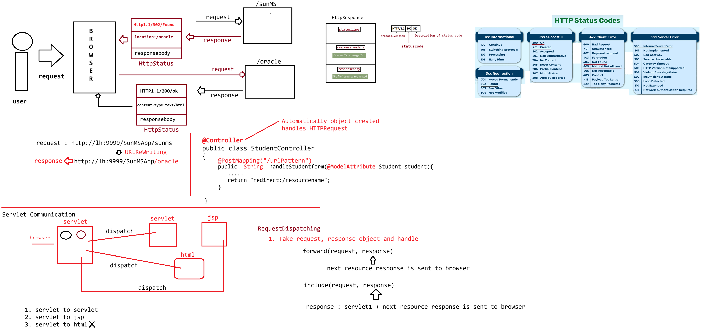

# Day-16 — 15-05-2026 — Redirection using Response Object Servlet Communication Dispatching the Servlet

---

## 🔀 HttpServletResponse Redirection APIs

```text
HttpServletResponse
    |=> public void sendRedirect(String location) throws IOException
    |=> public void setHeader(String location, String path)
    |=> public void setStatus(int code)
```

> **Correction:** Standard API is `sendRedirect(String location)`. Manual redirect uses status **302** and header name **`Location`** (mentor snippet used `setHeader("location", ...)` and wrote `sendRedirection`).

---

## 💻 Manual Redirect (302 + Location header)

```java
@WebServlet("/sunms")
public void doGet(HttpServletRequest request, HttpServletResponse response) throws ServletException, IOException {
	System.out.println("Redirecting to Oracle Service from : SUNMS");

	response.setStatus(302);
	response.setHeader("location",
			"http://localhost:9999/FirstServletApp/oracle");
	// response.sendRedirect("http://localhost:9999/FirstServletApp/oracle");
}
```

```java
@WebServlet("/oracle")
public void doGet(HttpServletRequest request, HttpServletResponse response) throws ServletException, IOException {
	response.getWriter().println("<h1>Serving response from :: OracleServet</h1>");
}
```

Either set status 302 + `Location` header, or use the convenience method `response.sendRedirect(...)`.

---

## 🤝 Servlet Communication

```text
Servletcommunication
   => servlet ===> servlet (commonly used)
   => servlet ===> jsp (commonly used)
   => servlet ===> html (not used more)
```

Dispatching between server-side resources (covered further with `RequestDispatcher` include/forward in the next lecture) is the usual “servlet communication” pattern after/alongside redirects.

---

## 🤖 AI Points

1. **Production consideration:** Prefer `sendRedirect` for external/absolute browser navigation; use relative paths carefully so reverse proxies don’t break Location URLs.
2. **Industry practice:** HTTP 302 (or 303/307 as appropriate) + `Location` is the wire protocol behind redirects—know both manual and `sendRedirect` forms.
3. **Common mistake:** Expecting request attributes to survive `sendRedirect`—redirect creates a **new** client request (data must go via session, flash, or query string).
4. **Interview insight:** Redirect is browser-visible URL change; dispatching (forward/include) is server-side and usually keeps the same request.
5. **Modern Spring Boot connection:** `redirect:` view names / `RedirectView` wrap the same `HttpServletResponse.sendRedirect` behavior.

---

## 💻 My Codes


  
## 🖼️ Image



