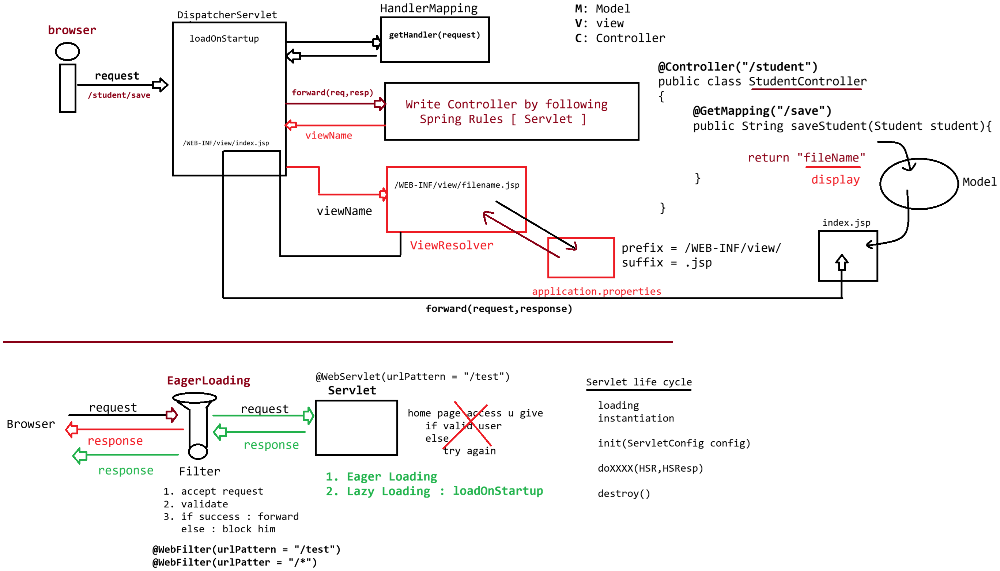

# Day-18 — 20-05-2026 — Springmvcflow Introduction to Filters

---

## 🔄 Request Flow: Server Start → Filter → Servlet

When the server starts, the **filter life cycle** starts.

```text
Browser -----> sending request -----> Servlet
					(/s1)
					  |-> Servlet life cycle starts
					  |-> filter will trap the request and calls doFilter() method to validate
							preprocessing logic
							chain.doFilter(request,response)
					  |-> Servlet Request processing
					  |-> chain.doFilter(request,response)
							postprocessing logic
```

- The filter traps the request before the Servlet runs.
- `doFilter()` runs **preprocessing** logic.
- `chain.doFilter(request, response)` passes control onward (to the next filter or the Servlet).
- After the Servlet finishes, control returns so **postprocessing** logic can run.

---

## 🧩 MyFilter Implementation

```java
package in.pw.ioi.filter;

import java.io.IOException;
import javax.servlet.Filter;
import javax.servlet.FilterChain;
import javax.servlet.FilterConfig;
import javax.servlet.ServletException;
import javax.servlet.ServletRequest;
import javax.servlet.ServletResponse;
import javax.servlet.annotation.WebFilter;


@WebFilter(urlPatterns = "/s1")
public class MyFilter implements Filter {

	static {
		System.out.println("Filter loading...");
	}
	
   
    public MyFilter() {
    	System.out.println("Filter Instantiation...");
    }

	
	public void destroy() {
		System.out.println("Filter DeInstantiation...");
	}

	
	public void doFilter(ServletRequest request, ServletResponse response, FilterChain chain) throws IOException, ServletException {
		// TODO Auto-generated method stub
		// place your code here
		System.out.println("Performing pre_processing logic before the servlet...");

		// pass the request along the filter chain
		chain.doFilter(request, response);
		
		System.out.println("Peforming post_processing logic after the servlet....");
		
	}

	public void init(FilterConfig fConfig) throws ServletException {
		System.out.println("Filter Initialisation...");
	}

}
```

### Filter lifecycle methods shown

| Phase | Method / block | Console message |
|-------|----------------|-----------------|
| Loading | `static { }` | Filter loading... |
| Instantiation | constructor | Filter Instantiation... |
| Initialization | `init(FilterConfig)` | Filter Initialisation... |
| Request | `doFilter(...)` | pre_processing → `chain.doFilter` → post_processing |
| De-instantiation | `destroy()` | Filter DeInstantiation... |

Mapped with `@WebFilter(urlPatterns = "/s1")` so it applies to the same URL as the Servlet below.

---

## 🧩 ServletA Mapped to `/s1`

```java
package in.pw.ioi.controller;

import java.io.IOException;
import javax.servlet.ServletException;
import javax.servlet.annotation.WebServlet;
import javax.servlet.http.HttpServlet;
import javax.servlet.http.HttpServletRequest;
import javax.servlet.http.HttpServletResponse;

@WebServlet("/s1")
public class ServletA extends HttpServlet {
	private static final long serialVersionUID = 1L;
	static {
		System.out.println("ServletA loading...");
	}

	public ServletA() {
		System.out.println("ServletA Instantiation....");
	}

	@Override
	public void init() throws ServletException {
		System.out.println("ServletA initialization");
	}

	@Override
	public void doGet(HttpServletRequest request, HttpServletResponse response) throws ServletException, IOException {
		System.out.println("***Request Processing*****");
	}

	@Override
	public void destroy() {
		System.out.println("ServletA Desinstantiation..");
	}

}
```

With both Filter and Servlet mapped to `/s1`, a GET to `/s1` triggers filter preprocessing, then Servlet request processing (`doGet`), then filter postprocessing.

---

## 🤖 AI Points

1. **Production consideration:** Always call `chain.doFilter(request, response)` unless you intentionally short-circuit (auth failure, CORS preflight). Skipping it silently blocks the Servlet.
2. **Industry practice:** Put cheap checks (auth header present, content-type) in preprocessing; logging of status/timing belongs in postprocessing after the chain returns.
3. **Common mistake:** Assuming filter and Servlet load in lockstep—filters are typically eager; Servlets may still be lazy unless `loadOnStartup` is set.
4. **Interview insight:** Filter `doFilter` wraps the Servlet: code before `chain.doFilter` is pre, code after is post—same call stack returning from the chain.
5. **Modern Spring Boot connection:** Spring Security’s filter chain is the same idea—ordered filters around the DispatcherServlet for authentication, CSRF, and authorization.

---

## 💻 My Codes


  
## 🖼️ Image


