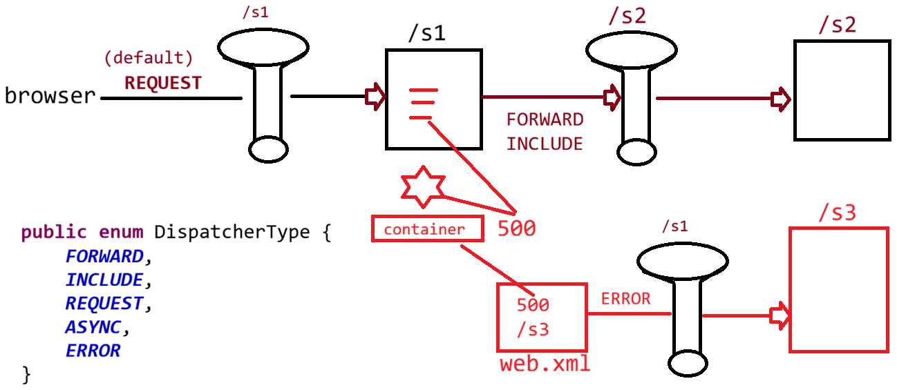

# Day-19 — 21-05-2026 — Filter and DispatcherType

---

## 🧩 Filter Basics

- Filters use **eager loading by default**.
- Configure a Filter to a Servlet via `URLPattern`.
  - Example: `urlPattern = "/*"`
  - Example: `urlPattern = "/urlPath"`
- Filters are used for **preprocessing** and **postprocessing** logics.

---

## 🔌 Interfaces to Work with Filter

Configuration sketch with init params:

```java
@WebFilter(
  urlPattern = "/*",
  initParams = {@WebInitParam(name = "K", value = "V")}
)
```

### a. `Filter` (interface)

- `init(FilterConfig config)`
  - `String value = getInitParameter("K");`
- `doFilter(request, response, FilterChain)`
- `destroy()`

> **Correction:** Method name is `destroy()`, not `destory()`.

### b. `FilterConfig` (interface)

- `public String getFilterName();`
- `public ServletContext getServletContext();`
- `public String getInitParameter(String name);`
- `public Enumeration<String> getInitParameterNames();`

### c. `FilterChain` (interface)

Used to continue the chain via `doFilter(request, response)` (covered further in later lectures).

---

## ⏱️ Loading Order: Listener → Filter → Servlet

| Component | When it gets a chance |
|-----------|------------------------|
| **Listener** | When we start the container and the container deploys the application |
| **Filter** | After the context object is created, then Filter will get a chance |
| **Servlet** | Control is with the user |
| Servlet with `loadOnStartup` | After filter — **eager loading** |
| Servlet with no `loadOnStartup` | On request — **lazy loading** |

---

## 📄 JSP: Reading Data from Request Scope

**Syntax:**

```jsp
<%= expression %>
```

- Expression should be Java methods / expressions which would **return something**.
- Equivalent idea: `out.println(expression);`

---

## 🤖 AI Points

1. **Production consideration:** Prefer narrow URL patterns over `/*` when possible so logging/auth filters do not run on static assets unnecessarily.
2. **Industry practice:** Put shared config (API keys flags, realm names) in `FilterConfig` init params or external config—not hard-coded in `doFilter`.
3. **Common mistake:** Expecting Servlet `init` before Filters—context and Filters initialize first; Servlets without `loadOnStartup` wait for the first hit.
4. **Interview insight:** Eager Filters vs lazy Servlets explain why filter static blocks print at deploy time even before any browser request.
5. **Real-world connection:** Expression tags (`<%= %>`) in JSP are the legacy way to print request-scoped data; EL `${...}` later replaces this for cleaner views.

---

## 💻 My Codes


  
## 🖼️ Image


