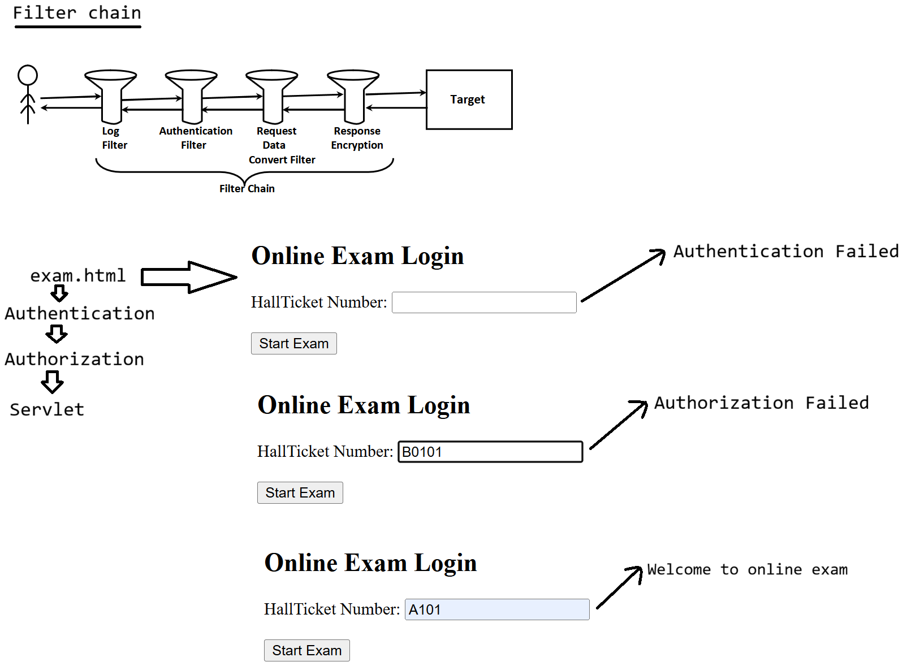

# Day-21 — 26-05-2026 — Filterchaining in Servlet

---

## 🧩 Filter Recap

### a. Preprocessing and postprocessing

Filters execute preprocessing and postprocessing logic around the target resource.

### b. Filter life cycle

1. `init(FilterConfig config)`
2. `doFilter(SR, SResp, FilterChain fc)` — callback
3. `destroy()`

> **Correction:** Method spelling is `destroy()`, not `destory()`.

### c. `FilterChain`

- Call `doFilter(SR, SResp)` to establish **Filter chaining** and tell the container where the request should go next:
  - a. Another Servlet
  - b. Another Filter

---

## 🏗️ Container Startup Order

```text
Container 
    |=> Event :: LifeCycle Event :: Event Listener ---> ServletContext
    |-> Filter (1)(2)
	   |-> loading, instantiation, initialization
```

---

## 📋 Ordering of Filter Execution

Ordering of Filter execution is **not** controlled via programmer logic alone, because the container loads filters when the application starts.

To control order, configure the container in `web.xml`:

- The container scans `web.xml`, identifies `<filter>` / `<filter-mapping>` tags.
- As per **top to bottom** order, it loads / maps the filters.

```text
browser -----> Authentication -------> Authorization ----------------------> Servlet
		(no inputs)		(checked for valid inputs)        (service)
```

---

## 📄 `web.xml` Filter Chain Example

```xml
   <filter>
        <filter-name>AuthenticationFilter</filter-name>
        <filter-class>in.pw.ioi.filter.AuthenticationFilter</filter-class>
        
    </filter>

    <!-- 2. Map the Filter to a URL pattern -->
    <filter-mapping>
        <filter-name>AuthenticationFilter</filter-name>
        <url-pattern>/exam</url-pattern>
    </filter-mapping>

   <filter>
        <filter-name>AuthorizationFilter</filter-name>
        <filter-class>in.pw.ioi.filter.AuthorizationFilter</filter-class>
        
    </filter>

    <!-- 2. Map the Filter to a URL pattern -->
    <filter-mapping>
        <filter-name>AuthorizationFilter</filter-name>
        <url-pattern>/exam</url-pattern>
    </filter-mapping>
```

Both filters map to `/exam`. Declaration / mapping order in `web.xml` (top → bottom) drives which runs first: Authentication, then Authorization, then the Servlet.

---

## 🤖 AI Points

1. **Production consideration:** Put Authentication before Authorization so anonymous requests never reach privilege checks.
2. **Industry practice:** Prefer explicit `web.xml` (or `FilterRegistrationBean` order in Spring Boot) when multiple filters share a URL—annotation-only order is harder to reason about.
3. **Common mistake:** Assuming `@WebFilter` order is predictable across containers; for critical chains, declare order in `web.xml` or Spring’s ordered filter registration.
4. **Interview insight:** Each filter must call `chain.doFilter` (or abort); the chain is how the container walks Filter(1) → Filter(2) → Servlet.
5. **Modern Spring Boot connection:** Spring Security’s `SecurityFilterChain` is filter chaining with a fixed, documented order (UsernamePasswordAuthenticationFilter, FilterSecurityInterceptor, etc.).

---

## 💻 My Codes


  
## 🖼️ Image


