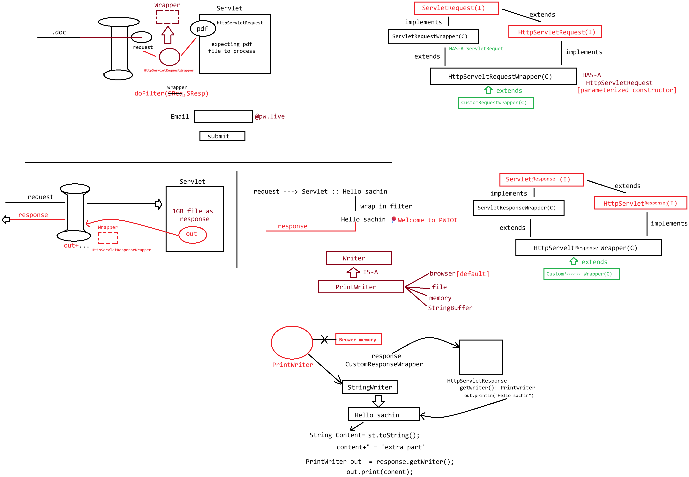

# Day-22 — 27-05-2026 — Wrapper Request Responsewrapper

---

## 🧩 Topic Context

This lecture introduces the idea behind **request/response wrappers**: capturing or redirecting what would normally be written to the real response stream (a foundation for `HttpServletRequestWrapper` / `HttpServletResponseWrapper` usage in filters).

The mentor demo uses `StringWriter` + `PrintWriter` to show writing into a **buffer in memory** instead of the console/network directly.

---

## 💻 Capturing Written Content with StringWriter

```java
package in.pw.ioi.test;

import java.io.PrintWriter;
import java.io.StringWriter;

public class TestApp {

	public static void main(String[] args) {

		StringWriter sw = new StringWriter();
		
		PrintWriter out = new PrintWriter(sw);
		out.write("hello sachin");
		out.write("🎈 Welcome to PW IOI");
		
		out.flush();
		
		System.out.println(out.toString());
		
		System.out.println(sw.toString());
		
		
		
	}

}
```

### What this demonstrates

- `PrintWriter` is constructed over a `StringWriter`, not `System.out`.
- Writes (`hello sachin`, welcome message) accumulate in the `StringWriter` buffer.
- After `flush()`, `sw.toString()` holds the full captured text.
- Printing `out.toString()` vs `sw.toString()` highlights that the **backing writer** (`StringWriter`) is where the content lives.

This pattern is the same idea used when a response wrapper swaps the real `PrintWriter`/`ServletOutputStream` for a buffered one so a filter can inspect or modify the body after the Servlet runs.

---

## 🤖 AI Points

1. **Production consideration:** Response wrappers that buffer entire bodies can increase memory use—stream/chunk carefully for large downloads.
2. **Industry practice:** Use `HttpServletResponseWrapper` + custom `ServletOutputStream`/`PrintWriter` in filters for compression, HTML injection, or audit logging of outbound payloads.
3. **Common mistake:** Forgetting `flush()`/`close()` on the wrapper writer so the buffered content never reaches the real response.
4. **Interview insight:** Wrappers implement the Decorator pattern—same Servlet API types, alternate behavior underneath.
5. **Real-world connection:** GZIP filters and Spring’s `ContentCachingResponseWrapper` rely on this capture-then-write technique.

---

## 💻 My Codes


  
## 🖼️ Image


