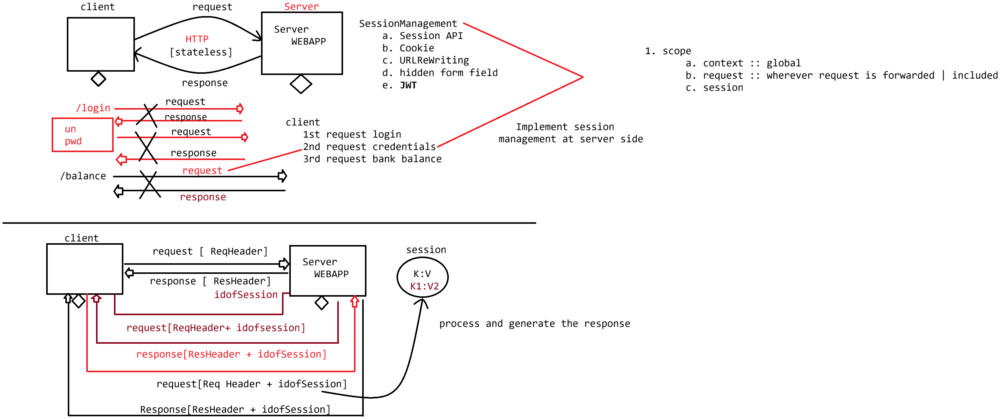

# Day-23 — 01-06-2026 — Session Management using Session API

---

## 🧩 Session Management at Server Side

### 1. Session API — `HttpSession`

Runtime environment supplies the implementation (e.g. Tomcat).

### Methods of `HttpSession`

| Method | Return |
|--------|--------|
| `isNew()` | `boolean` |
| `getId()` | `String` |
| `setMaxInactiveInterval()` | `void` |
| `getMaxInactiveInterval()` | `int` |
| `invalidate()` | `void` |
| `setAttribute(k, value)` | `void` |
| `getAttribute(k)` | `Object` |
| `getLastAccessedTime()` | `Long` |

---

## 🆕 How to Create a Session?

From `HttpServletRequest`:

- `getSession()` → `Session`
- `getSession(boolean)` → `Session`

### `getSession()`

Reads sessionId from the request header and checks whether a session with that id exists:

- **If exists:** return the same Session object
- **If not:** create a new Session object

### `getSession(true)`

Same as `getSession()`.

### `getSession(false)`

Reads sessionId from the request header and checks whether a session with that id exists:

- **If exists:** return the same Session object
- **If not:** return `null` (does **not** create)

---

## 🧪 Use Case: Inbox Login Gate

```text
inbox.html
   username  : 
   password  : 
	submit


a. ValidationServlet
    request.getSession() :: Session
		|
	forward to inboxServlet

b. inboxServlet 
	HttpSession session = request.getSession(false) 
		if(session == null)
			forward to inbox.html
		else
			forward to inbox messages
```

---

## 📄 `index.html` — Add to Cart Form

```html
<!DOCTYPE html>
<html>
<head>
<meta charset="UTF-8">
<title>Insert title here</title>
</head>
<body>
<form action="/HttpSessionApp/session/save" method="POST">
		<h1>Enter Book Information</h1>
		<pre>
			Name :<input type="text" name="name"><br>
			Value:<input type="text" name="value"><br>
			
		          <input type="submit" value="Add To Cart"/>
		</pre>
	</form>
	<br>
	<a href="/HttpSessionApp/session/display">Show My Cart</a>
</body>
</html>
```

---

## 💻 BookSaveServlet — Create/Reuse Session and Store Attributes

```java
package in.pw.ioi.controller;

import java.io.IOException;
import java.io.PrintWriter;

import javax.servlet.RequestDispatcher;
import javax.servlet.ServletException;
import javax.servlet.annotation.WebServlet;
import javax.servlet.http.HttpServlet;
import javax.servlet.http.HttpServletRequest;
import javax.servlet.http.HttpServletResponse;
import javax.servlet.http.HttpSession;


@WebServlet("/session/save")
public class BookSaveServlet extends HttpServlet {
	private static final long serialVersionUID = 1L;

	
	protected void doGet(HttpServletRequest request, HttpServletResponse response) throws ServletException, IOException {
		// TODO Auto-generated method stub
		response.getWriter().append("Served at: ").append(request.getContextPath());
	}

	
	protected void doPost(HttpServletRequest request, HttpServletResponse response) throws ServletException, IOException {
		
		response.setContentType("text/html");
		
		PrintWriter out = response.getWriter();
		HttpSession session = request.getSession();
		if (session.isNew()) {
			out.println("<h1>New Session Created with the id : "+session.getId()+"</h1>");
		} else {
			out.println("<h1>Using Existing session object with id : "+session.getId()+"</h1>");
		}
		
		session.setAttribute(request.getParameter("name"), request.getParameter("value"));
		
		RequestDispatcher rd = request.getRequestDispatcher("/index.html");
		rd.include(request, response);
		
		
		
	}

}
```

---

## 💻 DisplayServlet — Read Cart with `getSession(false)`

```java
package in.pw.ioi.controller;

import java.io.IOException;
import java.io.PrintWriter;
import java.util.Enumeration;

import javax.servlet.ServletException;
import javax.servlet.annotation.WebServlet;
import javax.servlet.http.HttpServlet;
import javax.servlet.http.HttpServletRequest;
import javax.servlet.http.HttpServletResponse;
import javax.servlet.http.HttpSession;


@WebServlet("/session/display")
public class DisplayServlet extends HttpServlet {
	private static final long serialVersionUID = 1L;

	
	protected void doGet(HttpServletRequest request, HttpServletResponse response) throws ServletException, IOException {
		response.setContentType("text/html");
		HttpSession session = request.getSession(false);
		PrintWriter out = response.getWriter();
		if (session == null) {
			out.print("<h2>Session object not available for request type</h2>");
		} else {
			out.println("<table border='1'>");
			out.println("<caption>Session Object Info</caption>");
			out.println("<thead><tr><th>NAME</th><th>VALUE</th></tr></thead>");
			out.println("<tbody>");	
			Enumeration<String> attributeNames = session.getAttributeNames();
			while (attributeNames.hasMoreElements()) {
				String name = (String) attributeNames.nextElement();
				out.println("<tr>");
				out.println("<td>"+name+"</td>");
				out.println("<td>"+session.getAttribute(name)+"</td>");
				out.println("</tr>");
			}
			out.println("<tbody>");
			out.println("</table>");
		}
	
	}

	
	protected void doPost(HttpServletRequest request, HttpServletResponse response) throws ServletException, IOException {
		doGet(request, response);
	}

}
```

---

## 🤖 AI Points

1. **Production consideration:** Use `getSession(false)` on protected pages so anonymous users are not accidentally given a new empty session.
2. **Industry practice:** Call `invalidate()` on logout and regenerate session id after login to reduce session fixation risk.
3. **Common mistake:** Calling `getSession()` (create) on every page—including display/cart—creates sessions for crawlers and wastes memory.
4. **Interview insight:** `isNew()` is true only on the request that created the session; subsequent requests reuse the same id.
5. **Real-world connection:** Shopping-cart demos store name/value pairs in session attributes—the same pattern as server-side baskets before Redis/JWT backends.

---

## 💻 My Codes


  
## 🖼️ Image


