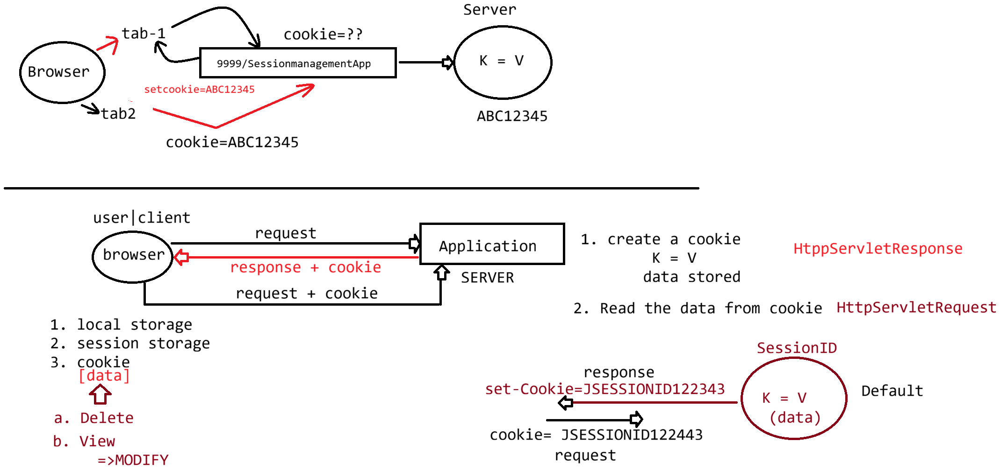

# Day-25 — 03-06-2026 — Cookie in Persistent and Nonpersistent Introduction to URLRewriting

---

## 🧩 Session Management Options

- **Session:** internally cookie = `JESSIONID...` (container-managed session id)
- **Cookie:** explicitly setting a cookie with required key and value (`K = V`)

> **Correction:** Standard name is usually `JSESSIONID`.

---

## 📄 `index.html` — Cookie Cart Form

```html
<!DOCTYPE html>
<html>
<head>
<meta charset="UTF-8">
<title>Insert title here</title>
</head>
<body>
<form action="/HttpSessionUsingCookie/cookie/save" method="POST">
		<h1>Enter Cookie Information</h1>
		<pre>
			ProductName :<input type="text" name="pName"><br>
			ProductCost :<input type="text" name="pCost"><br>
			
		          <input type="submit" value="Add To Cart"/>
		</pre>
	</form>
	<br>
	<a href="/HttpSessionUsingCookie/cookie/display">View cookies</a>
</body>
</html>
```

---

## 💻 CookieSaveServlet

```java
package in.pw.ioi.controller;

import java.io.IOException;
import java.io.PrintWriter;

import javax.servlet.RequestDispatcher;
import javax.servlet.ServletException;
import javax.servlet.annotation.WebServlet;
import javax.servlet.http.Cookie;
import javax.servlet.http.HttpServlet;
import javax.servlet.http.HttpServletRequest;
import javax.servlet.http.HttpServletResponse;


@WebServlet("/cookie/save")
public class CookieSaveServlet extends HttpServlet {
	private static final long serialVersionUID = 1L;

	protected void doGet(HttpServletRequest request, HttpServletResponse response) throws ServletException, IOException {
		// TODO Auto-generated method stub
		response.getWriter().append("Served at: ").append(request.getContextPath());
	}

	
	protected void doPost(HttpServletRequest request, HttpServletResponse response) throws ServletException, IOException {
		
		response.setContentType("text/html");
		
		PrintWriter out = response.getWriter();
		String name = request.getParameter("pName");
		String value = request.getParameter("pCost");
		
		Cookie cookie = new Cookie(name,value);
		response.addCookie(cookie);
		out.print("<h1>Cookie Added succesfully via request object</h1>");
		RequestDispatcher rd = request.getRequestDispatcher("/index.html");
		rd.include(request, response);
	
	}

}
```

Creates `new Cookie(name, value)`, adds it with `response.addCookie(cookie)`, then includes `index.html`.

---

## 💻 ViewCookieServlet

```java
package in.pw.ioi.controller;

import java.io.IOException;
import java.io.PrintWriter;

import javax.servlet.ServletException;
import javax.servlet.annotation.WebServlet;
import javax.servlet.http.Cookie;
import javax.servlet.http.HttpServlet;
import javax.servlet.http.HttpServletRequest;
import javax.servlet.http.HttpServletResponse;

@WebServlet("/cookie/display")
public class ViewCookieServlet extends HttpServlet {
	private static final long serialVersionUID = 1L;

	protected void doGet(HttpServletRequest request, HttpServletResponse response)
			throws ServletException, IOException {
		response.setContentType("text/html");
		PrintWriter out = response.getWriter();

		Cookie[] cookies = request.getCookies();
		System.out.println(cookies);
		out.println("<table border='1'>");
		out.println("<caption>Session Object Info</caption>");
		out.println("<thead><tr><th>NAME</th><th>VALUE</th></tr></thead>");
		out.println("<tbody>");
		
		for (Cookie cookie : cookies) {
			out.println("<tr>");
			out.println("<td>" + cookie.getName() + "</td>");
			out.println("<td>" + cookie.getValue() + "</td>");
			out.println("</tr>");
		}

		out.println("<tbody>");
		out.println("</table>");

	}

	protected void doPost(HttpServletRequest request, HttpServletResponse response)
			throws ServletException, IOException {
		// TODO Auto-generated method stub
		doGet(request, response);
	}

}
```

---

## 🍪 Types of Cookies

### a. Non-persistent cookie

As soon as the browser is closed, the cookie is automatically destroyed.

### b. Persistent cookie

Set a lifetime on the cookie so it stays alive for the required time. After the time expires, the cookie should be destroyed.

---

## ⚠️ Cookie Limitations for Session Management

Cookie is created at the server side and passed to the browser:

- **a.** If the browser permits storage, the user can modify cookies — session management can fail / be abused.
- **b.** If the browser does not permit cookie storage, session management can also fail.

### Solution 1

If the browser permits cookie storage, store in cookie and send it.

### Solution 2 — URL Rewriting

Applicable for dynamic pages on a website.

If the browser does not permit cookie storage, pass the session id in the URL (without relying on end-user awareness of cookies):

```text
URL : pathofProject/resource;JESSIONID=1234313241241
```

---

## 🤖 AI Points

1. **Production consideration:** Never store prices/roles as unsigned cookies alone—clients can change `pCost` before the next request.
2. **Industry practice:** Persistent cookies need `setMaxAge`; session cookies (maxAge default/negative) die when the browser closes.
3. **Common mistake:** Calling `request.getCookies()` without a null check when the client sent no Cookie header.
4. **Interview insight:** URL rewriting (`;jsessionid=...`) is the fallback when cookies are disabled—`response.encodeURL` helps generate such links.
5. **Real-world connection:** Modern apps prefer SameSite/HttpOnly cookies or tokens; URL rewriting leaks ids into logs and Referer headers.

---

## 💻 My Codes


  
## 🖼️ Image


