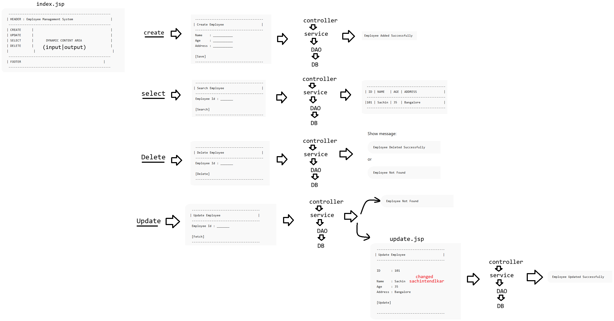

# Day-26 — 05-06-2026 — CRUD Project using HTML CSS and Servlet

---

## 🧩 Project UI Flow

```text
index.html
     create.html
	<form action='/projectName/employee'>
	hidden field : create name=action
        name : 
        age  : 
        address: 
		 save

	/employee?action=create 
	/employee?action=update
	/employee?action=delete
        /employee?action=select
```

A single `EmployeeController` servlet is reached with an `action` query/form parameter that selects the CRUD operation.

---

## 🎮 EmployeeController Sketch

```text
EmployeeController

	EmployeeService service = new EmployeeServiceImpl();
	
	doPost(request,response){
		doGet(request,response)
	}
	doGet(request,response){
		String action = request.getParameter("action")
		
		switch(action){
			case 'create': insertEmployee(request,response);
					break;
		}
        }
	public static void insertEmployee(request,response){
	
		//1. Read data from request object

		//2. Employee : id,Name,age,address

		//3. set the Employee object for the data using  request parameter

		//4.  try{
				service.save(emp);
				out.println("<h1>EMPLOYEE ADDED SUCESSFULLY</h1>");
			}catch(SQLException se ){
				throw new RunTimeException("SomeProblemOccured");
			}
	}
```

### `insertEmployee` steps (mentor outline)

1. Read data from the request object.
2. Model an `Employee` with id, name, age, address.
3. Set the Employee object from request parameters.
4. Call `service.save(emp)` inside try/catch; on `SQLException` throw a runtime exception with a problem message; on success print success HTML.

---

## 🧱 Service Layer

```java
public interface EmployeeService {
	
    void save(Employee employee);

    Employee findById(int id);

    void update(Employee employee);

    void delete(int id);
}
```

---

## 🗄️ DAO Layer

```java
public interface EmployeeDAO {
	
    void save(Employee employee); //ORM or JDBC []

    Employee findById(int id);

    void update(Employee employee);

    void delete(int id);
}
```

DAO may use **ORM or JDBC**. Controller → Service → DAO keeps HTML/Servlet UI separate from persistence.

---

## 🤖 AI Points

1. **Production consideration:** Do not print SQLException details to the browser; map to a user-safe message and log the stack server-side.
2. **Industry practice:** Front Controller pattern—one servlet (`/employee`) dispatches on `action` (or use separate mappings / Spring MVC later).
3. **Common mistake:** Putting JDBC directly in the servlet instead of Service → DAO, which blocks reuse and testing.
4. **Interview insight:** Layered CRUD (Controller/Service/DAO) is the classic Java EE teaching structure before Spring `@Service` / `@Repository`.
5. **Real-world connection:** Hidden `action` fields or REST verbs (`POST` create, `PUT` update) both express the same CRUD intent over HTTP.

---

## 💻 My Codes


  
## 🖼️ Image


