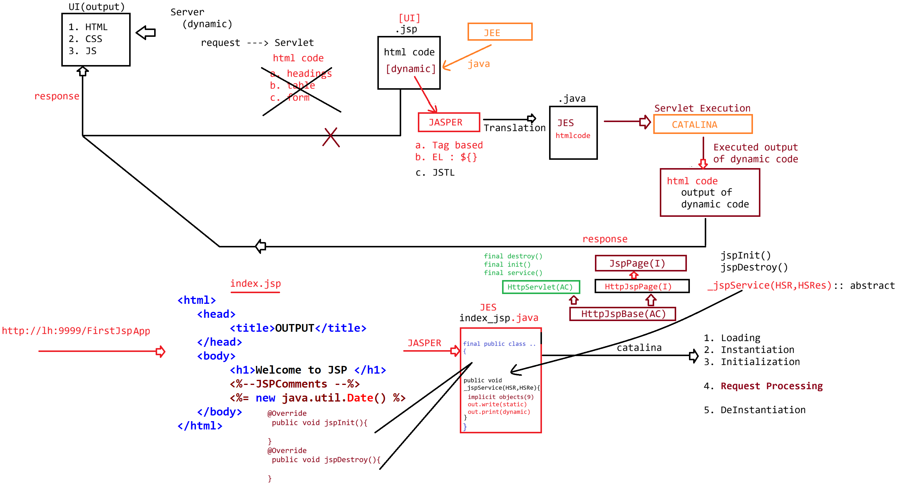

# Day-27 — 08-06-2026 — JSP Introduction

---

## 🧩 What is JSP?

JSP is a **UI technology** built on top of Servlet to make pages dynamic in web apps.

With JSP you can:

- **a.** Write HTML code
- **b.** Write code that generates dynamic output using the Java language in the form of **tags**

---

## ⚙️ How JSP Runs Internally

If we write JSP code, internally it gets converted to a Servlet via the **Translation phase [Jasper]**, and the translated code will be compiled and given to the **Catalina** container for execution.

```text
index.jsp  -->  Jasper (translation)  -->  Servlet .java/.class  -->  Catalina (execution)
```

---

## 📄 First `index.jsp`

```jsp
<html>
   <head>
		<title>OUTPUT</title>
   </head>
   <body>
		<h1>Welcome to JSP </h1>
		<%--JSPComments --%>
		<%= new java.util.Date() %>
   </body>
</html>
```

- `<%-- ... --%>` — JSP comment
- `<%= new java.util.Date() %>` — expression tag printing the current date/time dynamically

---

## 🤖 AI Points

1. **Production consideration:** First hit on a JSP pays translation+compile cost; precompile JSPs in CI for consistent latency.
2. **Industry practice:** Treat JSP as a view only—business logic stays in Servlets/services (MVC), not scriptlets.
3. **Common mistake:** Thinking `.jsp` is executed as HTML by the browser; the server translates it to a Servlet first.
4. **Interview insight:** Jasper = translation, Catalina = runtime container executing the generated Servlet.
5. **Modern Spring Boot connection:** Many Spring Boot apps prefer Thymeleaf/Mustache over JSP, but the same “template → dynamic HTML” idea applies.

---

## 💻 My Codes


  
## 🖼️ Image


