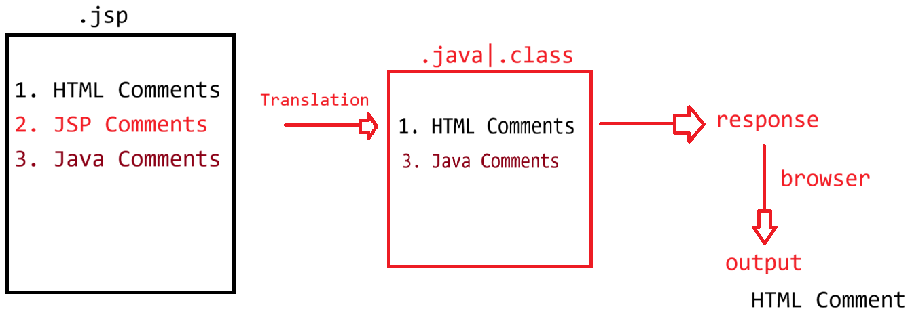

# Day-28 — 09-06-2026 — JSP Life Cycle JSP Comments Type of Tags to Write Java Code Inside JSP

---

## 🧩 JSP Overview

UI technology built on top of the Servlet API.

```text
		JspPage(I): jspInit()
			    jspDestroy()	       Servlet
		HttpJspPage(I)			    a. HttpServlet
			  : _jspService(HSR,HSRes)      |
.jsp ---------> JASPER ---------> .java -----------> .class ----> Catalina 
(html							a. loading		: static block
  tags : Java)						b. instantiation        : constructor
							c. initialization	: jspInit()
							d. request processing --> _jspService(HSR,HSRes)
							e. deinstantiation 	: jspDestroy()
```

---

## ✍️ Types of Java Statements vs JSP Tags

In Java, a class has methods (static | instance) + variables (static + instance).

### How to write Java code inside JSP?

Use tags as per expectation:

| Tag | Syntax | Where code goes |
|-----|--------|-----------------|
| **1. Scriptlet** | `<% statement; %>` | Inside `_jspService(HSReq, HSResp)` |
| **2. Expression** | `<%= expr %>` | Becomes `out.println(expr);` inside `_jspService` |
| **3. Declarative** | `<%! statement; %>` | Inside the generated final JES class body (not using implicit objects in that logic) |

### Inside `_jspService(HSReq, HSResp)` (scriptlet / expression area)

- 9 implicit objects available (e.g. `out` [`JspWriter`, buffer based], `exception` [`java.lang.Throwable`])
- Local variables
- Access instance variables
- Call methods
- Create objects and call methods

### Declarative tag `<%! ... %>`

Logic should **not** involve the usage of implicit objects.

Goes inside the final generated class:

- Declare a variable | block: static or instance
- Declare a method: instance method | static method

---

## 🧪 eg#1 — Lifecycle Logging in JSP

```jsp
<html>
   <head>
		<title>OUTPUT</title>
   </head>
   <body>
		<h1>Life Cycle of a Servlet </h1>
		
		<%!
			static{
				System.out.println("1. JSP Loading...");
			}	
		%>

		<%!
			public index_jsp(){
				System.out.println("2. JSP Instantiation....");
			}

			@Override
			public void jspInit(){
				System.out.println("3. JSP Initialization...");	
			}

			@Override
			public void jspDestroy(){
				System.out.println("5. JSP DeInstantiation...");	
			}
		%>

		<% System.out.println("4. Request Processing phase"); %>
		
   </body>
</html>
```

### 1st request: `http://localhost:9999/FirstJspApp/`

```text
 1. JSP Loading...
 2. JSP Instantiation....
 3. JSP Initialization...
 4. Request Processing phase
```

### 2nd request: `http://localhost:9999/FirstJspApp/`

```text
   4. Request Processing phase
```

For the first request, time to generate a response is more compared to second request onwards (translation + compilation + full lifecycle).

### Precompile to keep response time uniform

```text
http://localhost:9999/FirstJspApp/index.jsp?jsp_precompile=true
```

This triggers translation + compilation + Catalina lifecycle:

```text
1. JSP Loading...
2. JSP Instantiation....
3. JSP Initialization...
```

After precompile:

**1st request** → only `4. Request Processing phase`  
**2nd request** → only `4. Request Processing phase`

---

## 🧪 eg#2 — Declarative Inner Class + Scriptlet + Expressions

```jsp
<html>
   <head>
		<title>OUTPUT</title>
   </head>
   <body>
		<h1>Life Cycle of a Servlet </h1>
		
		<%!
			static{
				System.out.println("1. JSP Loading...");
			}	
		%>

		<%!
			public index_jsp(){
				System.out.println("2. JSP Instantiation....");
			}

			@Override
			public void jspInit(){
				System.out.println("3. JSP Initialization...");	
			}

			@Override
			public void jspDestroy(){
				System.out.println("5. JSP DeInstantiation...");	
			}
		%>

		<% System.out.println("4. Request Processing phase"); %>
		
		<%!
			public class Employee{
				private String name;
				private String address;
				private int age;
				public Employee(String name, int age, String address){
					this.name=  name;
					this.age= age;
					this.address = address;
				}
				public String getName(){
					return name;
				}
				public String getAddress(){
					return address;
				}
				public int getAge(){
					return age;
				}
			}
		%>
		<% 
			Employee emp = new Employee("sachin",55,"MI");
		%>
<table border='1'>
	<thead>
		<tr>
			<th>ENAME</th>
			<th>EAGE</th>
			<th>EADDRESS</th>
		</tr>
	</thead>
	<tbody>
		<tr>
			<td><%= emp.getName() %></td>
			<td><%= emp.getAge() %></td>
			<td><%= emp.getName() %></td>
		</tr>
	</tbody>
</table>

   </body>
</html>
```

> Note: mentor sample prints `emp.getName()` in the address column as written in the source notes.

---

## 💬 eg#3 — Types of Comments

Inside JSP we can write:

| Kind | Syntax |
|------|--------|
| HTML comments | `<!-- -->` |
| Java comments | `//` or `/* */` |
| JSP comments | `<%-- --%>` |

### Behavior

- During **translation | compilation**: JSP comments are removed.
- During **execution**: Java comments are removed; only **HTML comments** are sent as part of the response.

```jsp
 <html>
   <head>
		<title>OUTPUT</title>
   </head>
   <body>
        <!-- HTML Comments -->
		<h1>Life Cycle of a Servlet </h1>
		
		<%!
			static{
				//JAVA Comments 
				System.out.println("1. JSP Loading...");
			}	
		%>

		<%-- JSP Comments --%>
		<%!
			public index_jsp(){
				System.out.println("2. JSP Instantiation....");
			}

			@Override
			public void jspInit(){
				System.out.println("3. JSP Initialization...");	
			}

			@Override
			public void jspDestroy(){
				System.out.println("5. JSP DeInstantiation...");	
			}
		%>

		<% System.out.println("4. Request Processing phase"); %>
		
		<%!
			public class Employee{
				private String name;
				private String address;
				private int age;
				public Employee(String name, int age, String address){
					this.name=  name;
					this.age= age;
					this.address = address;
				}
				public String getName(){
					return name;
				}
				public String getAddress(){
					return address;
				}
				public int getAge(){
					return age;
				}
			}
		%>
		<% 
			Employee emp = new Employee("sachin",55,"MI");
		%>
<table border='1'>
	<thead>
		<tr>
			<th>ENAME</th>
			<th>EAGE</th>
			<th>EADDRESS</th>
		</tr>
	</thead>
	<tbody>
		<tr>
			<td><%= emp.getName() %></td>
			<td><%= emp.getAge() %></td>
			<td><%= emp.getName() %></td>
		</tr>
	</tbody>
</table>

   </body>
</html>
```

---

## 🤖 AI Points

1. **Production consideration:** Use `jsp_precompile=true` (or build-time precompile) so the first user does not pay Jasper compile cost.
2. **Industry practice:** Prefer expression/EL over heavy scriptlets; keep declarative tags for rare helpers, not business logic.
3. **Common mistake:** Using implicit objects (`request`, `out`) inside `<%! %>` declarations—those belong in `_jspService` (scriptlets).
4. **Interview insight:** JSP comments never reach the client; HTML comments do—do not put secrets in `<!-- -->`.
5. **Real-world connection:** Lifecycle mapping (load → construct → `jspInit` → `_jspService` → `jspDestroy`) mirrors `HttpServlet`’s init/service/destroy model.

---

## 💻 My Codes


  
## 🖼️ Image


