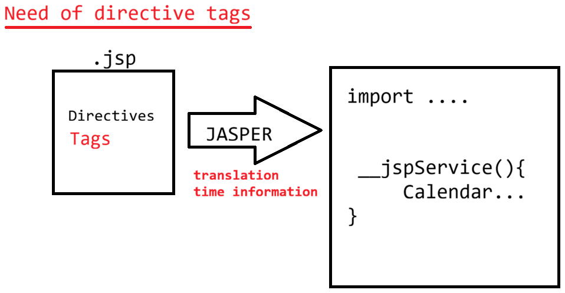

# Day-29 — 11-06-2026 — JSP Directives Page Import Session Iselignored Language Pageencoding Contenttype Use Request Object

---

## 🧩 JSP Recap

JSP is built on top of Servlet to present the dynamic UI.

```text
index.jsp -----> index_jsp.java -----> catalina
 -> translation  : Jasper Container
 -> Compilation  
 -> Execution    : Catalina container
			a. loading  b. instantiation
			c. initialization [jspInit]
			d. request processing  [_jspService(HSR,HSResp)]
```

### Tags inside `index.jsp`

| Tag | Syntax | Generated location |
|-----|--------|-------------------|
| Scriptlet | `<% statement; %>` | Inside `_jspService` |
| Expression | `<%= expression %>` | `out.print(expression)` inside `_jspService` |
| Declarative | `<%! statement; %>` | In `public final class fileName_jsp` body; `_jspService` still gets implicit objects like `out`, `request` |

---

## 🧪 eg#1 — Greeting with `request` and `Calendar`

```jsp
<%@ page import = "java.util.Calendar" %>
<html>
   <head>
		<title>OUTPUT</title>
   </head>
   <body>
        <% 
			String userName = request.getParameter("userName");
			String msg = "";
		%>

		<%
			Calendar calendar = Calendar.getInstance();
			System.out.println(calendar);
		
			int hour = calendar.get(Calendar.HOUR_OF_DAY);
			System.out.println(hour);
			
			if(hour<=12){
				msg+="Good Morning";
			}else if(hour<=16){
				msg+="Good Afternoon";
			}else if(hour<=20){
				msg+="Good Evening";
			}else{
				msg+="Good night";
			}

		%>

		<h1>Hello     user    : <%= userName %></h1> <br>
		<h2>Server Time is    : <%= new java.util.Date() %></h2><br/>
		<h2>Greeting the user : <%= msg %></h2>
		
   </body>
</html>
```

**Note:** Nesting of JSP tags is not permitted — it would result in `JasperException`.

---

## 📐 Page Directive

```jsp
<%@ page attributeName = "attributeValue" %>
```

### a. `pageEncoding`

Informing the JSP engine how Jasper should read the instructions present in the JSP file.

### b. `contentType`

Inform the browser how to present the output using charset / MIME.

- Default: `text/html; charset=UTF-8`

### c. `language`

- Default value is `java`.
- If changed, it results in Jasper execution error: invalid language attribute.

```jsp
<%@ page contentType="text/html;charset=UTF-8" 
	 pageEncoding="UTF-8" 
	 language= "java"%>
<html>
   <head>
		<title>OUTPUT</title>
   </head>
   <body>
        <h1>HELLO USER</h1>
		<h2>नमस्ते</h2>
   </body>
</html>
```

### d. `import`

Specify which Java classes are used inside the JSP.

```jsp
import = ""
```

or

```jsp
import = "java.util.List,java.util.ArrayList"
```

**Default imports in JES:**

- `java.lang.*`
- `javax.servlet.http.*`
- `javax.servlet.*`
- `javax.servlet.jsp.*`

> **Correction:** Packages are `javax.servlet.*` (mentor text sometimes shows `java.servlet`).

### e. `session`

Make the session object available to the JSP page.

- Default: `session = true`
- Values: case-sensitive or case-insensitive `true` / `false`
- Other values → `JasperException`

When `session = true`, in JES roughly:

```java
HttpSession session = null;
session = pageContext.getSession();
```

When `session = false`, those lines are not available.

### f. `isELIgnored`

- Used to inform Jasper whether to process Expression Language syntax.
- `isELIgnored = true` → EL syntax suppressed without evaluation.
- `isELIgnored = false` → EL syntax evaluated to generate a result.

**EL tries to get data from scopes (in order):**

1. page scope  
2. request scope  
3. session scope  
4. application scope  

```text
JSP ---> To build webapps in tag based way
			learn tags and write 'JAVA CODE'

		Servlet===> Java Developers[Write JAVA CODE]
		  |
		 JSP  ===> Syntax : ${expression}
```

---

## 🧪 Full Example — Imports, Session, EL

```jsp
<%@ page 
import = "java.util.Date,java.util.ArrayList,java.util.List,java.util.Scanner" 
		contentType="text/html;charset=UTF-8" pageEncoding="UTF-8" 
		language= "java"
		session = "TruE"
		isELIgnored="false"
		%>

	
<html>
   <head>
		<title>OUTPUT</title>
   </head>
   <body>
   		<%!
			public class Employee{
				private String name;
				private String address;
				private int age;
				public Employee(String name, int age, String address){
					this.name=  name;
					this.age= age;
					this.address = address;
				}
				public String getName(){
					System.out.println("Getter of name is called");
					return name;
				}
				public String getAddress(){
					return address;
				}
				public int getAge(){
					return age;
				}
			}
		%>
		<% 
			Employee emp = new Employee("sachin",55,"MI");
			request.setAttribute("emp",emp);
		%>
<table border='1'>
	<thead>
		<tr>
			<th>ENAME</th>
			<th>EAGE</th>
			<th>EADDRESS</th>
		</tr>
	</thead>
	<tbody>
		<tr>
			<td>${emp.name}</td>
			<td>${emp.age}</td>
			<td>${emp.address}</td>
		</tr>
	</tbody>
</table>

        <h1>HELLO USER</h1>
		<h2>नमस्ते</h2>
		The sum is : ${2+3}
		
		
   </body>
</html>
```

EL property access (`${emp.name}`) calls getters (e.g. `getName()` prints “Getter of name is called”). `${2+3}` evaluates to `5` when EL is not ignored.

---

## 🤖 AI Points

1. **Production consideration:** Set `pageEncoding` and `contentType` with UTF-8 when serving multilingual text (e.g. नमस्ते).
2. **Industry practice:** Prefer `isELIgnored="false"` and EL/JSTL over scriptlets for reading scoped beans.
3. **Common mistake:** Nesting JSP tags (`<%` inside `<%=`) → `JasperException`.
4. **Interview insight:** EL search order is page → request → session → application via `findAttribute`-style lookup.
5. **Real-world connection:** `${emp.name}` calling `getName()` is JavaBeans introspection—same idea Spring MVC model attributes use in views.

---

## 💻 My Codes


  
## 🖼️ Image


