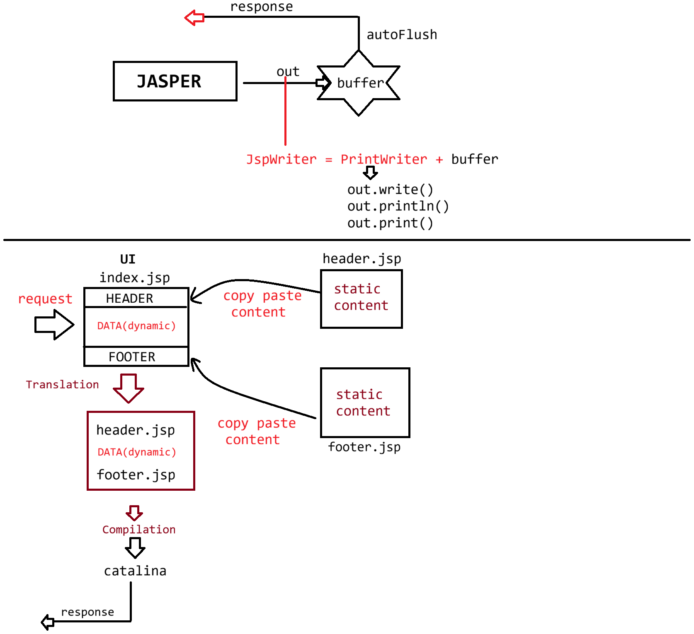

# Day-30 — 15-06-2026 — Jspimplicitobjects Pagedirective Includedirective

---

## 🧩 JSP Recap

- Building UI pages dynamically
- Built on top of Servlet

```text
jsp ----> translation ---> compilation ------> Execution
		--JASPER -------	    ---Container----
```

### How to write Java code inside JSP

| Tag | Syntax | Destination |
|-----|--------|-------------|
| Scriptlet | `<% statement; %>` | Inside `_jspService()` |
| Expression | `<%= expression %>` | Inside `_jspService()` → `out.write(expr)` (9 implicit objects) |
| Declarative | `<%! statement; %>` | Inside `public final class { statement; }` |

---

## 📐 Directives

Informing Jasper about what we use inside the JSP file.

- **a.** page directive
- **b.** taglib directive
- **c.** include directive

### Page directive

```jsp
<%@ page attributeName = "attributeValue" %>
```

Attributes covered / listed:

- `import`
- `language`
- `pageEncoding`
- `contentType`
- `session`
- `isELIgnored`
- `buffer`
- `autoFlush`
- `errorPage`
- `isErrorPage`
- `extends`

### Default values

- `buffer = "8kb"`
- `autoFlush = "true"`

### `out` : `JspWriter`

- `write()`, `print()`, `println()`
- `getBufferSize()` : `int`
- `getRemaining()` : `int`

---

## 🧪 case1: Small Buffer, `autoFlush="false"` → Overflow

```jsp
<%@ page  buffer="1kb" autoFlush="false"%>

	
<html>
   <head>
		<title>OUTPUT</title>
   </head>
   <body>
   		<h1> Buffer size : <%= out.getBufferSize()%> in bytes </h1><br/>
		<%	
			for(int i=0;i<5000;i++)
				out.println("A");
		%>
		<h1> Buffer remaining : <%= out.getRemaining()%> in bytes </h1><br/>
   </body>
</html>
```

**Output:** `IOException` : buffer overflow

---

## 🧪 case2: Small Buffer, `autoFlush="true"`

```jsp
<%@ page  buffer="1kb" autoFlush="true"%>
	
<html>
   <head>
		<title>OUTPUT</title>
   </head>
   <body>
   		<h1> Buffer size : <%= out.getBufferSize()%> in bytes </h1><br/>
		<%	
			for(int i=0;i<5000;i++)
				out.println("A");
		%>
		<h1> Buffer remaining : <%= out.getRemaining()%> in bytes </h1><br/>
   </body>
</html>
```

**Output:** 5000 times `A`

```text
Buffer size : 1024 in bytes
	;;;;;;
Buffer remaining : 206 in bytes
```

---

## 🧪 case3: Exception During Execution — `errorPage` / `isErrorPage`

- `errorPage=""` → delegates the exception object to the specified file
- `isErrorPage="false"` by default; set to `true` to access/handle the `exception` object

### `index.jsp`

```jsp
<%@ page  buffer="8kb" autoFlush="true" errorPage="errror.jsp"%>
	
<html>
   <head>
		<title>OUTPUT</title>
   </head>
   <body>
   		<h1> Buffer size : <%= out.getBufferSize()%> in bytes </h1><br/>
			<%= 10/0 %>
		<h1> Buffer remaining : <%= out.getRemaining()%> in bytes </h1><br/>
   </body>
</html>
```

### `errror.jsp`

```jsp
<%@ page isErrorPage="true"%>
<h1> HEY U R ERROR PAGE </h1><br>
<%= exception.getMessage() %>
```

**Output:**

```text
HEY U R ERROR PAGE
	/by zero
```

### Flow

```text
index.jsp---> translated ---> compiled --> Execution
						   |
						 Exception occured 
						   |
						errorPage.jsp
						   |				 						
					translated ---> compiled --> Execution
										|
									     response
```

---

## 🔑 Implicit Objects of JSP

| Implicit object | Type |
|-----------------|------|
| `request` | `HttpServletRequest` |
| `response` | `HttpServletResponse` |
| `session` | `HttpSession` |
| `out` | `JspWriter` (CC) |
| `application` | `ServletContext` |
| `config` | `ServletConfig` |
| `exception` | `Throwable` |
| `page` | `java.lang.Object` or `this` |
| `pageContext` | `javax.servlet.jsp.PageContext` (CC) — main object |

### `extends`

- Default value: `org.apache.jasper.runtime.HttpJspBase`
- If we change the value, the entire architecture of building JSP would be destroyed.

---

## 📎 Include Directive

```jsp
<%@ include ... %>
```

(Section introduced for **include directive** — static inclusion; continued in later lectures with `taglib` / more examples.)

---

## 🤖 AI Points

1. **Production consideration:** Leaving `autoFlush="false"` with a tiny buffer will throw `IOException` under load—keep defaults unless you intentionally buffer for filters.
2. **Industry practice:** Pair `errorPage` on business JSPs with `isErrorPage="true"` on the error JSP so `exception` is available.
3. **Common mistake:** Typos in error page filenames (`errror.jsp`) break the delegation chain at runtime.
4. **Interview insight:** `pageContext` is the hub that can expose request, response, session, out, config, application, and exception.
5. **Real-world connection:** Do not change `extends` away from `HttpJspBase` unless you deeply customize Jasper’s generated Servlet hierarchy.

---

## 💻 My Codes


  
## 🖼️ Image


