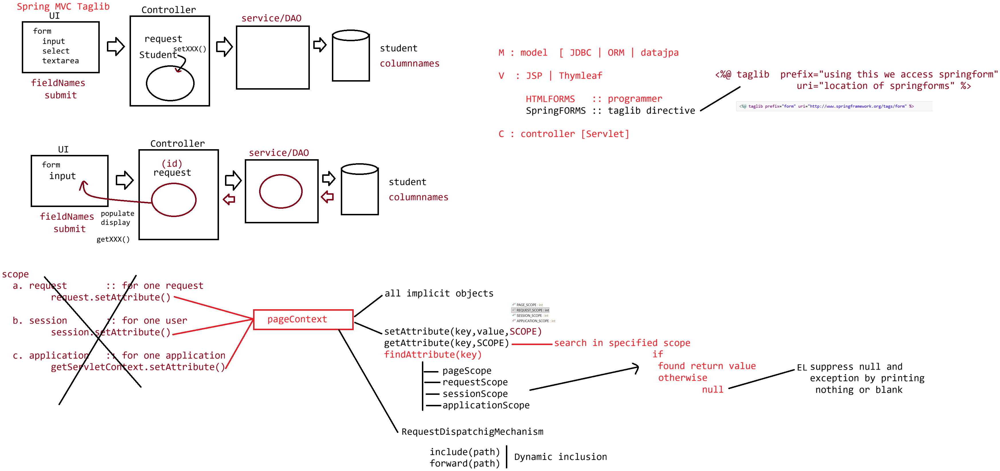

# Day-31 — 16-06-2026 — All Implicit Objects Is Covered and Taglib Directive

---

## 🧩 JSP Implicit Objects (List)

- `request`
- `response`
- `session`
- `out`
- `pageContext`
- `page`
- `config`
- `application`
- `exception`

---

## 📐 Directives

### a. page

```jsp
<%@ page attribute="attributeValue" %>
```

Attributes: `import`, `language`, `pageEncoding`, `contentType`, `isELIgnored`, `errorPage`, `isErrorPage`, `session`, `extends`, `buffer`, `autoFlush`

### b. include

```jsp
<%@ include file="" %>
```

Supports **static inclusion**.

### c. taglib

Indicates the location of 3rd-party libraries to be used inside JSP.

```jsp
<%@ taglib prefix="" uri=""%>
```

**case1 (Spring form tags):**

```jsp
<%@ taglib prefix="form" uri="http://www.springframework.org/tags/form" %>
```

---

## ⚙️ Working with Implicit Objects — `config`

`config` :: `ServletConfig`

Config object parameters are **local to that particular servlet**. If we want that parameter data shared to JSP, it should be sent via any scope. It **cannot** be accessed via the `config` object available inside JSP as if it were the servlet’s init params automatically.

### eg#1 — Servlet init params → request attributes → JSP

```java
import java.io.IOException;
import javax.servlet.ServletConfig;
import javax.servlet.ServletException;
import javax.servlet.annotation.WebInitParam;
import javax.servlet.annotation.WebServlet;
import javax.servlet.http.HttpServlet;
import javax.servlet.http.HttpServletRequest;
import javax.servlet.http.HttpServletResponse;

@WebServlet(
		urlPatterns = { "/employee" }, 
		initParams = { 
				@WebInitParam(name = "userName", value = "sachin"), 
				@WebInitParam(name = "userAge", value = "55")
		})
public class EmployeeController extends HttpServlet {
	private static final long serialVersionUID = 1L;
       
   
    public EmployeeController() {
        super();
        // TODO Auto-generated constructor stub
    }

	
	protected void doGet(HttpServletRequest request, HttpServletResponse response) throws ServletException, IOException {

		ServletConfig config = getServletConfig();
		System.out.println(config);
		String userName = config.getInitParameter("userName");
		String userAge = config.getInitParameter("userAge");
		
		//keep in request object and forward the request
		request.setAttribute("userName", userName);
		request.setAttribute("userAge", userAge);
		
		request.getRequestDispatcher("index.jsp").forward(request, response);
		
	}

	
	protected void doPost(HttpServletRequest request, HttpServletResponse response) throws ServletException, IOException {
		// TODO Auto-generated method stub
		doGet(request, response);
	}

}
```

### `index.jsp`

```jsp
<%@ page language="java" %>	
<html>
   <head>
		<title>OUTPUT</title>
   </head>
   <body>
   		Config object is :: <%= config %> <br/>
   		<h1>
		Config data is : <%= request.getAttribute("userName")%> <br/> 
			<%= request.getAttribute("userAge") %><br/>
		</h1>
   </body>
</html>
```

**Request:** `http://localhost:9999/FirstJspApp/employee`

**Response (mentor output):**

```text
Controller       :: org.apache.catalina.core.StandardWrapperFacade@15f0c535
Config object is :: org.apache.catalina.core.StandardWrapperFacade@3fda4d83
Config data is   ::  sachin, 55
```

JSP’s `config` is the **JSP’s own** `ServletConfig`, not the controller’s—hence different facade hash; values arrive via request attributes.

---

## 🌐 `application` :: `ServletContext`

Data kept inside `ServletContext` is available across all resources for the entire application.

### EmployeeController (`/employee`) with `loadOnStartup`

```java
import java.io.IOException;
import javax.servlet.ServletConfig;
import javax.servlet.ServletContext;
import javax.servlet.ServletException;
import javax.servlet.annotation.WebInitParam;
import javax.servlet.annotation.WebServlet;
import javax.servlet.http.HttpServlet;
import javax.servlet.http.HttpServletRequest;
import javax.servlet.http.HttpServletResponse;

@WebServlet(
		urlPatterns = { "/employee" }, 
		initParams = { 
				@WebInitParam(name = "userName", value = "sachin"), 
				@WebInitParam(name = "userAge", value = "55")
		},loadOnStartup=1)
public class EmployeeController extends HttpServlet {
	private static final long serialVersionUID = 1L;
       
   
    public EmployeeController() {
        super();
        // TODO Auto-generated constructor stub
    }

	@Override
    public void init() throws ServletException {
    	
    	ServletContext context = getServletContext();
    	context.setAttribute("userName", getServletConfig().getInitParameter("userName"));
    	context.setAttribute("userAge", getServletConfig().getInitParameter("userAge"));
    	
    }
	
	protected void doGet(HttpServletRequest request, HttpServletResponse response) throws ServletException, IOException {

		
		
		request.getRequestDispatcher("index.jsp").forward(request, response);
		
	}

	
	protected void doPost(HttpServletRequest request, HttpServletResponse response) throws ServletException, IOException {
		// TODO Auto-generated method stub
		doGet(request, response);
	}

}
```

### `index.jsp`

```jsp
<%@ page language="java" %>	
<html>
   <head>
		<title>OUTPUT</title>
   </head>
   <body>
   		Context object is :: <%= application %> <br/>
   		<h1>
		Application data is : <%= application.getAttribute("userName")%> and 
			<%= application.getAttribute("userAge") %><br/>
		</h1>
   </body>
</html>
```

### `second.jsp`

```jsp
<%@ page language="java" %>	
<html>
   <head>
		<title>OUTPUT</title>
   </head>
   <body>
   		Context object is :: <%= application %> <br/>
   		<h1>
		Application data is : <%= application.getAttribute("userName")%> and 
			<%= application.getAttribute("userAge") %><br/>
		</h1>
   </body>
</html>
```

**Request:** `http://localhost:9999/FirstJspApp/employee`

```text
Context object is :: org.apache.catalina.core.ApplicationContextFacade@435fce79
Application data is : sachin and 55
```

**Request:** `http://localhost:9999/FirstJspApp/second.jsp`

```text
Context object is :: org.apache.catalina.core.ApplicationContextFacade@435fce79
Application data is : sachin and 55
```

Same `application` facade and shared attributes across pages.

---

## 📄 `page` and `pageContext`

```jsp
<%@ page language="java" %>	
<html>
   <head>
		<title>OUTPUT</title>
   </head>
   <body>
   		<h1> Page Object is : <%= page %><br/>
		<h2> Value of this :  <%= this %>

		<hr/>
		<h1> PageContext object is : <%= pageContext %>
   </body>
</html>
```

`page` corresponds to `this` (the generated Servlet instance); `pageContext` is the central JSP context object.

---

## 🤖 AI Points

1. **Production consideration:** Put app-wide config in `ServletContext` (or Spring `@Value`/config props)—not servlet-local init params if JSPs need them.
2. **Industry practice:** Forward init data via request/session/application scopes; do not assume JSP `config` equals the controller’s `ServletConfig`.
3. **Common mistake:** Reading `config.getInitParameter` in JSP expecting controller `@WebInitParam` values—those belong to the servlet mapping, not the JSP.
4. **Interview insight:** `application` attributes survive across pages and requests for the whole web app lifecycle.
5. **Modern Spring Boot connection:** `taglib` for Spring form tags (`spring:form`) is how JSP apps bind forms—Thymeleaf replaces this in many Boot apps.

---

## 💻 My Codes


  
## 🖼️ Image


