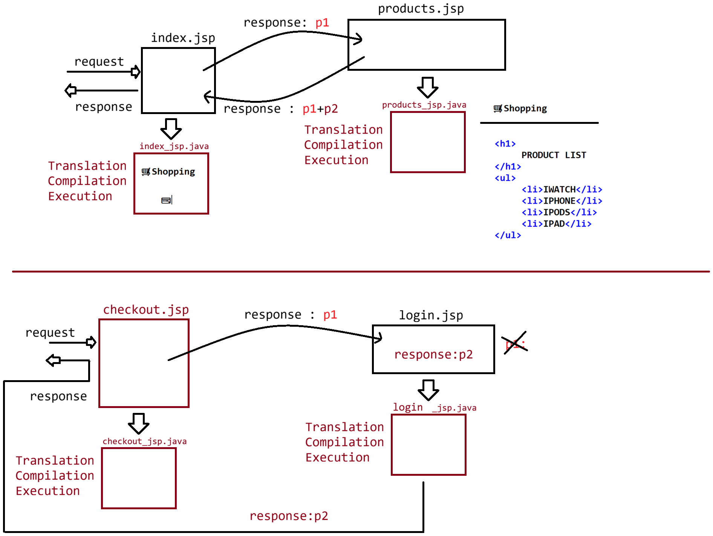

# Day-32 — 17-06-2026 — Pagecontext Operations and Introduction to EL and JSTL

---

## 🧩 JSP Recap

UI technology built on top of Servlet.

### Tags

- Scriptlet: `<% statement; %>`
- Expression: `<%= expr %>`
- Declarative: `<%! statement; %>`

### Directives

- **page** — inform about the API used in a page: `<%@ page attributeName="attributeValue" %>`
- **taglib** — import 3rd-party library: `<%@ taglib prefix="" uri=""%>`
- **include** — static inclusion: `<%@ include file=""%>`

### Implicit objects

- `request`, `response`, `session`, `out`, `config`, `application`, `exception`, `page`
- `pageContext`

---

## 🧪 eg#1 — Accessing Objects via `pageContext`

```jsp
<%@ page language="java" isErrorPage="true"%>	
<html>
   <head>
		<title>OUTPUT</title>
   </head>
   <body>
   <%
		int c = 10/0;
   %>
   	<h1> Request  object : <%= pageContext.getRequest() %></h1>
	<h1> Response object : <%= pageContext.getResponse() %></h1>
	<h1> Session  object : <%= pageContext.getSession() %></h1>
	<h1> CONFIG   object : <%= pageContext.getServletConfig() %></h1>
	<h1> Context  object : <%= pageContext.getServletContext() %></h1>
	<h1> Exception  object : <%= pageContext.getException() %></h1>
	<h1> Out  object : <%= pageContext.getOut() %></h1>
   </body>
</html>
```

**Output (mentor):**

```text
Request object : org.apache.catalina.connector.RequestFacade@7b4034bc
Response object : org.apache.catalina.connector.ResponseFacade@3a996e38
Session object : org.apache.catalina.session.StandardSessionFacade@3ba4574d
CONFIG object : org.apache.catalina.core.StandardWrapperFacade@3a006014
Context object : org.apache.catalina.core.ApplicationContextFacade@c8b75e
Exception object : null
Out object : org.apache.jasper.runtime.JspWriterImpl@69a56ac8
```

---

## 🧪 eg#2 — Scoped Attributes with `pageContext`

```jsp
	<%
		pageContext.setAttribute("userName","sachin");
		pageContext.setAttribute("NAME","dravid",2);
		pageContext.setAttribute("userrName","saurav",3);
		pageContext.setAttribute("nAmE","kohli",4);
		
   	%>
   	
	<h1>
		Scope based data is : <%= pageContext.getAttribute("name")%><br/>
		Scope based data is : <%= pageContext.findAttribute("name")%>
	</h2>
```

**Output:**

```text
Scope based data is : null
Scope based data is : null
```

Lookup key `"name"` does not match stored keys (`userName`, `NAME`, `userrName`, `nAmE`) — both `getAttribute` and `findAttribute` return null.

Scope integers used with `setAttribute(name, value, scope)` (mentor demo): page default, then scopes `2`, `3`, `4`.

---

## 🧪 eg#3 — Dynamic Dispatcher: `include(path)` and `forward(path)`

### `index.jsp` with `pageContext.include`

```jsp
<%@ page language="java" contentType="text/html; charset=UTF-8"
    pageEncoding="UTF-8"%>
<html>
   <head>
		<title>OUTPUT</title>
   </head>
   <body>
   
   <h1>
		🛒Shopping
   </h1>
   <hr>
	<%
		pageContext.include("products.jsp");
	%>
	<hr>
	<button>💳</button>
   </body>
</html>
```

### `products.jsp`

```jsp
<%@ page language="java" contentType="text/html; charset=UTF-8"
    pageEncoding="UTF-8"%>	
<html>
   <head>
		<title>OUTPUT</title>
   </head>
   <body>
   
   <h1>
		PRODUCT LIST
   </h1>
   <ul>
		<li>IWATCH</li>
		<li>IPHONE</li>
		<li>IPODS</li>
		<li>IPAD</li>
   </ul>
   
	
   </body>
</html>
```

**Output:**

```text
🛒Shopping
PRODUCT LIST
  IWATCH
  IPHONE
  IPODS
  IPAD
💳
```

---

## 🔀 Using `pageContext.forward()`

### `index.jsp`

```jsp
<%@ page isErrorPage="true" %>
<%
	boolean isAvailable = false;
	if(!isAvailable){
			pageContext.forward("login.jsp");
	}
%>
<h1>CheckoutPage</h1>
```

### `login.jsp`

```jsp
<h1>
	Please enter the credentials and login to the page
</h1>
```

**Output:**

```text
Please enter the credentials and login to the page
```

(`CheckoutPage` is not shown after forward.)

---

## 🔤 Expression Language (EL) Introduction

- Main aim of JSP is to remove Java code from JSP; to do so we write presentation reads in EL.
- Java code historically: set value and read the value [EL]; methods / business logic elsewhere.
- **EL is mainly meant for reading the data.**

**Q:** Can EL have exposure of writing business logic which generates dynamic code?  
**Ans:** No.  
**Solution:** use **JSTL** (JSP Standard Tag Library).

**EL + JSTL** help remove Java code completely from JSP.

How EL is used to read values for presentation:

- **a.** EL operators  
- **b.** EL implicit objects  

---

## 🤖 AI Points

1. **Production consideration:** Prefer `pageContext.include` / `forward` carefully—forward replaces the response; include composes fragments.
2. **Industry practice:** Use EL+JSTL for reads and control flow instead of scriptlets once pageContext demos are understood.
3. **Common mistake:** Attribute key case/spelling mismatches (`name` vs `NAME` / `nAmE`) yield silent nulls with EL/`findAttribute`.
4. **Interview insight:** `pageContext` can get every major implicit object and perform scoped set/get/find plus include/forward.
5. **Real-world connection:** Shopping page include of `products.jsp` is the same fragment idea Thymeleaf `th:replace` / server-side includes solve today.

---

## 💻 My Codes


  
## 🖼️ Image


