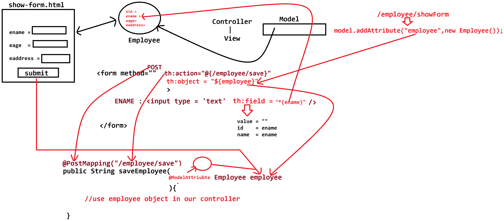

# Day-34 — 21-06-2026 — Spring MVC Read Parameter Use Model to Display Form Binding

---

## 🧩 Spring MVC Core Pieces

1. **DispatcherServlet** — via `spring-starter-web-mvc` (Spring Boot starter for web MVC)
2. **HandlerMapper**
3. **Controller** — programmer
4. **View** — programmer
5. **ViewResolver** — configured in `application.properties`

---

## 📥 Reading Input from the UI

### a. Query string (web apps) — `@RequestParam`

**GET:** `http://localhost:9999/employee/findById?id=10`

```java
@Controller
@RequestMapping("/employee")
public class EmployeeController {

	@GetMapping("/findById")
	public String showData(@RequestParam Integer id){
		// id should be used here
		return "...";
	}
}
```

**GET with multiple params:** `http://localhost:9999/employee/findById?id=10&name=sachin`

```java
@GetMapping("/findById")
public String showData(@RequestParam("id") Integer eid, 
		       @RequestParam String name){
	// eid and name should be used here
	return "...";
}
```

- Explicit name: `@RequestParam("id") Integer eid`
- Implicit name from parameter: `@RequestParam String name`

---

### b. Path variable (web and RESTful) — `@PathVariable`

**GET:** `http://localhost:9999/employee/findById/{id}`  
Examples: `/7`, `/18`, `/10`

```java
@GetMapping("/findById/{id}")
public String showData(@PathVariable Integer id){
	// id should be used here
	return "...";
}
```

**Two path variables:** `http://localhost:9999/employee/findById/{id}/{name}`  
Examples: `/10/sachin`, `/7/dhoni`, `/18/kohli`

```java
@GetMapping("/findById/{id}/{name}")
public String showData(@PathVariable Integer id, 
		       @PathVariable String name){
	// id and name should be used here
	return "...";
}
```

**Mixed path segments:** `http://localhost:9999/employee/findById/{id}/name/{address}`  
Examples: `/10/name/MI`, `/7/name/CSK`, `/18/name/RCB`

```java
@GetMapping("/findById/{id}/name/{address}")
public String showData(
		@PathVariable Integer id, 
		@PathVariable String address){
	// id and address should be used here
	return "...";
}
```

---

## 📤 Sending Data from Controller to View — `Model`

Want to send:

- a. String type  
- b. Object type  
- c. Collection type: Array, List, `List<T>`

**Answer:** `Model` object

```java
model.addAttribute(String key, Object value);
// value can be String, Array, List<Employee> employees
// Employee fields: eid, ename, eage, eaddress

model.addAttribute("employees", employees);
```

### View (Thymeleaf)

```html
<tr th:each="emp:${employees}">
	<td th:text="${emp.eid}"></td>
	<td th:text="${emp.ename}"></td>
	<td th:text="${emp.eage}"></td>
	<td th:text="${emp.eaddress}"></td>
</tr>
```

---

## 📝 Form Binding — `@ModelAttribute`

Form data bound to a model / entity:

```text
EmployeeForm		    Employee(M)
	ename    <----> 	ename(String)
	eage     <----->        eage(Integer)
	eaddress <----->	eaddress(String)

	   submit ==============> Controller ---> Service --> DAO ---> Database(AI)
	   update <-------------- Controller <--- Service <-- DAO <--- Database
```

**Answer:** `@ModelAttribute`

---

## ✅ Task Outline

### a. URL: `http://localhost:9999/employee/showForm`

1. Use `Model` and share an `Employee` object with no values to `showForm.html`
2. Inside `showForm.html` use the employee object and Thymeleaf to show/bind data with `th:field` and `th:object`

### b. URL: `http://localhost:9999/employee/save`

1. Use `@ModelAttribute` to get the employee object filled with meaningful values entered by the user
2. Use `Model` to share data from controller to UI (`viewName`: `showData.html`)

---

## 🤖 AI Points

1. **Production consideration:** Prefer `@RequestParam` for filters/search and `@PathVariable` for resource identity in REST-style URLs.
2. **Industry practice:** Bind forms with `@ModelAttribute` + Thymeleaf `th:object`/`th:field` instead of reading every field via `request.getParameter`.
3. **Common mistake:** Mismatching path template names (`{id}`) and `@PathVariable` method parameter names without an explicit name.
4. **Interview insight:** DispatcherServlet → HandlerMapping → Controller → Model → ViewResolver → View is the Spring MVC request pipeline.
5. **Modern Spring Boot connection:** `spring-boot-starter-web` auto-configures DispatcherServlet and ViewResolvers; Thymeleaf starter wires HTML views used in this lecture’s `th:each` / form binding.

---

## 💻 My Codes


  
## 🖼️ Image


