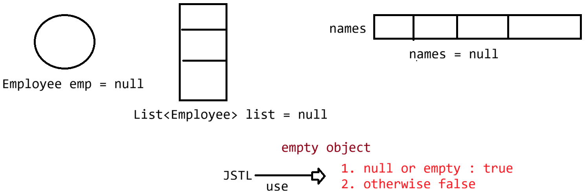

# Day-36 — 23-06-2026 — EL Operators and JSTL Core Library

---

## 🧩 EL Operators

Expression Language (EL) supports arithmetic, logical, relational, and the `empty` operator for presenting data in JSP without scriptlets.

### Arithmetic operators

- Operators: `+`, `-`, `*`, `/`, `%`

#### `+` operator rules

1. `null` is treated as zero
2. `""` is treated as zero (internally `Integer.parseInt("data")`)
3. `+` is **not** overloaded for string concatenation — it performs addition only

#### `/` and `%`

They follow IEEE 754 style numeric behaviour (16-bit related discussion in lecture):

| Expression | Result |
|---|---|
| `data / 0` | `Infinity` |
| `0 / 0` | `NaN` |
| `data % 0` | `ArithmeticException: / by zero` |

- `/` → division
- `%` → remainder

```jsp
${10/3 }<br/>
${10/0 }<br/>
${0/0 }
${10%1}
```

```text
Output
3.3333333333333335
Infinity
-Infinity
NaN
1
0
```

> **Correction:** Mentor output also listed `-Infinity` / extra lines relative to the four expressions shown; treat the IEEE behaviour (`Infinity`, `NaN`) as the teaching point.

### Logical operators

| Operator | Meaning |
|---|---|
| `&&`, `&` | and |
| `\|\|`, `\|` | or |
| `!` | not |

### Relational operators

| Symbol | Word form |
|---|---|
| `<`, `<=` | `lt`, `le` |
| `>`, `>=` | `gt`, `ge` |
| `==`, `!=` | `eq`, `ne` |

```jsp
${ 10 eq 10 }<br/>
${10 ne 10 } <br/>
${10 le 5 }<br/>
${10 lt 5 }<br/>
```

```text
Output
true
false
false
false
```

---

## 🧩 `empty` Operator

The `empty` operator checks whether an object, array, or collection is null/empty.

```jsp
<%!

public class Employee {
	private Integer eid;
	private String ename;

	public Employee(){
		
	}
	
	public Employee(Integer eid, String ename) {
		this.eid = eid;
		this.ename = ename;
	}

	public Integer getEid() {
		return eid;
	}

	public String getEname() {
		return ename;
	}
	
	@Override
	public String toString() {
		return "Employee [eid=" + eid + ", ename=" + ename + "]";
	}

}
%>

<%
	Employee e1 = new Employee(7,"dhoni");
	Employee e2 = new Employee(18,"kohli");
	Employee e3 = new Employee(19,"dravid");
	
	List<Employee> list = List.of(e1,e2,e3);
	pageContext.setAttribute("list", list);
	
	Employee employee = new Employee(10,"sachin");
	pageContext.setAttribute("employee", employee);
%>

	<%
		String names[] = {"sachin","saurav","dhoni"};
		pageContext.setAttribute("names", names);
	
	%>
	
	<h1>Status is : ${empty employee }</h1>
	<h1>Employee Data is : ${employee }</h1>
	
	<h1>Result is : ${empty names }</h1>
	<h1>
		Names are :: <span>${names }</span>
	</h1>
	
	<h1>List Result is : ${empty list }</h1>
	<h1>Employees Data is : ${list }</h1>
```

```text
Output
Status is : false
Employee Data is : Employee [eid=10, ename=sachin]
Result is : false
Names are :: [Ljava.lang.String;@f9510c3
List Result is : false
Employees Data is : [Employee [eid=7, ename=dhoni], Employee [eid=18, ename=kohli], Employee [eid=19, ename=dravid]]
```

---

## 🧩 JSP → EL + JSTL

```text
|JSP => EL + JSTL|
```

**JSTL** is a library given by Sun Microsystems to provide commonly used actions to present data on the UI page **without writing Java code**.

Categories:

| Category | Purpose |
|---|---|
| Conditional | true/false, branching, exception-based |
| Iteration | `forEach` (iterate), `forTokens` (split and iterate) |
| Formatting | date, currency, locale |
| Functions | data manipulation methods |

### Core tags demo (`c:set`, `c:out`, `c:remove`)

```jsp
<%@page import="org.apache.catalina.valves.StuckThreadDetectionValve"%>
<%@ page language="java" contentType="text/html; charset=UTF-8"
	pageEncoding="UTF-8" import="java.util.*" %>

<%@ taglib prefix="c" uri="http://java.sun.com/jsp/jstl/core" %>

<!DOCTYPE html>
<html>
<head>
<meta charset="UTF-8">
<title>Insert title here</title>
</head>
<body>

	<%-- pageContext.setAttribute("name","sachin",1) --%>
	<c:set value="sachin" var="name" scope="page"/>
	
	<%--pageContext.findAttribute("name") --%>
	<c:out value="${name }"/>
	
	<%--pageContext.removeAttriubte("name") --%>
	<c:remove var="name"/>
</body>
</html>
```

### Exception handling + `c:if` pattern

```jsp
<c:catch var="e">
	<%--risky code :: e== null if not exception otherwise e = object --%> 
	<%
	  int a= Integer.parseInt(request.getParameter("age"));
	%>
</c:catch>
	
<c:if test="${not empty e }">
	<%-- handling exception object --%>
</c:if>
```

---

## 🤖 AI Points

1. **Production consideration:** Prefer word-form relational operators (`eq`, `ne`, `lt`, `gt`) in EL inside XML/JSP markup so `<` / `>` never break tag parsing.
2. **Industry practice:** Keep scriptlets for demos only; production JSP views should rely on EL + JSTL so presentation stays free of Java logic.
3. **Common mistake:** Expecting `+` in EL to concatenate strings like Java — EL `+` is numeric addition, and empty/null coerce toward zero.
4. **Interview insight:** `empty` works across null, empty strings, empty collections, and empty arrays — one operator covers several “is blank?” checks.
5. **Real-world connection:** Modern Spring Boot apps often use Thymeleaf instead of JSP/JSTL, but the same ideas (expressions, conditionals, iteration, formatting) map directly onto `th:*` attributes.

---

## 💻 My Codes


  
## 🖼️ Image


