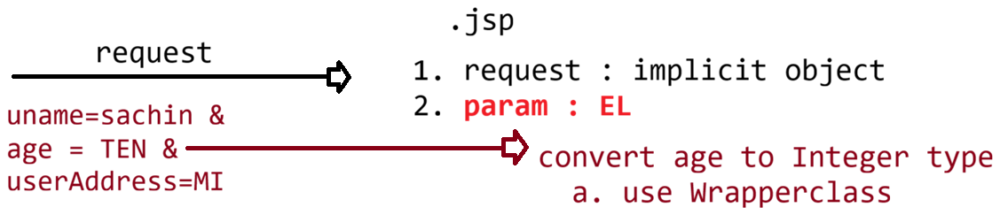

# Day-37 — 24-06-2026 — Coretags of JSTL If If Else Switch Foreach Urltags

---

## 🧩 JSP → EL + JSTL Recap

```text
JSP => EL + JSTL

EL   => ${variable} | ${obj.variableName} | ${obj['index'|"index"]

JSTL => tags given to perform
	a. iteration and conditional checks
	b. formatting
	c. functional based outputs
```

### Core tags

| Tag | Role |
|---|---|
| `<c:set var="" value="" scope=""/>` | Set scoped attribute |
| `<c:out value=""/>` | Print value |
| `<c:remove var=""/>` | Remove attribute |
| `<c:catch var="">...</c:catch>` | Catch risky code |

```jsp
<c:catch var="">
	<%-- risky code --%>
</c:catch>
```

---

## 🧩 Conditional Tags

### `c:if`

```jsp
<c:if test="condition">
	<%-- TRUE --%>
</c:if>
```

### if-else via `c:choose`

```jsp
<c:choose>
	<c:when test=""></c:when>
	<c:otherwise> </c:otherwise>
</c:choose>
```

### switch-style branching (multiple `c:when`)

```jsp
<c:choose>
	<c:when test=""></c:when>
	<c:when test=""></c:when>
	<c:when test=""></c:when>
	<c:otherwise> </c:otherwise>
</c:choose>
```

---

## 🧩 Iteration Tags

### Numeric `forEach` (classic for-loop style)

```jsp
<c:forEach var="iteratingvariable" begin="" end="" step="">
</c:forEach>
```

### Collection `forEach`

```jsp
<c:forEach items="${iterationobject}" var="variabletoUse">
</c:forEach>
```

---

## 🧩 URL / Param Tags

```jsp
<c:url value="" var="">
	<c:param name="" value=""/>
</c:url>
<a href="${var}"> UPDATE | DELETE </a>
```

`var` becomes: `value?name=value`

```jsp
<c:url value="http://localhost:9999/index.jsp" var="url">
	<c:param name="id" value="${emp.eid }"/>
</c:url>
<a href="${url }">
	UPDATE|DELETE
</a>
```

```text
output: http://localhost:9999/index.jsp?id=10
					id=7
					id=18
```

---

## 🧩 Example 1 — `c:catch` + `c:if` for Invalid Age

```jsp
<%@page import="org.apache.catalina.valves.StuckThreadDetectionValve"%>
<%@ page language="java" contentType="text/html; charset=UTF-8"
	pageEncoding="UTF-8" import="java.util.*" %>

<%@ taglib prefix="c" uri="http://java.sun.com/jsp/jstl/core" %>

<!DOCTYPE html>
<html>
<head>
<meta charset="UTF-8">
<title>Insert title here</title>
</head>
<body>

	<h1>Username is : ${param.userName }</h1>
	<c:catch var="e">
		<%--risky code :: e== null if no exception occurs otherwise e = Exception --%> 
		<%
			int a= Integer.parseInt(request.getParameter("age"));
		%>
		<h1>Age is : ${param.age }</h1>
	</c:catch>
	
	<c:if test="${not empty e }">
		<%-- handling exception object --%>
		<h1> Something went wrong with the input :<span style="color:red;"> ${e.message }</span></h1>
	</c:if>
	
	<h1>UserAddress is : ${param.userAddress }</h1>
	
</body>
</html>
```

---

## 🧩 Example 2 — Employee Dashboard with Grades

`if-else` is implemented via switch-style `c:choose` in JSTL. Nested `c:choose` assigns grades from marks.

```jsp
<%@page import="org.apache.catalina.valves.StuckThreadDetectionValve"%>
<%@ page language="java" contentType="text/html; charset=UTF-8"
	pageEncoding="UTF-8" import="java.util.*"%>

<%@ taglib prefix="c" uri="http://java.sun.com/jsp/jstl/core"%>

<!DOCTYPE html>
<html>
<head>
<meta charset="UTF-8">
<title>Insert title here</title>
</head>
<body>

	<%!public class Employee {
		private Integer eid;
		private String ename;
		private Integer marks;

		public Employee(Integer eid, String ename,Integer marks) {
			this.eid = eid;
			this.ename = ename;
			this.marks = marks;
		}

		public Integer getEid() {
			return eid;
		}
		public Integer getMarks() {
			return marks;
		}

		public String getEname() {
			return ename;
		}

		@Override
		public String toString() {
			return "Employee [eid=" + eid + ", ename=" + ename + "]";
		}

	}%>

	<%
	Employee e1 = new Employee(10, "sachin",70);
	Employee e2 = new Employee(7, "dhoni",55);
	Employee e3 = new Employee(18, "kohli",60);
	List<Employee> emps = List.of(e1, e2, e3);
	pageContext.setAttribute("emps", emps);
	%>

	<%-- if-else is implemented via switch statement in JSTL --%>
	<c:choose>
		<c:when test="${empty emps }">
			<h1>Record not found</h1>
		</c:when>

		<c:otherwise>
			<%-- Iterate and display the record in the form of table --%>
			<table border="1" cellpadding="3">
				<caption>
					<b>EMPLOYEE DASHBOARD</b>
				</caption>
				<thead>
					<tr>
						<th>ID</th>
						<th>NAME</th>
						<th>MARKS</th>
						<th>GRADE</th>
					</tr>
				</thead>
				
				<tbody style="text-align:center;">
					
					<c:forEach items="${emps }" var="emp">
						<tr>
							<td>${emp.eid }</td>
							<td>${emp.ename }</td>
							<td>${emp.marks }</td>
							<td>
								<c:choose>
									<c:when test="${emp.marks ge 90 }">
										<span style="color:red;">GRADE A</span>
									</c:when>
									<c:when test="${emp.marks ge 70 }">
										<span style="color:goldenrod;">GRADE B</span>
									</c:when>
									<c:when test="${emp.marks ge 60 }">
										<span style="color:blue;">GRADE C</span>
									</c:when>
									<c:otherwise>									
										<span style="color:green;">GRADE D</span>
									</c:otherwise>
								</c:choose>
							</td>
						</tr>
					</c:forEach>	
				</tbody>
			</table>
			
		</c:otherwise>
	</c:choose>
	
	<c:forEach begin="5" end="50" var="i" step="5">
		<h1>${i }</h1>
	</c:forEach>
	
	<%
		String names[] = {"sachin","saurav","dhoni","kohli"};
		pageContext.setAttribute("names", names);
	%>
	
	Names are : <c:forEach items="${ names}" var="name">
					<h1>${name }</h1>
				</c:forEach>

</body>
</html>
```

Grade thresholds from the lecture:

| Condition | Grade |
|---|---|
| `marks ge 90` | GRADE A |
| `marks ge 70` | GRADE B |
| `marks ge 60` | GRADE C |
| otherwise | GRADE D |

---

## 🤖 AI Points

1. **Production consideration:** Build update/delete links with `<c:url>` + `<c:param>` so query strings are encoded correctly and context-path issues are reduced.
2. **Industry practice:** Use nested `c:choose` for multi-branch UI decisions (grades, status badges) instead of scriptlet `if/else` chains.
3. **Common mistake:** Forgetting that JSTL has no dedicated `if-else` tag — `c:choose` / `c:when` / `c:otherwise` is the idiomatic substitute.
4. **Interview insight:** `c:forEach` covers both index loops (`begin`/`end`/`step`) and collection iteration (`items`/`var`) with one tag family.
5. **Real-world connection:** Catching `NumberFormatException` via `c:catch` on form params mirrors server-side validation UX before Spring Boot `@Valid` / BindingResult became the norm.

---

## 💻 My Codes


  
## 🖼️ Image


