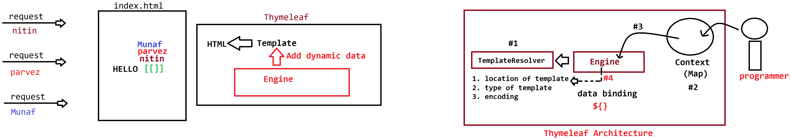

# Day-39 — 29-06-2026 — Functions in JSTL and Introduction to Thymeleaf

---

## 🧩 JSTL Recap — Core, Iteration, Conditional, Format

```text
JSP = EL + JSTL
```

### Core library

- `<c:set var="" value="" scope=""/>`
- `<c:out value="" />`
- `<c:remove var=""/>`
- `<c:catch var="" scope="">...</c:catch>`
- `<c:url value="" var=""><c:param name="" value=""/></c:url>`
- `<c:redirect url=""/>`
- `<c:import url=""/>`

### Iteration tags

- `<c:forEach begin="" end="" step="" var="" items="obj"></c:forEach>`
- `<c:forTokens items="" delims="" var=""/>`

### Conditional tags

```jsp
<c:if test=""></c:if>
<c:choose>
	<c:when test=""></c:when>
	<c:otherwise></c:otherwise>
</c:choose>
```

### Format tags

```jsp
<fmt:formatNumber var="" value="" type="" pattern=""/>
<fmt:setLocale value=""/>
<fmt:formatDate var="" value="" pattern=""/>
<fmt:setBundle basename=""/>
<fmt:message key=""/>
```

---

## 🧩 I18N with JSTL Format Bundle

Depending upon the locale of the application, the page should display localized details.

Example: US — currency `$`, language `en`.

### Step A — Properties files (`src/main/java` / resources, basename `messages`)

`message.properties` / `messages.properties`:

```properties
welcome=WELCOME
logout=LOGOUT
```

`messages_hi.properties`:

```properties
welcome=\u0938\u094D\u0935\u093E\u0917\u0924
```

### Step B — Use in JSP

```jsp
<fmt:setLocale value="hi"/>
<fmt:setBundle basename="messages"/>
<fmt:message key="welcome"/>
```

Depending upon the locale the value should change:

```text
output: स्वागत लॉग आउट
output: Bienvenue LOGOUT
```

**Note:** If the key is not present in the specified locale file, JSTL falls back to the base basename file.

---

## 🧩 Function Library (`fn`)

```jsp
<%@ taglib prefix="fn" uri="http://java.sun.com/jsp/jstl/functions"%>
```

Common functions:

| Function | Use |
|---|---|
| `length()` | Length of string/collection |
| `contains()` | Substring check |
| `toUpperCase()` | Uppercase |
| `toLowerCase()` | Lowercase |
| `split()` | Split string |
| `startsWith()` | Prefix check |
| `endsWith()` | Suffix check |

### `index.jsp` demo

```jsp
<c:set value="Learning-JSTL-is-very-easy" var="data" />
	
   <h1>Length of the string is : ${fn:length(data) }</h1>
   <h1>Does this string contains JSTL : ${fn:contains(data,"JSTL") }</h1>
   <h1>Presenting in UpperCase : ${fn:toUpperCase(data) }</h1>
   <h1>
	DATA WITH DELIMITOR ${fn:split(data," ") }
    </h1>

    <c:forEach var="result" items="${fn:split(data,'-')}">
	<span style='color:red;'>${result }</span><br/>
     </c:forEach>
	
    <h1>String with some data : ${fn:toLowerCase(data) }</h1>
```

---

## 🧩 Limitation of JSP → Why Thymeleaf?

JSP translates to a Servlet (API usage) — relatively heavy / slow compared with natural HTML templates.

### Browser-open comparison

**`index.jsp`**

```jsp
<h1>Employee Name is :${employee.name} </h1>
```

Open file in the browser → output still shows:

```text
Employee Name is :${employee.name}
```

**`index.html` (Thymeleaf attributes)**

```html
<h1 th:text value="${employee.name}">
	EmployeeName
</h1>
```

Open file in the browser → static fallback text:

```text
EmployeeName
```

Give the same file as input to **ThymeleafEngine**:

```html
<h1 th:text value="${employee.name}">
	EmployeeName
</h1>
```

```text
Output: <h1>sachin</h1> | <h1> EmployeeName </h1>
```

(Processed page shows dynamic value; unprocessed HTML still shows prototype text.)

### What is Thymeleaf?

Thymeleaf is a **Server Side Template Engine** used for generating dynamic HTML pages.

---

## 🤖 AI Points

1. **Production consideration:** Keep i18n keys in resource bundles (`messages_*.properties`) and never hard-code user-facing strings in JSP when multi-locale support is required.
2. **Industry practice:** Combine `fn:split` with `c:forEach` for delimiter-driven UI lists instead of writing Java loops in the view.
3. **Common mistake:** Assuming opening a Thymeleaf `.html` in the browser will evaluate `${...}` — without the engine, only prototype body text appears.
4. **Interview insight:** JSTL `fn` functions run in EL (`${fn:length(data)}`); they are not tag bodies — different model from core/fmt tags.
5. **Modern Spring Boot connection:** Thymeleaf became Spring Boot’s default HTML view technology because templates remain valid HTML prototypes (“natural templates”) while JSP requires container translation.

---

## 💻 My Codes


  
## 🖼️ Image


