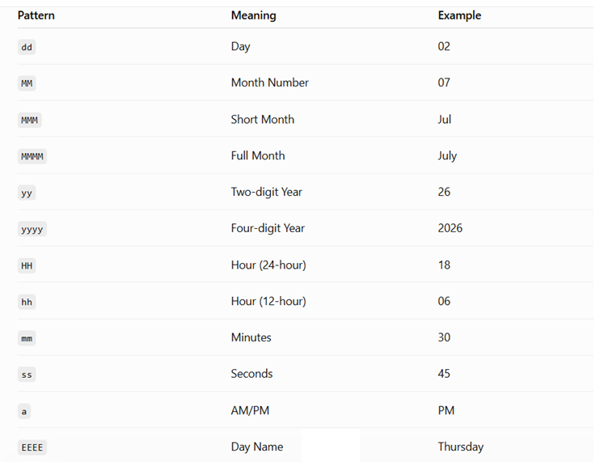

# Day-42 — 02-07-2026 — Thymeleaf Utility Objects Like Strings Temporals List Numbers and Working with URL Expression

---

## 🧩 Thymeleaf Attributes Recap

| Attribute | Notes |
|---|---|
| `th:text` | Print text |
| `th:object` | Selection root |
| `th:if` / `th:unless` | Conditionals |
| `th:each="obj,stat:${iterators}"` | Iteration; `stat` → first, last, even, odd, count, index |
| `th:class` | Ternary class expression |
| `th:with` | Local variables; ops: `gt`, `lt`, `gte`, `lte`, `eq`, `neq`, `and`, `or`, `not` |
| `th:switch` / `th:case` / `th:case="*"` | Switch + default |
| `<th:block>` | Thymeleaf-only element (not understood by browser as HTML content) |

---

## 🧩 Symbols Used in Thymeleaf

| Symbol | Meaning |
|---|---|
| `${}` | Value expression |
| `*{}` | Selection expression |
| `@{/}` | URL expression |
| `~{}` | Fragment expression |
| `#{}` | Message expression |

---

## 🧩 Utility Objects for Formatting

While presenting data we format:

- **String** → `#strings`
- **List** → `#lists`
- **LocalDate / LocalDateTime** → `#temporals`
- **Number** (integer and decimal) → `#numbers`

### String (`#strings`)

```text
${#strings.toUpperCase(input)}
${#strings.toLowerCase(input)}
${#strings.startsWith(input)}
${#strings.endsWith(input)}
${#strings.contains(input,"data")}
```

### Number (`#numbers`)

```text
#numbers.formatInteger(input, minDigitBeforeDecimal)
#numbers.formatDecimal(input, minDigitBeforeDecimal, minDigitAfterDecimal)
```

### List (`#lists`)

```text
#lists.size(data)
#lists.isEmpty(data)
#lists.contains(data,"element")
```

### LocalDate / LocalDateTime (`#temporals`)

```text
#temporals.format(input,'formatspecifiers')
```

> **Correction:** Raw note spelled `#tempoarals`; the correct utility object is `#temporals`.

---

## 🧩 URL Expression

**Syntax:**

```text
th:href="@{/URLlocation(k1=V1,K2=V2)}"
```

### Example row with utilities + URL links

```html
<tr style='text-align: center;' th:object="${emp}">
		<td th:text="*{eid}"></td>
		<td th:text="*{#strings.toUpperCase(ename)}"></td>
		<td th:text="*{#numbers.formatDecimal(salary,6,2)}"></td>
		
		<td th:text="*{#temporals.format(dateOfBirth,'EEEE dd MMM yyyy')}">
					
		</td>
				
		<td th:text="*{#temporals.format(joiningDate,'EEEE dd MMMM yy hh:mm:ss a')}">
				
		</td>
		<td>
			<a th:href="@{./homePage.html(eid=*{eid},ename=*{ename})}">UPDATE</a>
			<a th:href="@{./homePage.html(eid=*{eid},ename=*{ename})}">DELETE</a>
		</td>
</tr>
```

Highlights:

- Uppercase name via `#strings.toUpperCase`
- Salary via `#numbers.formatDecimal(salary,6,2)`
- DOB / joining date patterns with `#temporals.format`
- UPDATE / DELETE links built with `@{...(...)}` query parameters from selection expressions

---

## 🤖 AI Points

1. **Production consideration:** Format money and dates in the view with `#numbers` / `#temporals` so controllers stay free of locale-specific string formatting.
2. **Industry practice:** Build action links with `@{path(param=*{id})}` so Thymeleaf encodes query parameters correctly.
3. **Common mistake:** Calling `#strings` / `#numbers` outside a valid expression context, or forgetting selection vs value expression when already inside `th:object`.
4. **Interview insight:** Thymeleaf utility objects (`#strings`, `#lists`, `#numbers`, `#temporals`) are the counterpart of JSTL’s `fn` and `fmt` libraries.
5. **Modern Spring Boot connection:** URL expressions integrate with Spring’s context path and link rewriting when Thymeleaf is used with Spring MVC / WebFlux.

---

## 💻 My Codes


  
## 🖼️ Image


