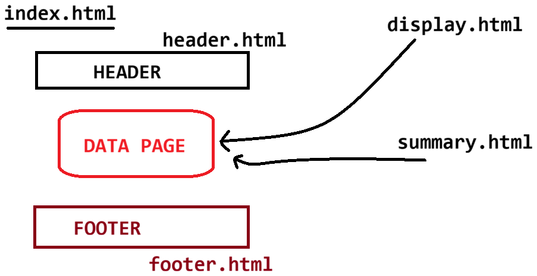

# Day-43 — 03-07-2026 — Servlet Integration with Thymeleaf Plus Fragment Expression in Thymeleaf

---

## 🧩 Thymeleaf Recap

### Attributes

- `th:text`, `th:object`, `th:class`
- `th:if` / `th:unless`
- `th:switch` / `th:case` / `th:case="*"`
- `th:with`, `<th:block>`
- `th:each`, `th:href`, `th:value` (for `<input type="" value="">`)

### Symbols

`${}`, `@{/}`, `#{}`, `*{}`, `~{}`

### Utility objects

`strings`, `lists`, `numbers`, `temporals`

---

## 🧩 Servlet + Thymeleaf Integration

Create a Maven **webapp** project and add dependencies in `pom.xml`.

```text
webapp = RESOURCES + dynamic code[ JEE API : Servlet, JSP and Thymeleaf]
		 browser to server interaction

1. artifactId = ServletThymeleafApp
2. groupId    = in.ioi.pw
3. packaging  = change from jar to war
```

### Project layout

```text
ServletThymeleafApp
	|=> src/main/java
		  |=> webapp
			 |=> WEB-INF
				|-> templates
					|=> *.html [ Thymeleaf engine]
	|=> src/main/resources
		  |=> .xml file
```

**Note:** Select the project → Alt+Enter → Project Facets → change Dynamic Web Module from **2.0** to **4.0** (to use annotations).

### `pom.xml` dependencies

```xml
<dependencies>
	<!-- Source:
	https://mvnrepository.com/artifact/javax.servlet/javax.servlet-api -->
	<dependency>
		<groupId>javax.servlet</groupId>
		<artifactId>javax.servlet-api</artifactId>
		<version>4.0.1</version>
		<scope>provided</scope>
	</dependency>

	<!-- Source: https://mvnrepository.com/artifact/org.thymeleaf/thymeleaf -->
	<dependency>
		<groupId>org.thymeleaf</groupId>
		<artifactId>thymeleaf</artifactId>
		<version>3.0.15.RELEASE</version>
		<scope>compile</scope>
	</dependency>
</dependencies>
```

---

## 🧩 Controller — `DispatcherServlet`

Uses `WebContext` (request/response/servletContext) and a shared `TemplateEngine`.

```java
package in.ioi.pw.controller;

import java.io.IOException;
import javax.servlet.ServletException;
import javax.servlet.annotation.WebServlet;
import javax.servlet.http.HttpServlet;
import javax.servlet.http.HttpServletRequest;
import javax.servlet.http.HttpServletResponse;

import org.thymeleaf.TemplateEngine;
import org.thymeleaf.context.WebContext;

import in.ioi.pw.util.ThymeleafUtil;

@WebServlet("/")
public class DispatcherServlet extends HttpServlet {
	private static final long serialVersionUID = 1L;

	protected void doGet(HttpServletRequest request, HttpServletResponse response)
			throws ServletException, IOException {
	
		WebContext context = new WebContext(request, response, getServletContext());
		
		context.setVariable("name", "PWIOI");
		context.setVariable("Course", "SpringBoot + Microservices");
		
		
		
		TemplateEngine engine = ThymeleafUtil.getEngine(getServletContext());
		
		engine.process("output", context, response.getWriter());
		
		
	}

	protected void doPost(HttpServletRequest request, HttpServletResponse response)
			throws ServletException, IOException {
		// TODO Auto-generated method stub
		doGet(request, response);
	}

}
```

---

## 🧩 Utility — Singleton-style `TemplateEngine`

Uses `ServletContextTemplateResolver` with prefix `/WEB-INF/templates/`.

```java
package in.ioi.pw.util;

import javax.servlet.ServletContext;

import org.thymeleaf.TemplateEngine;
import org.thymeleaf.templateresolver.ServletContextTemplateResolver;

public class ThymeleafUtil {

	private static TemplateEngine engine = null;

	private ThymeleafUtil() {

	}

	public static TemplateEngine getEngine(ServletContext context) {
		if (engine == null) {

		ServletContextTemplateResolver templateResolver = new ServletContextTemplateResolver(context);
			templateResolver.setPrefix("/WEB-INF/templates/");
			templateResolver.setSuffix(".html");
			templateResolver.setCharacterEncoding("UTF-8");
			templateResolver.setTemplateMode("HTML");

			engine = new TemplateEngine();
			engine.setTemplateResolver(templateResolver);

		}
		return engine;
	}

}
```

### `output.html`

```html
<!DOCTYPE html>
<html xmlns:th="http://www.thymeleaf.org">
<head>
<meta charset="UTF-8">
<title>Insert title here</title>
</head>
<body>
	<h1> JOIN <span th:text="${name}" style='color:green;'> </span></h1>
	<h2> Learn <span th:text="${Course}" 
		th:style="${#strings.length(Course)>0 ? 'color:goldenrod' :'color: red'}"></span> and get placed</h2>
</body>
</html>
```

---

## 🧩 Fragment Expression

**Declare fragment:**

```text
Syntax: th:fragment ="nameoffragment"
```

> **Correction:** Raw note wrote `th:framgement`; correct attribute is `th:fragment`.

**Use fragment:**

```text
th:insert  = ~{filenamewithoutextension :: nameoffragment}
th:replace = ~{filenamewithoutextension :: nameoffragment}
```

### Difference: `th:insert` vs `th:replace`

| Attribute | Behaviour |
|---|---|
| `th:insert` | Inserts the fragment **into** the container **without replacing** the host element |
| `th:replace` | Inserts the fragment **by replacing** the host element where `th:replace` is written |

### `output.html` with header/footer fragments

```html
<!DOCTYPE html>
<html xmlns:th="http://www.thymeleaf.org">
<head>
<meta charset="UTF-8">
<title>Insert title here</title>
<style type="text/css">
.bg-style {
	background-color: black;
	color: white;
	width: 600px;
	height: 250px;
	border: 1px solid black;
}
#container{
	border: 2px dotted red;
	width: 500px;
	height: 250px;padding: 25px;
}
</style>


</head>
<body>
	<div id='container'>
		<div th:replace="~{header :: headeroutput}"></div>
	</div>
	<h1>
		JOIN <span th:text="${name}" style='color: green;'> </span>
	</h1>
	<h2>
		Learn <span th:text="${Course}"
			th:style="${#strings.length(Course)>0 ? 'color:goldenrod' :'color: red'}"></span>
		and get placed
	</h2>
	
	<div id='container'>
		<div th:insert = "~{header :: footeroutput}">
			
		</div>
	</div>
</body>
</html>
```

### `header.html`

```html
<!DOCTYPE html>
<html xmlns:th="http://www.thymeleaf.org">
<head>
<meta charset="UTF-8">
<title>Insert title here</title>

<style type="text/css">
.bg-style {
	background-color: black;
	color: white;
	width: 250px;
	height:100px;
	border: 1px solid black;
}
</style>
</head>
<body>
	<div th:fragment="headeroutput" class='bg-style'>
		<h1>SERVICES OFFERED BY PW ARE</h1>
	</div>
	
	<div th:fragment="footeroutput" class='bg-style'>
		<h1>Loacated at : NOIDA,Bengaluru,Pune,Lucknow</h1>
	</div>
</body>
</html>
```

---

## 🧩 Stack Combinations Looking Ahead

```text
Servlet + JDBC + JSP
Servlet + ORM  + JSP
Servlet + JDBC + Thymeleaf
Servlet + ORM  + Thymeleaf ===> war ---> tomcat war file [ devtools]
```

---

## 🤖 AI Points

1. **Production consideration:** Keep templates under `/WEB-INF/templates/` so they are not directly downloadable as static files from the browser.
2. **Industry practice:** Reuse layout pieces with `th:fragment` + `th:replace`/`th:insert` (`~{file :: fragment}`) instead of copy-pasting headers/footers.
3. **Common mistake:** Confusing `th:insert` (keeps host element) with `th:replace` (swaps host element) — layouts break if the wrong one is chosen.
4. **Interview insight:** Servlet integration needs `WebContext` (not plain `Context`) so request/session/servletContext are available to expressions.
5. **Modern Spring Boot connection:** Boot + Thymeleaf still uses the same fragment syntax; only wiring moves from manual `ServletContextTemplateResolver` to auto-configuration.

---

## 💻 My Codes


  
## 🖼️ Image


