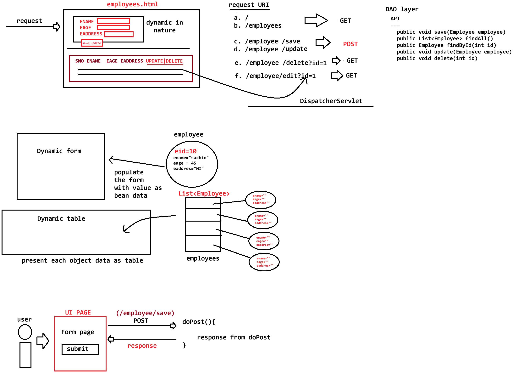

# Day-44 — 06-07-2026 — Servlet Plus Thymeleaf Plus Hibernate Fully Fledged Employeemanagementapp

---

## 🧩 Stack Overview

```text
Servlet
Thymeleaf
Hibernate

Maven style : run webapp using tomcat
```

### Employee entity fields

| Field | Meaning |
|---|---|
| `eid` | Employee id |
| `ename` | Name |
| `eage` | Age |
| `eaddress` | Address |

---

## 🧩 REST-style URL Mapping (Front Controller)

| Method | URL | Handler idea |
|---|---|---|
| GET | `/employee` | `showEmployees()` |
| POST | `/employee` | `saveEmployee()` |
| GET | `/employee/edit?id=1` | `editEmployee()` |
| POST | `/employee/update` | `updateEmployee()` |
| GET | `/employee/delete?id=1` | `deleteEmployee()` |

---

## 🧩 DAO / API Layer

```java
public void save(Employee employee)
public List<Employee> findAll()
public Employee findById(int id) 
public void update(Employee employee)
public void delete(int id)
```

---

## 🧩 `employees.html` — Form + Table Sketch

Mentor UI sketch: one form that switches between SAVE and UPDATE based on whether `employee` is present; table lists employees with UPDATE/DELETE actions.

```html
<form th:action="${employee!= null} ? '/employee/update'? '/employee/save'">

	<!-- FOR UPDATE OPERATION WE NEED employee object filled with employeeId--/>	
	<input type='text' name='eid' hidden th:value='${employee!=null?employee.eid:''}'>

	<input type ='text' name='ename' th:value='${employee!=null?employee.ename : ''}'/>


	<button th:text="${employee!=null?'UPDATE':'SAVE'}" 
		th:style='${employee!=null}?'btn btn-success':'btn-primary''>
	</button>
</form>
<hr>
<table>
	<tr>
		<td>ACTION</td>
	</tr>

	<tbody>
		<tr th:each="employee,stat: ${employees}">
			<td>*{stat.count}</td>
			<td>
				<a th:href='@{/employees/edit(id=${employee.id})}'
					class='btn btn-primary'
					>UPDATE</a>
						|
				<a th:href='@{/employees/delete(id=${employee.id})}'
				onclick="return confirm('R u sure u want to delete record???')"
				class='btn btn-danger'
				>DELETE</a>
			</td>
		</tr>
	</tbody>

</table>
```

> **Correction:** The ternary `th:action` sketch is incomplete in the raw note (`? '/employee/update'? '/employee/save'`). Intended pattern is closer to:  
> `th:action="${employee != null} ? @{/employee/update} : @{/employee/save}"`  
> Also use `${stat.count}` (value expression), not `*{stat.count}`, unless `stat` is the selection object.

Teaching points from the sketch:

1. Hidden `eid` only meaningful for update
2. Button label/style flips between UPDATE and SAVE
3. Delete link uses browser `confirm(...)`
4. Edit/delete URLs use Thymeleaf URL expressions with `id` query param

---

## 🤖 AI Points

1. **Production consideration:** Separate GET (show/edit form) from POST (save/update) and always redirect after POST (PRG) to avoid duplicate writes — continued in the next lectures.
2. **Industry practice:** Keep a thin DAO API (`save` / `findAll` / `findById` / `update` / `delete`) so the servlet front controller stays a router, not a SQL layer.
3. **Common mistake:** Reusing one form for create and update without a hidden id — updates silently create new rows.
4. **Interview insight:** A single DispatcherServlet switching on URI + method is a manual version of Spring MVC’s `DispatcherServlet` + `@RequestMapping`.
5. **Modern Spring Boot connection:** The same Employee CRUD maps cleanly onto `@Controller` + Thymeleaf + Spring Data JPA repositories.

---

## 💻 My Codes


  
## 🖼️ Image


