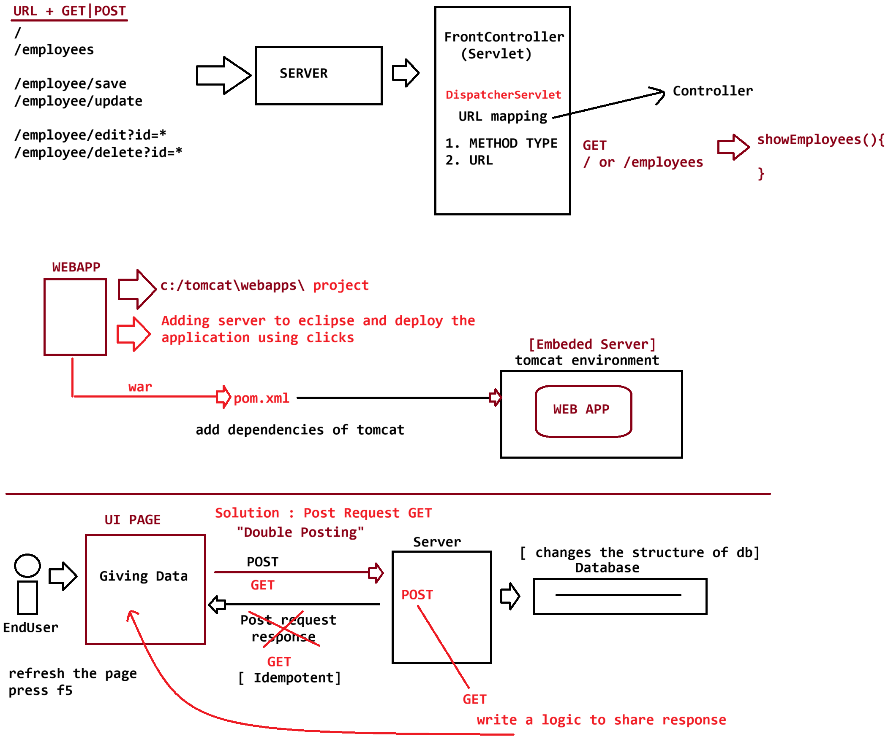

# Day-45 — 07-07-2026 — Doubleposting Embedded Server in Maven

---

## 🧩 Maven `pom.xml` — WAR + Embedded Tomcat Plugin

`EmployeeCrudApp` is packaged as a **war** and run via **tomcat7-maven-plugin** on port **9090** (embedded-style Maven Tomcat run).

```xml
<project xmlns="http://maven.apache.org/POM/4.0.0"
	xmlns:xsi="http://www.w3.org/2001/XMLSchema-instance"
	xsi:schemaLocation="http://maven.apache.org/POM/4.0.0 https://maven.apache.org/xsd/maven-4.0.0.xsd">
	<modelVersion>4.0.0</modelVersion>
	<groupId>in.ioi.pw</groupId>
	<artifactId>EmployeeCrudApp</artifactId>
	<version>1.0</version>
	<packaging>war</packaging>

	<dependencies>
		<!-- Source:
		https://mvnrepository.com/artifact/javax.servlet/javax.servlet-api -->
		<dependency>
			<groupId>javax.servlet</groupId>
			<artifactId>javax.servlet-api</artifactId>
			<version>4.0.1</version>
			<scope>provided</scope>
		</dependency>

		<!-- Source: https://mvnrepository.com/artifact/org.projectlombok/lombok -->
		<dependency>
			<groupId>org.projectlombok</groupId>
			<artifactId>lombok</artifactId>
			<version>1.14.6</version>
			<scope>compile</scope>
		</dependency>

		<dependency>
			<groupId>org.thymeleaf</groupId>
			<artifactId>thymeleaf</artifactId>
			<version>3.0.15.RELEASE</version>
		</dependency>

		<dependency>
			<groupId>org.hibernate</groupId>
			<artifactId>hibernate-core</artifactId>
			<version>5.6.15.Final</version>
		</dependency>

		<!-- JPA API -->
		<dependency>
			<groupId>javax.persistence</groupId>
			<artifactId>javax.persistence-api</artifactId>
			<version>2.2</version>
		</dependency>

		<!-- MySQL Driver -->
		<dependency>
			<groupId>mysql</groupId>
			<artifactId>mysql-connector-java</artifactId>
			<version>8.0.33</version>
		</dependency>

		<!-- Logging (recommended with Hibernate) -->
		<dependency>
			<groupId>org.slf4j</groupId>
			<artifactId>slf4j-simple</artifactId>
			<version>2.0.17</version>
		</dependency>


	</dependencies>

	<build>
		<plugins>

			<plugin>
				<groupId>org.apache.tomcat.maven</groupId>
				<artifactId>tomcat7-maven-plugin</artifactId>
				<version>2.2</version>

				<configuration>
					<port>9090</port>
				</configuration>
			</plugin>

		</plugins>
	</build>


</project>
```

Dependencies stack: Servlet API (`provided`), Lombok, Thymeleaf, Hibernate core, JPA API, MySQL connector, SLF4J simple.

---

## 🧩 Front Controller — Routing + Double-Post Concern

`DispatcherServlet` routes by `request.getServletPath()`.

### GET routes

| Path | Action |
|---|---|
| `/`, `/employees` | `showEmployees` |
| `/employee/edit` | (stub in this note) |
| `/employee/delete` | `deleteEmployee` then redirect |

### POST routes

| Path | Action |
|---|---|
| `/employee/save` | `saveEmployee` |
| `/employee/update` | (stub in this note) |

```java
package in.pw.ioi.controller;

import java.io.IOException;
import java.util.List;

import javax.servlet.ServletException;
import javax.servlet.http.HttpServlet;
import javax.servlet.http.HttpServletRequest;
import javax.servlet.http.HttpServletResponse;

import org.thymeleaf.TemplateEngine;
import org.thymeleaf.context.WebContext;

import in.pw.ioi.bean.Employee;
import in.pw.ioi.dao.EmployeeDAO;
import in.pw.ioi.util.ThymeleafUtil;

public class DispatcherServlet extends HttpServlet {
	private static final long serialVersionUID = 1L;

	private EmployeeDAO dao;

	@Override
	public void init() throws ServletException {
		dao = new EmployeeDAO();
	}

	protected void doGet(HttpServletRequest request, HttpServletResponse response)
			throws ServletException, IOException {
		String uri = request.getServletPath();
		System.out.println(uri);

		switch (uri) {
		case "/":
		case "/employees":
			showEmployees(request, response);
			break;

		case "/employee/edit":
			break;
		case "/employee/delete":
			deleteEmployee(request, response);
			break;
		default:
			break;
		}

	}

	private void deleteEmployee(HttpServletRequest request, HttpServletResponse response) throws IOException {

		int id = Integer.parseInt(request.getParameter("id"));

		dao.delete(id);

		response.sendRedirect(request.getContextPath() + "/employees");

	}

	private void showEmployees(HttpServletRequest request, HttpServletResponse response)
			throws ServletException, IOException {

		// 1. inject dao layer to get data from db
		List<Employee> employees = dao.findAll();

		TemplateEngine engine = ThymeleafUtil.getTemplateEngine(getServletContext());

		WebContext context = new WebContext(request, response, getServletContext());
		context.setVariable("employees", employees);

		engine.process("employees", context, response.getWriter());

	}

	protected void doPost(HttpServletRequest request, HttpServletResponse response)
			throws ServletException, IOException {

		String uri = request.getServletPath();
		System.out.println(uri);

		switch (uri) {
		case "/employee/save":
			saveEmployee(request, response);
			break;
		case "/employee/update":
			break;
		default:
			break;
		}

	}

	// http://localhost:9999/EmployeeCrudApp/employee/save
	private void saveEmployee(HttpServletRequest request, HttpServletResponse response) throws IOException {

		Employee employee = new Employee();

		employee.setName(request.getParameter("name"));
		employee.setAddress(request.getParameter("address"));
		employee.setAge(Integer.parseInt(request.getParameter("age")));
		employee.setSalary(Double.parseDouble(request.getParameter("salary")));

		dao.save(employee);

		// follow PRG pattern :: http://localhost:9999/EmployeeCrudApp/employees
		// System.out.println(request.getContextPath());
		// response.sendRedirect(request.getContextPath() + "/employees");

	}

}
```

### Double posting / PRG (Post-Redirect-Get)

After a successful POST save:

1. Persist via `dao.save(employee)`
2. Then call `response.sendRedirect(contextPath + "/employees")` so a browser refresh issues a GET, not another POST

In this lecture snapshot the redirect lines are still **commented**, which is exactly how refresh can **double-post** (duplicate inserts). Delete already redirects correctly.

```text
POST /employee/save  -->  save to DB
                         |
                         +--> sendRedirect GET /employees   (PRG — safe refresh)
                         |
                         +--> (if missing) browser refresh re-POSTs  (double posting)
```

---

## 🤖 AI Points

1. **Production consideration:** Always finish mutating POSTs with PRG (`sendRedirect` to a GET list page) so refresh cannot re-submit the form.
2. **Industry practice:** Run WARs during development with a Maven Tomcat plugin (`tomcat7-maven-plugin`) before packaging for a real container.
3. **Common mistake:** Leaving `sendRedirect` commented after `dao.save` — classic source of duplicate employee rows on F5.
4. **Interview insight:** Servlet API marked `provided` because the container supplies it at runtime; bundling it inside the WAR can cause classloader conflicts.
5. **Modern Spring Boot connection:** Boot’s embedded Tomcat is the evolution of “run Tomcat from the build”; PRG is still recommended (`redirect:` view names in Spring MVC).

---

## 💻 My Codes


  
## 🖼️ Image


