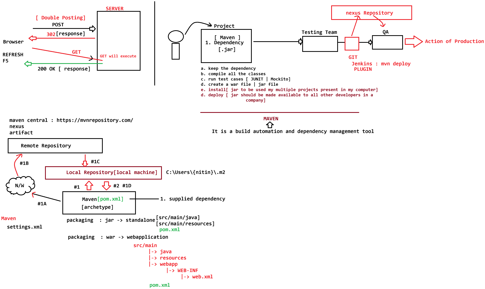

# Day-46 — 08-07-2026 — Updateoperation Maven Architecture Archetypes

---

## 🧩 Dispatcher Servlet Role

```text
a. Single Servlet capable of handling all the request.
b. UI handled via thymeleaf
c. URL - > /, /employee/save,/employee/update,/employee/edit?id=* ,/employee/delete?id=*
```

---

## 🧩 Complete Front Controller with Update / Edit

This lecture completes **edit** (GET) and **update** (POST) and enables PRG on **save**.

```java
package in.pw.ioi.controller;

import java.io.IOException;
import java.util.List;

import javax.servlet.ServletException;
import javax.servlet.http.HttpServlet;
import javax.servlet.http.HttpServletRequest;
import javax.servlet.http.HttpServletResponse;

import org.thymeleaf.TemplateEngine;
import org.thymeleaf.context.WebContext;

import in.pw.ioi.bean.Employee;
import in.pw.ioi.dao.EmployeeDAO;
import in.pw.ioi.util.ThymeleafUtil;

public class DispatcherServlet extends HttpServlet {
	private static final long serialVersionUID = 1L;

	private EmployeeDAO dao;

	@Override
	public void init() throws ServletException {
		dao = new EmployeeDAO();
	}

	protected void doGet(HttpServletRequest request, HttpServletResponse response)
			throws ServletException, IOException {
		String uri = request.getServletPath();
		System.out.println(uri);

		switch (uri) {
		case "/":
		case "/employees":
			showEmployees(request, response);
			break;

		case "/employee/edit":
			editEmployee(request, response);
			break;
		case "/employee/delete":
			deleteEmployee(request, response);
			break;
		default:
			break;
		}

	}

	private void editEmployee(HttpServletRequest request, HttpServletResponse response)
			throws ServletException, IOException {
		
		int id = Integer.parseInt(request.getParameter("id"));
		Employee employee = dao.findById(id);
		
		List<Employee> employees = dao.findAll();

		TemplateEngine engine = ThymeleafUtil.getTemplateEngine(getServletContext());

		WebContext context = new WebContext(request, response, getServletContext());
		context.setVariable("employees", employees);
		context.setVariable("employee",employee);
		
		engine.process("employees", context, response.getWriter());
	}

	private void deleteEmployee(HttpServletRequest request, HttpServletResponse response) throws IOException {

		int id = Integer.parseInt(request.getParameter("id"));

		dao.delete(id);

		response.sendRedirect(request.getContextPath() + "/employees");

	}

	private void showEmployees(HttpServletRequest request, HttpServletResponse response)
			throws ServletException, IOException {

		// 1. inject dao layer to get data from db
		List<Employee> employees = dao.findAll();

		TemplateEngine engine = ThymeleafUtil.getTemplateEngine(getServletContext());

		WebContext context = new WebContext(request, response, getServletContext());
		context.setVariable("employees", employees);

		engine.process("employees", context, response.getWriter());

	}

	protected void doPost(HttpServletRequest request, HttpServletResponse response)
			throws ServletException, IOException {

		String uri = request.getServletPath();
		System.out.println(uri);

		switch (uri) {
		case "/employee/save":
			saveEmployee(request, response);
			break;
		case "/employee/update": updateEmployee(request,response);
			break;
		default:
			break;
		}
		

	}

	private void updateEmployee(HttpServletRequest request, HttpServletResponse response) throws ServletException, IOException{
		
		Employee employee = new Employee();
		int id = Integer.parseInt(request.getParameter("id"));
		employee.setId(id);
		employee.setName(request.getParameter("name"));
		int age = Integer.parseInt(request.getParameter("age"));
		employee.setAge(age);
		double salary = Double.parseDouble(request.getParameter("salary"));
		employee.setSalary(salary);
		String address = request.getParameter("address");
		employee.setAddress(address);
		
		dao.update(employee);
		
		//PRG
		response.sendRedirect(request.getContextPath() + "/employees");
		
	}

	// http://localhost:9999/EmployeeCrudApp/employee/save
	private void saveEmployee(HttpServletRequest request, HttpServletResponse response) throws IOException {

		Employee employee = new Employee();

		employee.setName(request.getParameter("name"));
		employee.setAddress(request.getParameter("address"));
		employee.setAge(Integer.parseInt(request.getParameter("age")));
		employee.setSalary(Double.parseDouble(request.getParameter("salary")));

		dao.save(employee);

		// follow PRG pattern :: http://localhost:9999/EmployeeCrudApp/employees
		// System.out.println(request.getContextPath());
		response.sendRedirect(request.getContextPath() + "/employees");

	}

}
```

### Edit flow

```text
GET /employee/edit?id=...
  -> dao.findById(id)
  -> dao.findAll()
  -> context: employees + employee
  -> render employees.html (form pre-filled for update)
```

### Update flow (PRG)

```text
POST /employee/update
  -> bind id,name,age,salary,address
  -> dao.update(employee)
  -> redirect GET /employees
```

### Save flow (PRG now enabled)

```text
POST /employee/save
  -> dao.save(employee)
  -> redirect GET /employees
```

---

## 📝 Note on Title vs Raw Content

Filename / title mentions **Maven architecture / archetypes**, but the mentor `.txt` for this date focuses on completing the **Employee CRUD update/edit** path in `DispatcherServlet`. Maven lifecycle / archetypes appear in the following days’ notes.

---

## 🤖 AI Points

1. **Production consideration:** On edit, load both the selected `employee` and the full `employees` list so the same Thymeleaf page can show a pre-filled form and the table.
2. **Industry practice:** Treat update like save: bind fields → DAO → **PRG redirect**, never leave the browser on the POST URL.
3. **Common mistake:** Updating without reading/setting the primary key (`id`) — Hibernate/JPA then cannot target the correct row.
4. **Interview insight:** One front-controller servlet switching on URI is the teaching model behind Spring’s `DispatcherServlet`.
5. **Modern Spring Boot connection:** `editEmployee` + `updateEmployee` map to `@GetMapping("/edit")` returning a form view and `@PostMapping("/update")` with `redirect:/employees`.

---

## 💻 My Codes


  
## 🖼️ Image


