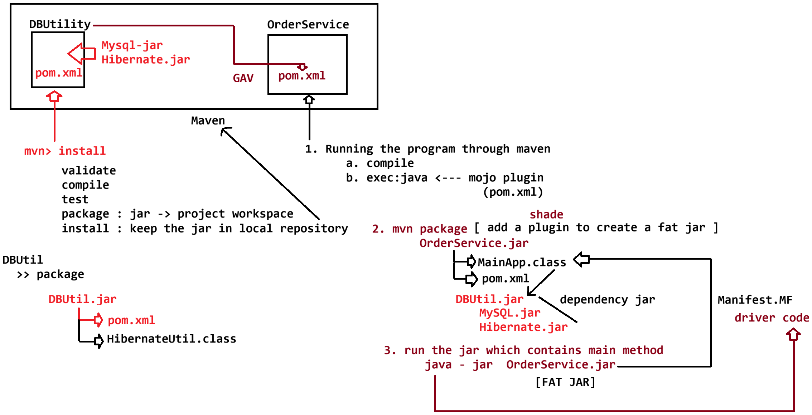

# Day-48 — 10-07-2026 — Maven Full Lifecycle with Creation of Fat JAR

---

## 🧩 Shared Module — `DBUtil`

```text
DBUtil
 |=> pom.xml
 |=> HibernateUtil.java
 |=> Employee.java
 |=> hibernate.cfg.xml
```

### `pom.xml`

Lifecycle reminder in comments: `validate`, `compile`, `test`, `package`, `install`, `deploy`.

```xml
<project xmlns="http://maven.apache.org/POM/4.0.0"
	xmlns:xsi="http://www.w3.org/2001/XMLSchema-instance"
	xsi:schemaLocation="http://maven.apache.org/POM/4.0.0 https://maven.apache.org/xsd/maven-4.0.0.xsd">
	<modelVersion>4.0.0</modelVersion>
	<groupId>in.ioi.pw</groupId>
	<artifactId>DBUtil</artifactId>
	<version>1.0</version>

	<!--validate, compile, test, package, install, deploy-->


	<!-- Source:
	https://mvnrepository.com/artifact/org.hibernate.orm/hibernate-core -->
	<dependencies>
		<dependency>
			<groupId>org.hibernate.orm</groupId>
			<artifactId>hibernate-core</artifactId>
			<version>7.0.9.Final</version>
			<scope>compile</scope>
		</dependency>
		<!-- Source:
		https://mvnrepository.com/artifact/com.mysql/mysql-connector-j -->
		<dependency>
			<groupId>com.mysql</groupId>
			<artifactId>mysql-connector-j</artifactId>
			<version>8.3.0</version>
			<scope>compile</scope>
		</dependency>

		<!-- Source: https://mvnrepository.com/artifact/org.projectlombok/lombok -->
		<dependency>
			<groupId>org.projectlombok</groupId>
			<artifactId>lombok</artifactId>
			<version>1.18.46</version>
			<scope>compile</scope>
		</dependency>
	</dependencies>
</project>
```

Install `DBUtil` so other projects can depend on `in.ioi.pw:DBUtil:1.0`.

---

## 🧩 Consumer — `OrderService`

```text
OrderService
  |=> pom.xml
  |=> MainApp
```

```java
package com.abc.edtech;

import org.hibernate.Session;
import org.hibernate.SessionFactory;

import com.db.mysql.util.HibernateUtil;

public class MainApp {

	public static void main(String[] args) {

		SessionFactory sessionFactory = HibernateUtil.getSessionFactory();
		Session session = sessionFactory.openSession();
		System.out.println("SESSION OBJECT TO PERFORM Transient operation : " + session);

	}

}
```

### `pom.xml` — dependency + `exec` + **shade (fat JAR)**

```xml
<project xmlns="http://maven.apache.org/POM/4.0.0"
	xmlns:xsi="http://www.w3.org/2001/XMLSchema-instance"
	xsi:schemaLocation="http://maven.apache.org/POM/4.0.0 https://maven.apache.org/xsd/maven-4.0.0.xsd">
	<modelVersion>4.0.0</modelVersion>
	<groupId>com.abc.edtech</groupId>
	<artifactId>OrderService</artifactId>
	<version>2.0</version>

	<dependencies>
		<dependency>
			<groupId>in.ioi.pw</groupId>
			<artifactId>DBUtil</artifactId>
			<version>1.0</version>
		</dependency>
	</dependencies>
	<build>
		<plugins>

			<plugin>
				<groupId>org.codehaus.mojo</groupId>
				<artifactId>exec-maven-plugin</artifactId>
				<version>3.5.0</version>

				<configuration>
					<mainClass>com.abc.edtech.MainApp</mainClass>
				</configuration>
			</plugin>

			<plugin>

				<groupId>org.apache.maven.plugins</groupId>

				<artifactId>maven-shade-plugin</artifactId>

				<version>3.5.1</version>

				<executions>

					<execution>

						<phase>package</phase>

						<goals>

							<goal>shade</goal>

						</goals>

						<configuration>

							<transformers>

								<transformer
									implementation="org.apache.maven.plugins.shade.resource.ManifestResourceTransformer">

									<mainClass>com.abc.edtech.MainApp</mainClass>

								</transformer>

							</transformers>

						</configuration>

					</execution>

				</executions>

			</plugin>


		</plugins>
	</build>


</project>
```

### Run the fat JAR

```bash
java -jar OrderService-2.0.jar
```

```text
Output
   Session Impl :
```

**Fat JAR idea:** `maven-shade-plugin` runs at `package`, bundles dependencies (including `DBUtil` / Hibernate / MySQL driver contents as shaded), and writes a `Main-Class` into the manifest via `ManifestResourceTransformer`.

```text
mvn package
   -> compile/test
   -> package
   -> shade goal
   -> OrderService-2.0.jar (executable / uber jar)
```

---

## 🤖 AI Points

1. **Production consideration:** Prefer an executable fat JAR (shade / Spring Boot repackage) when ops need `java -jar` without a pre-installed dependency classpath.
2. **Industry practice:** Extract shared Hibernate utilities into a versioned Maven module (`DBUtil`) consumed by multiple services.
3. **Common mistake:** Building a thin JAR then running `java -jar` — missing Hibernate/MySQL classes cause `ClassNotFoundException` unless shade/classpath is set.
4. **Interview insight:** Shade binds to the `package` phase so a normal `mvn package` also produces the uber JAR with `Main-Class` in the manifest.
5. **Modern Spring Boot connection:** `spring-boot-maven-plugin` `repackage` is Boot’s standard fat-JAR approach (similar goal, different layout/loader).

---

## 💻 My Codes


  
## 🖼️ Image


