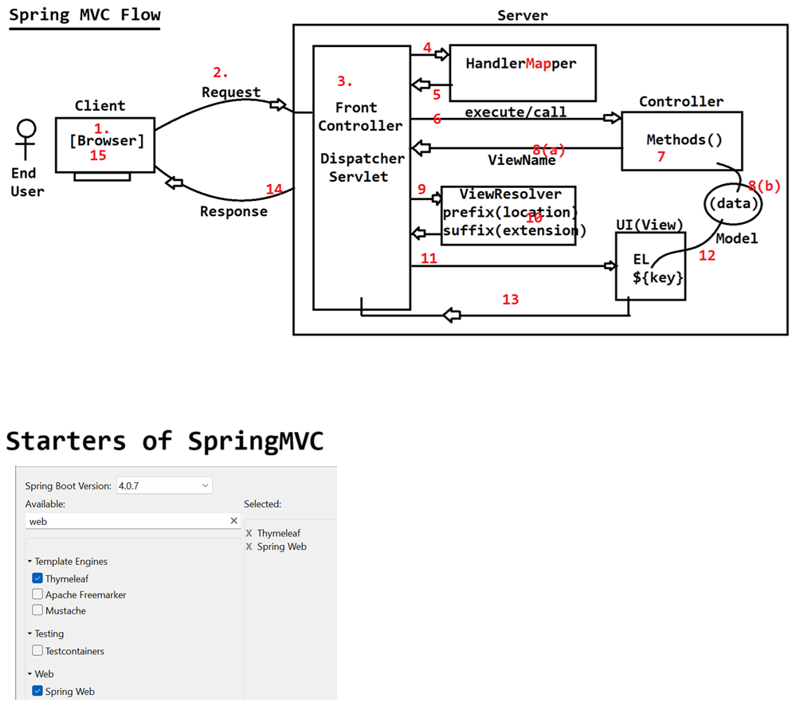

# Day-49 — 20-07-2026 — Spring MVC First App

---

## 🧩 Spring MVC Introduction

Spring Framework provides a module called **spring-mvc** to build web applications.

### Request types

| Method | Typical use |
|---|---|
| GET | Link click or requesting data via form |
| POST | Sending data to the server using a form |

```text
=> Spring MVC is built on top of Servlet
=> Spring F/w gave a control flow through which action on the page can be decided.
```

Example URLs:

```text
GET : http://localhost:9999/employee/
GET : http://localhost:9999/product/
```

---

## 🧩 Control Flow (after server start)

### 1. Request → DispatcherServlet

```text
Request Dispatcher ----> /employee/
```

### 2. HandlerMapper

| Input (URL) | Output (handler) |
|---|---|
| `/employee/` | `EmployeeController.showForm()` via DispatcherServlet |
| `/product/` | `ProductController.showForm()` via DispatcherServlet |

Controller annotations:

```text
@Controller
@RequestMapping(value="/",method=RequestMethod.GET)
@GetMapping(value="/") | @PostMapping(value="/save")
```

```java
@Controller //@Component + able to handle HTTPRequest binded to a method with GET or POST
@RequestMapping("/employee")
public class EmployeeController{

	@GetMapping(value="/")
	public String  showForm(){
		return "show-form-employee"; //view-name : JSP,Thymeleaf[HTML],Velocity,FreeMarker
	}
}

@Controller
@RequestMapping("/product")
public class ProductController{

	@GetMapping(value="/")
	public String  showForm(){
		return "show-form-product";
	}
}
```

### 3. ViewResolver

Configure view stack + location (often via `application.properties`):

```text
input  : viewName
output : stack name and its location   :: DispatcherServlet
```

### 4. Render view with Model data

DispatcherServlet executes the view component; dynamic data comes from the **Model**:

```html
<p th:text="${}"> NOT AVAILABLE </p>
```

### 5. Response

DispatcherServlet takes the view output and passes it to the browser as the response.

```text
Browser
  -> DispatcherServlet
      -> HandlerMapping -> Controller method -> view name
      -> ViewResolver -> actual template
      -> render with Model
  <- HTML response
```

---

## 🧩 Annotations Used in Spring MVC

| Annotation | Role |
|---|---|
| `@Controller` | Component that handles HTTP requests |
| `@RequestMapping` | Map URL (+ optional method) |
| `@GetMapping` | GET mapping |
| `@PostMapping` | POST mapping |
| `@RequestParam` | Query / form params |
| `@PathVariable` | Path variables |
| `@ModelAttribute` | Bind model / form object |
| `@ControllerAdvice` + `@ExceptionHandler` | Global / local exception handling |

---

## 🧩 Building Spring MVC with Spring Boot

1. Starters: **Spring Web** + **Thymeleaf**
2. Extra dependencies: not required for this demo
3. Write the controller
4. Configure ViewResolver properties
5. Run the `@SpringBootApplication` main class
6. Hit the URL

### Controller

```java
package in.ioi.pw.controller;

import org.springframework.stereotype.Controller;
import org.springframework.ui.Model;
import org.springframework.web.bind.annotation.GetMapping;
import org.springframework.web.bind.annotation.RequestMapping;

@Controller
@RequestMapping("/employee")
public class EmployeeController {

	//@RequestMapping(value = "/",method = RequestMethod.GET)
	@GetMapping("/")
	public String showMessage(Model model) {
		String name = "sachin";
		model.addAttribute("name",name );
		return "showOutput";
	}
	
}
```

### `showOutput.html`

```html
<!DOCTYPE html>
<html xmlns:th="http://www.thymeleaf.org">
<head>
<meta charset="UTF-8">
<title>Output</title>
</head>
<body>
	<h1>Hello <span th:text="${name}" style="color:red;"></span></h1>
</body>
</html>
```

### `application.properties`

```properties
spring.application.name=SpringBootWebApp
server.port = 9999

spring.mvc.view.prefix= classpath:/templates/
spring.mvc.view.suffix= .html
```

### Request flow for this app

```text
http://localhost:9999/          ==> context path
http://localhost:9999/employee/ ===>

1. Dispatcher Servlet  :: /employee/ ---> EmployeeController.showMessage()
			    :: showOutput
  
2. Dispatcher Servlet  :: showOutput --> ViewResolver
			    :: /templates/showOutput.html

3. Dispatcher Servlet  :: Activates Thymeleaf and render the page
			Output:: Hello sachin
```

---

## 🤖 AI Points

1. **Production consideration:** Keep controllers returning logical view names only; let ViewResolver resolve prefix/suffix so template locations stay configurable.
2. **Industry practice:** Prefer `@GetMapping` / `@PostMapping` over verbose `@RequestMapping(method=...)` for readability.
3. **Common mistake:** Returning `"showOutput"` while the file is not under `classpath:/templates/` with the configured suffix — 404 / template not found.
4. **Interview insight:** Spring MVC’s DispatcherServlet + HandlerMapping + ViewResolver is the same front-controller idea you hand-coded with Servlet + Thymeleaf.
5. **Modern Spring Boot connection:** `spring-boot-starter-web` + `spring-boot-starter-thymeleaf` auto-configures most of the MVC stack; port and view settings live in `application.properties`.

---

## 💻 My Codes


  
## 🖼️ Image


