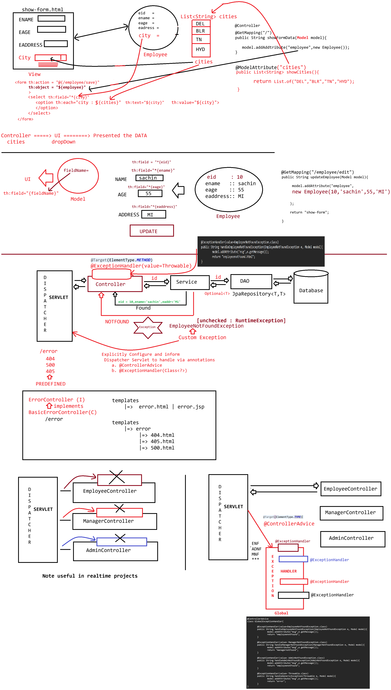

# Day-50 — 22-07-2026 — Modelattribute to Load 2way Binding Exception Handling At Controller and Globally

---

## 🧩 Spring MVC Pieces Recap

| Piece | Owner |
|---|---|
| `DispatcherServlet` | Framework |
| `HandlerMapper` | `spring-starter-web-mvc` |
| Controller | Programmer |
| View | Programmer |
| ViewResolver | Configured in `application.properties` |

### Annotations

| Annotation | Role |
|---|---|
| `@Controller` | `@Component` + HTTP request methods (GET/POST) |
| `@RequestMapping(value="")` | Base / method mapping |
| `@GetMapping` / `@PostMapping` | Verb-specific mappings |
| `@RequestParam` / `@RequestParam("keyName")` | Query string |
| `@PathVariable` / `@PathVariable("keyName")` | Path segments / endpoints |
| `@ModelAttribute` / `@ModelAttribute("keyName")` | Bind / expose model objects |

Path variable syntax:

```text
http://lh:9999/employee/{pathVariable}/staticpoint/{pathVariable}
```

### Sharing data Controller → UI

```text
Model
  |=> addAttribute(String key, Object value)
```

### Typical flows mentioned

```text
GET : /employee/save 
       inputs ---> list-employee.html
		
GET : /employee/edit
	  dummy object and show it to UI
```

(`@ModelAttribute` supports loading predefined form data — dropdowns, checkboxes, radiobuttons — and two-way binding with Thymeleaf `th:object` / `th:field` as continued in Day-51 companion notes.)

---

## 🧩 Exception Handling in MVC

### Controller-local `@ExceptionHandler`

```java
@Controller
@RequestMapping("/employee")
public class EmployeeController{


	private IEmployeeService service;

	EmployeeController(IEmployeeService service){
		this.service = service;
	}

	@GetMapping("/find/{id}")
	public String loadEmployee(@PathVariable Integer id,Model model){
		Employee employee = service.findById(id);

		model.addAttribute("employee",employee);

		return "list-employee";
	}

	
	@ExceptionHandler(value=EmployeeNotFoundException.class)
	public String handleEmployeeNotFoundException(EmployeeNotFoundException e, Model model){
		model.addAttribute("msg",e.getMessage());
		return "employeenotFound";
        }

	
	

}
```

### Service throwing domain exception

```java
@Service
public class ServiceImpl{

	public Employee findById(id){
		if(id==7){
			return new Employee(7,"dhoni",45,"CSK");
		}
		else{
			throw new EmployeeNotFoundException("Employee Not found for the given id:: "+id);
		}
	}	
}
```

### Custom exception

```java
public class EmployeeNotFoundException extends RuntimeException{
	EmployeeNotFoundException(String msg){
		super(msg);
	}
}
```

---

## 🧩 Global Handling — `@ControllerAdvice`

```java
@ControllerAdvice
class GlobalExceptionHandler{
	
	@ExceptionHandler(value=EmployeeNotFoundException.class)
	public String handleEmployeeNotFoundException(EmployeeNotFoundException e, Model model){
		model.addAttribute("msg",e.getMessage());
		return "employeenotFound";
        }

	@ExceptionHandler(value= ManagerNotFoundException.class)
	public String handleManagerNotFoundException(ManagerNotFoundException e, Model model){
		model.addAttribute("msg",e.getMessage());
		return "managernotFound";
        }

	@ExceptionHandler(value= AdminNotFoundException.class)
	public String handleAdminNotFoundException(AdminNotFoundException e, Model model){
		model.addAttribute("msg",e.getMessage());
		return "employeenotFound";
        }

	@ExceptionHandler(value= Throwable.class)
	public String handleGenericException(Throwable e, Model model){
		model.addAttribute("msg",e.getMessage());
		return "error";
        }
}
```

### Teaching flow

```text
Controller method throws EmployeeNotFoundException
        |
        +--> local @ExceptionHandler on same @Controller (if present)
        |
        +--> else @ControllerAdvice GlobalExceptionHandler
                 -> model.addAttribute("msg", ...)
                 -> return error view name
```

---

## 🤖 AI Points

1. **Production consideration:** Prefer `@ControllerAdvice` for cross-cutting exceptions so every controller does not duplicate handler methods.
2. **Industry practice:** Put a catch-all `@ExceptionHandler(Throwable.class)` last so unexpected failures still render a friendly error page.
3. **Common mistake:** Handling only in one controller — exceptions from other controllers bubble uncaught unless a global advice exists.
4. **Interview insight:** Controller-local `@ExceptionHandler` wins for that controller; `@ControllerAdvice` applies application-wide for types not handled locally.
5. **Modern Spring Boot connection:** REST apps often return `ProblemDetail` / `@RestControllerAdvice`; MVC apps return view names as in this lecture.

---

## 💻 My Codes


  
## 🖼️ Image


