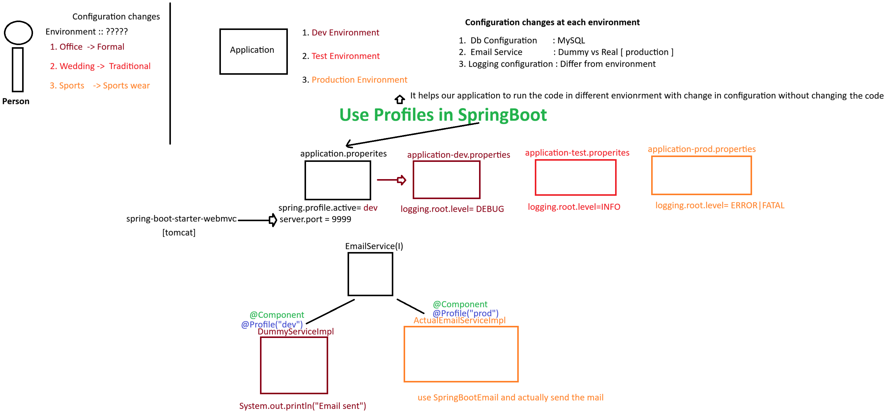

# Day-51 — 27-07-2026 — Logging Basic and Profiling with Spring Boot

---

## 🧩 Annotations Recap

| Annotation | Role |
|---|---|
| `@Controller` | `@Component` + HTTP request handling |
| `@RequestParam` | Query parameter is bound based on the key |
| `@RequestMapping` | URL + HTTP method |
| `@GetMapping` / `@PostMapping` | URL mapped to GET / POST |
| `@ModelAttribute` | Bind form data to a model object (2-way binding with `th:field=*{}`) using `th:object` and `th:field`; also used to load predefined data onto the form (dropdown, checkbox, radio button) |
| `@ControllerAdvice` | `@Component` + methods that handle exception objects |

### 🔐 Global Exception Handler Pattern

```java
public class GlobalExceptionHandler {

    @ExceptionHandler(value = XXXXX.class)
    public String handleException(XXXXX e, Model model) {
        // handle e object here
        // Model -> sending data from controller to View
        return "viewName";
    }
}
```

---

## 🧪 What Is Profiling?

Without making any changes in our source code, we need to create an environment for other teams to use our application with their configuration.

To do so we need to learn **Profiling**.

Spring Boot supports profiling with the help of a key:

```properties
spring.profiles.active=???
```

---

## ⚠️ Important Defaults

- If the profile value is **not set**, Spring Boot falls back to the `default` profile.
- If the log level is **not set**, Spring Boot’s default log level is `INFO`.

---

## 🤖 AI Points

1. **Production consideration:** Never leave `spring.profiles.active=dev` (or DEBUG logging) accidentally enabled in a production build; wire the active profile via environment variables or deployment config instead of hardcoding it in committed `application.properties`.
2. **Industry practice:** Prefer `application-{profile}.yml` (or `.properties`) plus secrets from a vault/K8s secrets — keep credentials out of source control even for non-prod profiles.
3. **Common mistake:** Confusing `@Profile` on beans with `spring.profiles.active` — if no bean matches the active profile for a required dependency, the context fails to start.
4. **Interview insight:** Explain that Spring Boot’s default logging is Logback behind SLF4J at `INFO`, and that `logging.level.root` / `logging.level.<package>` override levels without code changes.
5. **Real-world connection:** Profiling is how the same artifact serves local, QA, and prod with different DataSources, mail senders, and log verbosity — a core Spring Boot deployment pattern.

---

## 💻 My Codes


  
## 🖼️ Image


