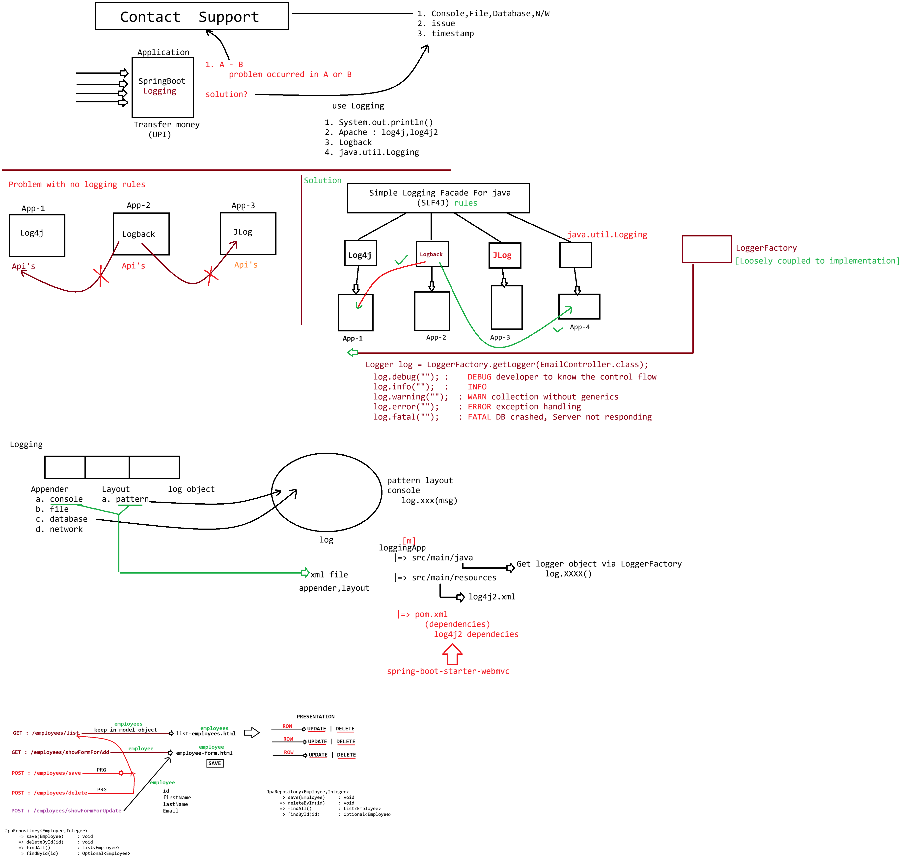

# Day-52 — 31-07-2026 — Spring MVC Logging with POM XML Exclude Feature

---

## 🧩 Profile

Depending upon the environment, without changing the application logic, permitting the changes to work with different configuration is referred as **Profiling**.

With the help of a properties file, Spring Boot gave the support of profiling:

```properties
spring.profiles.active=????
```

---

## 📝 Logging

### What is the need of logging in a realtime application?

Logging is the process of recording the events occurring inside an application while it is running.

In stand-alone applications, we use logging to decide the control flow using `System.out.println()` statements, but the same can't be used in web applications because:

- No timestamp about when the request had come
- It won't speak about the log level (seriousness about the cause)
- Cannot be stored in files (once we clear the console, all logs will be deleted permanently)
- Cannot be filtered as per the needs
- Cannot search efficiently

**Solution:** Apache Log4j

| Concern | Value |
| --- | --- |
| Console | Appender |
| Format | PatternLayout |
| LEVEL | TRACE, DEBUG, INFO, WARN, ERROR, FATAL, OFF |

Log levels covered:

- **TRACE**
- **DEBUG** — Developer :: `log`
- **INFO**
- **WARN**
- **ERROR**
- **FATAL** — Production: application has crashed
- **OFF**

Example log line shape:

```text
2026-7-31T13:09:56 LOGLEVEL id ApplicationName [main] fully qualified className : description
```

---

## 📄 log4j2.xml

```xml
<?xml version="1.0" encoding="UTF-8"?>

<Configuration>

    <Appenders>

        <Console name="Console" target="SYSTEM_OUT">

            <PatternLayout
                pattern="%d{yyyy-MM-dd HH:mm:ss} [%t] %-5level %logger{36} - %msg%n"/>

        </Console>

    </Appenders>

    <Loggers>

        <Root level="info">

            <AppenderRef ref="Console"/>

        </Root>

    </Loggers>

</Configuration>
```

**Note:** `pattern="%d{yyyy-MM-dd HH:mm:ss} [%t] %-5level %logger{36} - %msg%n"`

| Token | Meaning |
| --- | --- |
| `%t` | threadName |
| `%-5level` | level with 5-width character, left aligned |
| `%logger{36}` | fully qualified classname with 36 character space reserved |
| `-` | separator |
| `%msg` | message which is a part of `log.XXX(msg)` |
| `%n` | new line |

---

## 🔄 Changing the Runtime Environment (POM Exclude)

**Q:** Is it possible to change the runtime environment while running Spring Boot applications?

**Ans:** Yes — exclude the default Tomcat starter and add Jetty:

```xml
<dependency>
    <groupId>org.springframework.boot</groupId>
    <artifactId>spring-boot-starter-webmvc</artifactId>
    <exclusions>
        <exclusion>
            <groupId>org.springframework.boot</groupId>
            <artifactId>spring-boot-starter-tomcat</artifactId>
        </exclusion>
    </exclusions>
</dependency>
<dependency>
    <groupId>org.springframework.boot</groupId>
    <artifactId>spring-boot-starter-jetty</artifactId>
</dependency>
```

**Q:** What is the default logging mechanism used by Spring Boot to log the message on console?

**Ans:** Logback → SLF4J

---

## 📦 pom.xml — Log4j2 Dependencies

```xml
<dependencies>

    <!-- Log4j2 API -->
    <dependency>
        <groupId>org.apache.logging.log4j</groupId>
        <artifactId>log4j-api</artifactId>
        <version>2.25.1</version>
    </dependency>

    <!-- Log4j2 Core -->
    <dependency>
        <groupId>org.apache.logging.log4j</groupId>
        <artifactId>log4j-core</artifactId>
        <version>2.25.1</version>
    </dependency>

</dependencies>
```

---

## 🤖 AI Points

1. **Production consideration:** Prefer structured file appenders and environment-specific log levels via profiles (`spring.profiles.active`) so production never runs at TRACE/DEBUG by default.
2. **Industry practice:** Keep SLF4J as the façade; swap Logback ↔ Log4j2 carefully and exclude conflicting starters so only one binding is on the classpath.
3. **Common mistake:** Relying on `System.out.println` in web apps—no levels, no persistence, no searchable correlation with request time.
4. **Interview insight:** Explain POM `<exclusions>` to replace embedded Tomcat with Jetty without rewriting application code—same Boot app, different servlet container.
5. **Modern Spring Boot connection:** Boot’s default is Logback over SLF4J; bringing Log4j2 means adding `log4j-api`/`log4j-core` (and typically excluding `spring-boot-starter-logging`) so the bridge is clean.

---

## 💻 My Codes


  
## 🖼️ Image


