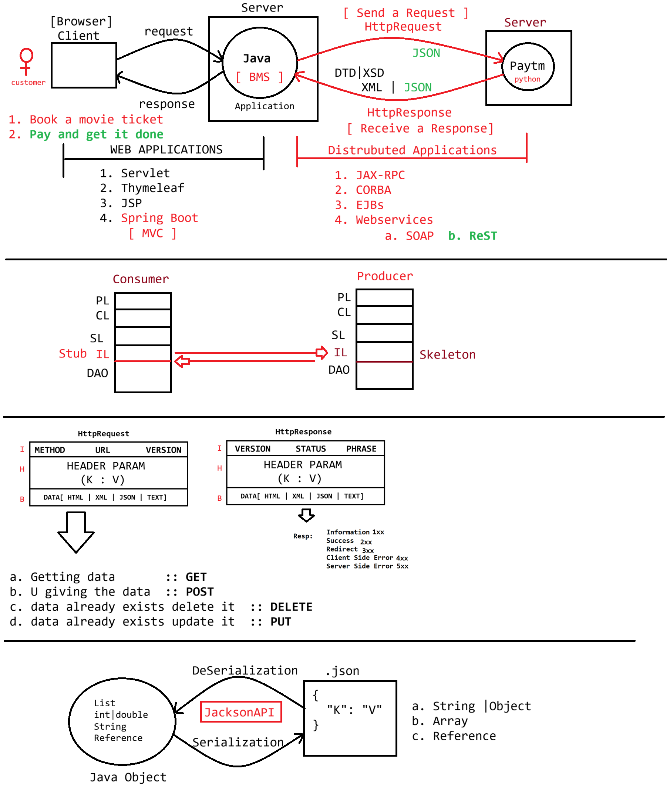

# Day-53 — 06-08-2026 — Introduction to Webservices Java to JSON

---

## 🧩 eg#1 — Employee & Project Models

```java
package in.ioi.pw.model;

import java.util.List;

public class Employee {
	private Integer eid;
	private String ename;
	private String eaddress;

	private List<String> depts;

	private Project project;

	public Project getProject() {
		return project;
	}

	public void setProject(Project project) {
		System.out.println("Employee.setProject()");
		this.project = project;
	}

	public Employee(Integer eid, String ename, String eaddress, List<String> depts, Project project) {
		super();
		this.eid = eid;
		this.ename = ename;
		this.eaddress = eaddress;
		this.depts = depts;
		this.project = project;
	}

	public Employee() {
		System.out.println("Employee:: Object is created....");
	}

	public List<String> getDepts() {
		return depts;
	}

	public void setDepts(List<String> depts) {
		this.depts = depts;
	}

	public Integer getEid() {
		return eid;
	}

	public void setEid(Integer eid) {
		System.out.println("Employee.setEid()");
		this.eid = eid;
	}

	public String getEname() {
		return ename;
	}

	public void setEname(String ename) {
		System.out.println("Employee.setEname()");
		this.ename = ename;
	}

	public String getEaddress() {
		return eaddress;
	}

	public void setEaddress(String eaddress) {
		System.out.println("Employee.setEaddress()");
		this.eaddress = eaddress;
	}

	@Override
	public String toString() {
		return "Employee [eid=" + eid + ", ename=" + ename + ", eaddress=" + eaddress + ", depts=" + depts
				+ ", project=" + project + "]";
	}

}
```

```java
package in.ioi.pw.model;

public class Project {
	private Integer pid;
	private String pname;
	private String ploc;

	public Project() {
		System.out.println("Project:: Object created...");
	}

	public Project(Integer pid, String pname, String ploc) {
		super();
		this.pid = pid;
		this.pname = pname;
		this.ploc = ploc;
	}

	@Override
	public String toString() {
		return "Project [pid=" + pid + ", pname=" + pname + ", ploc=" + ploc + "]";
	}

	public Integer getPid() {
		return pid;
	}

	public void setPid(Integer pid) {
		System.out.println("Project.setPid()");
		this.pid = pid;
	}

	public String getPname() {
		return pname;
	}

	public void setPname(String pname) {
		System.out.println("Project.setPname()");
		this.pname = pname;
	}

	public String getPloc() {
		return ploc;
	}

	public void setPloc(String ploc) {
		System.out.println("Project.setPloc()");
		this.ploc = ploc;
	}

}
```

---

## 🔄 Serialization — Java Object to JSON

```java
package in.ioi.pw;

import java.io.File;
import java.util.List;

import com.fasterxml.jackson.databind.ObjectMapper;

import in.ioi.pw.model.Employee;
import in.ioi.pw.model.Project;

public class TestApp {

	public static void main(String[] args) throws Exception {

		// step1. Create an Employee object with data

		Project project = new Project(100,"HospitalManagement","PUNE");
		Employee employee = new Employee(10, "sachin", "MI",List.of("IT", "HR","FINANCE","ADMIN"),project);

		// Serialize employee object into json file
		ObjectMapper mapper = new ObjectMapper();
		
							mapper
							.writerWithDefaultPrettyPrinter()
							.writeValue(new File("output.json"), employee);
							
		System.out.println("JSON FILE IS GENERATED");

	}

}
```

### Output

```json
{
  "eid" : 10,
  "ename" : "sachin",
  "eaddress" : "MI",
  "depts" : [ "IT", "HR", "FINANCE", "ADMIN" ],
  "project" : {
    "pid" : 100,
    "pname" : "HospitalManagement",
    "ploc" : "PUNE"
  }
}
```

---

## 🤖 AI Points

1. **Production consideration:** Nested domain graphs (Employee → Project, collections) must serialize cleanly for API contracts; prefer DTOs over exposing full persistence graphs.
2. **Industry practice:** Use Jackson’s `ObjectMapper` with `writerWithDefaultPrettyPrinter()` for readable artifacts in demos; production APIs usually emit compact JSON.
3. **Common mistake:** Missing no-arg constructors / setters—Jackson relies on them for later deserialization even if you only serialize today.
4. **Interview insight:** Serialization here is Java object → JSON via Jackson `writeValue`; web services exchange that JSON across process boundaries.
5. **Modern Spring Boot connection:** Spring MVC/WebFlux auto-configures the same Jackson `ObjectMapper` behind `@RequestBody` / `@ResponseBody` and `ResponseEntity`.

---

## 💻 My Codes


  
## 🖼️ Image


