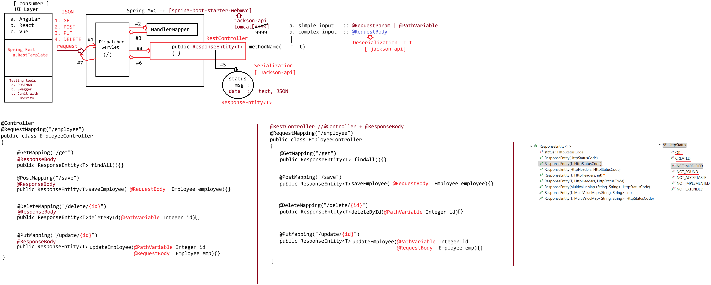

# Day-54 — 10-08-2026 — Working with Spring REST using Spring Boot Introduction

---

## 🌐 Distributed Application

**B2B service**

| Role | Meaning | Example |
| --- | --- | --- |
| Consumer | Takes the data from API | BMS service |
| Producer | Gives API | UPI Service |

Consumer talks to producer over **XML | JSON**:

```text
BMS service ------------XML|JSON---------> UPI Service
                              |=> Book LPG gas      [ service ]
                              |=> Electricity bill  [ service ]
                              |=> Book train ticket [ IRCTC ]
                              |=> Book flight ticket [ AirIndia, Indigo ]
```

Java applications [APIs for giving the data] :: **producer**

**Producer** :: Giving the data to other service

```text
.java ----> Java object
        |Serialization [ jackson api ]
        |              |=> ObjectMapper
        |                 |=> writeValueAsString()
        |                 |=> writeValue(Data output, data)
       Json
```

---

## 💻 Realtime Coding

### a. Send request

Request is passed into API: **JSON to Java**

1. **POST** [Give data : JSON] → `.java`

```text
JSON
  |Deserialization [ jackson api ]
  |                |=> ObjectMapper
  |                   |=> <T> readValue(location, T.class)
Java Object  :: @RequestBody T t
```

Request is passed into API: response should be sent → **Java to JSON**

2. **GET** [Give input]

- `id` :: QueryString
- PathVariable

```text
.java
  | input
  |
 Java Object
  |Serialization [ jackson api ]  :: @ResponseBody + R.T :: ResponseEntity<T>
  |                |=> ObjectMapper
  |                   |=> writeValueAsString()
  |                   |=> writeValue(Data output, data)
 Json
```

---

## 🔁 Deserialization

### output.json

```json
{
  "eid" : 10,
  "ename" : "sachin",
  "eaddress" : "MI",
  "depts" : [ "IT", "HR", "FINANCE", "ADMIN" ],
  "project" : {
    "pid" : 100,
    "pname" : "HospitalManagement",
    "ploc" : "PUNE"
  }
}
```

```java
public class TestApp {

	public static void main(String[] args) throws Exception {
		
		// Deserialize and collect output into java object
		ObjectMapper mapper = new ObjectMapper();
		Employee employee = mapper.readValue(new File("output.json"), Employee.class);
		System.out.println(employee);
	}

}
```

### Output

```text
Employee [eid=10, ename=sachin, eaddress=MI, depts=[IT, HR, FINANCE, ADMIN],
	project=Project [pid=100, pname=HospitalManagement, ploc=PUNE]]
```

---

## 🛠️ Designing RESTful Services using Spring REST

(Introduction / setup for designing REST services with Spring REST — continued in following lectures.)

---

## 🤖 AI Points

1. **Production consideration:** Treat producer/consumer contracts as versioned JSON schemas; breaking field names breaks every B2B integrator (IRCTC-style consumers).
2. **Industry practice:** POST bodies use `@RequestBody` (JSON → Java); GET responses use `@ResponseBody` / `ResponseEntity<T>` (Java → JSON) with Jackson under the hood.
3. **Common mistake:** Confusing serialization direction—providers serialize responses; consumers deserialize responses and serialize request bodies.
4. **Interview insight:** Distributed B2B apps exchange XML/JSON; Jackson `ObjectMapper.readValue` / `writeValue*` is the Java bridge.
5. **Modern Spring Boot connection:** `spring-boot-starter-web` wires Jackson automatically so controllers focus on resources, not manual mapper plumbing.

---

## 💻 My Codes


  
## 🖼️ Image


