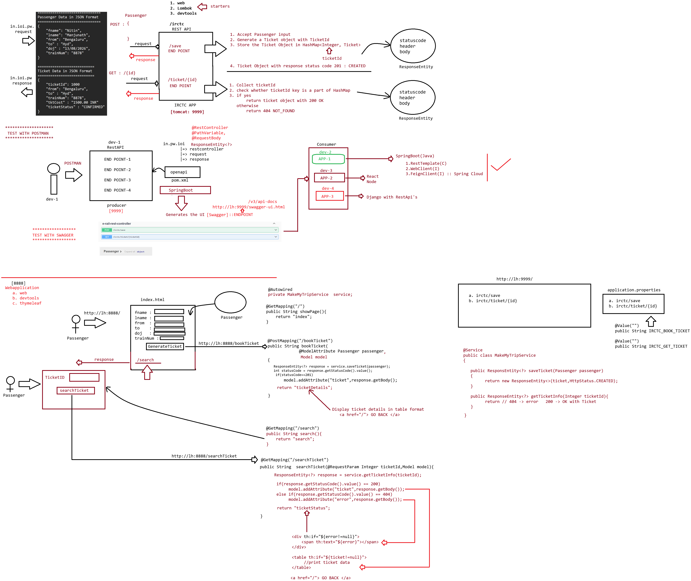

# Day-56 — 14-08-2026 — Irctc Service Swagger Introduction to RestTemplate Project

---

## 🧩 IRCTC Service / Swagger / RestTemplate Project

This lecture date has image material only (no textual mentor `.txt` note).

Topic identified from filename/image: **IRCTC Service**, **Swagger** introduction, and starting a **RestTemplate** consumer/producer project (ticket booking style provider + client).

Do not invent mentor lecture prose.

---

## 🤖 AI Points

1. **Production consideration:** Document provider contracts (IRCTC-style save/ticket APIs) with OpenAPI/Swagger so consumers do not guess JSON shapes.
2. **Industry practice:** Separate provider (ticket API) and consumer (MakeMyTrip-style) apps; RestTemplate (or WebClient) calls published base URLs and paths.
3. **Common mistake:** Hard-coding provider URLs in controllers instead of `application.properties` / config—breaks when ports or hosts change.
4. **Interview insight:** Swagger/OpenAPI UI validates endpoints while RestTemplate is the classic synchronous HTTP client for inter-service calls.
5. **Modern Spring Boot connection:** `springdoc-openapi` replaces older Springfox for Swagger UI; RestTemplate remains supported though WebClient/`RestClient` are preferred for new work.

---

## 💻 My Codes

  
## 🖼️ Image

