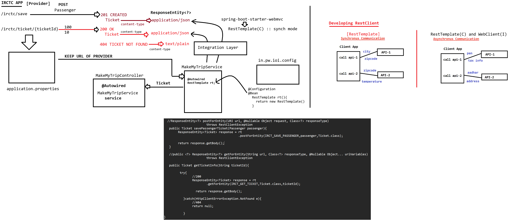

# Day-57 — 17-08-2026 — RestTemplate in Sync Mode

---

## ⚙️ application.properties

```properties
server.port = 8888
irctc.save.passenger = http://localhost:9999/irctc/save
irct.get.ticket      = http://localhost:9999/irctc/ticket/{ticketId}
```

---

## 🛠️ Service Layer

```java
@Service
public class MakeMyTripService{

    @Value("${irctc.save.passenger}")
    private String IRCT_SAVE_PASSENGER;

    @Value("${irctc.get.ticket}")
    private string IRCT_GET_TICKET;


  //ResponseEntity<T> postForEntity(URI url, @Nullable Object request, Class<T> responseType)
			throws RestClientException 
   public Ticket savePassengerTicket(Passenger passenger){
	ResponseEntity<Ticket> response = rt
     	  				  .postForEntity(IRCT_SAVE_PASSENGER,passenger,Ticket.class);
	
	return response.getBody();
   }
   
   //public <T> ResponseEntity<T> getForEntity(String url, Class<T> responseType, @Nullable Object... uriVariables)
			throws RestClientException

   public Ticket getTicketInfo(String ticketId){

	 try{
		//200
		ResponseEntity<Ticket> response = rt
                 	.getForEntity(IRCT_GET_TICKET,Ticket.class,ticketId);

		  return response.getBody();

	   }catch(HttpClientErrorException.NotFound e){
		//404
		return null;

	   } 
}

}
```

> **Correction:** Property placeholder and field name should align (`irctc.get.ticket` vs `irct.get.ticket`); Java type should be `String` (not `string`).

Key RestTemplate APIs used:

- `postForEntity(url, request, Ticket.class)` → save passenger, return `Ticket` body
- `getForEntity(url, Ticket.class, ticketId)` → get ticket; catch `HttpClientErrorException.NotFound` for 404

---

## 🎮 Controller

```java
@Controller
public class MakeMyTripController{

	@Autowired
        MakeMyTripService service;


	public String savePassengerData(@ModelAttribute Passenger passenger,Model model)
	{
		//consume a service

		model.addAttribute("ticket",ticket);
		return "UI_NAME";
	}

	public String getTicketInfo(@RequestParam String ticketId,Model model){
		//consume a service

		if(ticket!=null){
			model.addAttribute("ticket",ticket);
			return "UI_NAME";
		}else{
			model.addAttribute("error","Ticket not found for the give id "+ticketId);
			return "UI_NAME";
		}	
	}
}
```

Controller consumes the service, puts `ticket` (or error message) on the `Model`, and returns a view name.

---

## 🤖 AI Points

1. **Production consideration:** Externalize IRCTC URLs with `@Value` / config so env promotion (dev → prod hosts) does not require recompiles.
2. **Industry practice:** Synchronous RestTemplate `postForEntity` / `getForEntity` blocks the calling thread until the provider responds—fine for MVC request threads at moderate load.
3. **Common mistake:** Ignoring 404—`getForEntity` throws `HttpClientErrorException.NotFound`; catch and map to a user-facing “ticket not found” model attribute.
4. **Interview insight:** RestTemplate returns `ResponseEntity<T>`; business code typically uses `getBody()` after checking status or catching client errors.
5. **Modern Spring Boot connection:** RestTemplate is in maintenance mode; same sync pattern maps cleanly to `RestClient` or blocking WebClient `.block()` in newer Boot apps.

---

## 💻 My Codes


  
## 🖼️ Image


