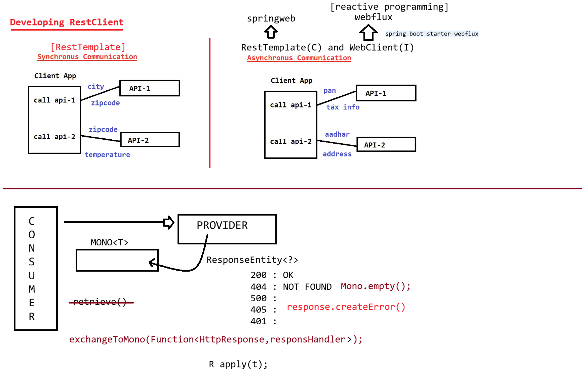

# Day-58 — 18-08-2026 — WebClient in Sync Mode using Mono

---

## 🧩 Working with WebClient

### a. Starter — Spring Reactive

- Starter: Spring reactive program → `spring-boot-starter-webflux`

### b. Configuration — WebClient Bean

```java
package in.ioi.pw.config;

import org.springframework.context.annotation.Bean;
import org.springframework.context.annotation.Configuration;
import org.springframework.web.reactive.function.client.WebClient;

@Configuration
public class MakeMyTripConfig {

	@Bean
	WebClient webClient() {
		return WebClient
			.builder()
			.baseUrl("http://localhost:9999")
			.build();
	}	
}
```

### c. Service Layer — Call Endpoint

GET → `http://localhost:9999/irctc/ticket/{ticketId}`

| Status | Content type | Body |
| --- | --- | --- |
| 200 OK | `application/json` | Ticket |
| 404 | `text/plain` | Ticket Not found |

```java
package in.ioi.pw.rest;

import org.springframework.beans.factory.annotation.Value;
import org.springframework.http.MediaType;
import org.springframework.stereotype.Service;
import org.springframework.web.reactive.function.client.WebClient;

import in.ioi.pw.model.Employee;


@Service
public class MakeMyTripService {

	@Value("${irctc.get.ticket}")
	private String IRCTC_GET_TICKET;
	
	final WebClient webClient;

	public MakeMyTripService(WebClient webClient) {
		this.webClient = webClient;
	}
	
	public void getTicketofPasenger(String ticketId) {
		System.out.println("Working in Synch Mode");
		
		Ticket ticket = webClient
			.get()   // type of request
			.uri(IRCTC_GET_TICKET, ticketId) // END POINT with INPUT
			.accept(MediaType.APPLICATION_JSON) // response type
			.retrieve() // get the data from response body
			.bodyToMono(Ticket.class) //bind json to Java object
			.block(); // don't continue further

		System.out.println(ticket);
	
		System.out.println("Completed working in Synch Mode");
	}
	
	
}
```

### d. Usage from Main

```java
@SpringBootApplication
public class SpringRestAppApplication {

	public static void main(String[] args) {
		ConfigurableApplicationContext context = SpringApplication.run(SpringRestAppApplication.class, args);

		//Get the bean
		MakeMyTripService bean = context.getBean(MakeMyTripService.class);

		//call the method
		bean.getTicketofPasenger("100");
	}

}
```

### RestTemplate vs WebClient on 404

```text
             RestTemplate               WebClient
                  |                       |
              404 response              404 response
                  |                       |
              throws exception          throws exception
                  |                       |
            HttpClientErrorException    WebClientResponseException
                  |			  |
             NotFound		        NotFound
```

---

## 🔁 Using Mono<T> with exchangeToMono

```java
Employee employee = webClient
			.get()
			.uri(IRCTC_GET_TICKET, ticketId)
			.exchangeToMono(response->{
				if (response.statusCode().equals(HttpStatus.OK)) {
					return response.bodyToMono(Employee.class);
				}else if(response.statusCode().equals(HttpStatus.NOT_FOUND)) {
					return Mono.empty();
				}else {
					return response.createError();//500,405,401
				}
			})
			.block();
		
		if (employee!=null) {
			System.out.println(employee);
		} else {
			System.out.println("employee not found");
		}
```

- **200** → `bodyToMono(Employee.class)`
- **404** → `Mono.empty()` (null after `.block()`)
- Other statuses → `createError()` (500, 405, 401, …)

---

## 🤖 AI Points

1. **Production consideration:** Prefer a shared `WebClient` bean with `baseUrl` and timeouts; avoid creating a new client per call.
2. **Industry practice:** Sync mode uses `.retrieve().bodyToMono(...).block()`—convenient for MVC callers, but blocking on the event loop in pure WebFlux is harmful.
3. **Common mistake:** Assuming WebClient swallows 404—`retrieve()` still throws `WebClientResponseException.NotFound` unless you use `exchangeToMono` / `onStatus`.
4. **Interview insight:** Contrast RestTemplate’s `HttpClientErrorException.NotFound` with WebClient’s `WebClientResponseException.NotFound` for the same 404.
5. **Modern Spring Boot connection:** `spring-boot-starter-webflux` brings WebClient even into mostly Servlet apps when you only need a reactive HTTP client.

---

## 💻 My Codes


  
## 🖼️ Image


