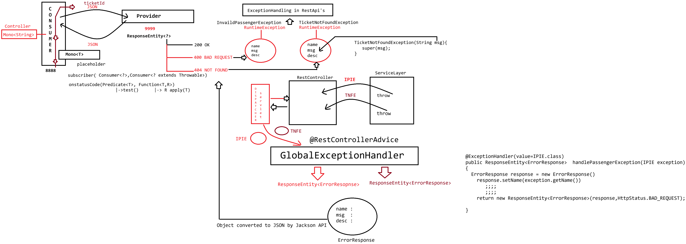

# Day-59 — 19-08-2026 — WebClient in Async Mode using Mono and Exceptionhandling in REST

---

## 🧩 WebClient Async Mode / Mono / Exception Handling

This lecture date has image material only (no textual mentor `.txt` note).

Topic identified from filename/image: **WebClient in async mode using Mono**, plus **exception handling in REST** (non-blocking subscribe / reactive error signals instead of only `.block()`).

Do not invent mentor lecture prose.

---

## 🤖 AI Points

1. **Production consideration:** Async WebClient avoids tying up Servlet threads on slow downstream IRCTC calls; always define timeout and error mappings.
2. **Industry practice:** Prefer returning `Mono`/`Flux` from services and map HTTP errors with `onStatus` or `exchangeToMono` rather than catching after `.block()`.
3. **Common mistake:** Calling `.block()` inside a WebFlux controller—defeats async and can deadlock the event loop.
4. **Interview insight:** Async mode means subscribe to `Mono` (success / error / complete consumers) instead of blocking for the body immediately.
5. **Modern Spring Boot connection:** Pair WebClient with global `@ControllerAdvice` or reactive `ErrorWebExceptionHandler` so REST clients get consistent error JSON.

---

## 💻 My Codes

  
## 🖼️ Image

