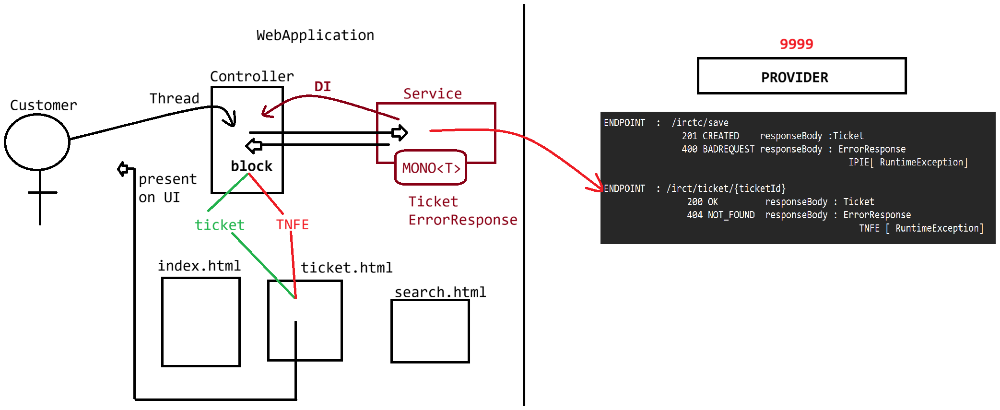

# Day-60 — 20-08-2026 — Working with Async for MakeMyTrip using Onstatuscode

---

## 📡 Provider Endpoints

### ENDPOINT: `/irctc/save`

| Status | Response body | Exception |
| --- | --- | --- |
| 201 CREATED | `Ticket` | — |
| 400 BAD REQUEST | `ErrorResponse` | IPIE [`RuntimeException`] |

### ENDPOINT: `/irctc/ticket/{ticketId}`

> **Correction:** Mentor notes wrote `/irct/ticket/{ticketId}`; intended path is `/irctc/ticket/{ticketId}`.

| Status | Response body | Exception |
| --- | --- | --- |
| 200 OK | `Ticket` | — |
| 404 NOT_FOUND | `ErrorResponse` | TNFE [`RuntimeException`] |

---

## 🛠️ Service

### ENDPOINT-1 — POST save

```java
Mono<Ticket> ticket =  webClient
		.post()
		.uri(END_POINT)
		.bodyValue(passenger)
		.onStatusCode(
			statusCode->statusCode.value().is4xxClientError(),
			response->response
				  .bodyToMono(ErrorResponse.class)
				  .map(errorResponse->new IPIFE(errorResponse.getMessage())
		)
		.bodyToMono(Ticket.class);

	return ticket;
```

```text
      MONO<Ticket>
      |          |
   201 OK       4XXX
      |          |
    Ticket     ErrorSignal
```

### ENDPOINT-2 — GET ticket by id

```java
  return webClient
    .get()
    .uri(ENDPOINT,ticketId)
    .retrieve()
    .onStatusCode(
		//Predicate<HttpStatusCode> :: boolean test(statusCode)
		//Function< ClientResponse,  Mono< ? extends Throwable > > :: Mono<Throwable> apply(resposne)
		//Function< ? Super ErrorResponse, Throwable >
		statusCode-> statusCode.equals() == 404,
		response  -> response
				.bodyToMono(ErrorResponse.class)//Taking the json object to ErrorResponse
				.map(errorResponse-> new TicketNotFoundException(errorResposne.getMessage()))
		

	)
    .bodyToMono(Ticket.class);
```

`onStatusCode` takes:

- `Predicate<HttpStatusCode>` — `boolean test(statusCode)`
- `Function<ClientResponse, Mono<? extends Throwable>>` — build the error `Mono`

---

## 🎮 Controller

```java
try{
	Ticket ticket = service
		.getTicketById(ticketId)
		.block();

	 model.addAddtribute("ticket",ticket);
	 return "ViewName";
}catch(TicketNotFoundException e){
	model.addAttribute("error",e.getMessage());
	return "ViewName";
}
```

Controller still may `.block()` for MVC views, catching `TicketNotFoundException` to show an error attribute.

---

## 🤖 AI Points

1. **Production consideration:** Map provider `ErrorResponse` JSON into domain exceptions (`TicketNotFoundException`, invalid passenger) so UI and APIs share one error vocabulary.
2. **Industry practice:** Use WebClient `retrieve().onStatus(...)` (mentor: `onStatusCode`) to convert 4xx bodies into typed exceptions before `bodyToMono`.
3. **Common mistake:** Only checking happy-path 201/200 and letting generic WebClient exceptions bubble with opaque messages to users.
4. **Interview insight:** Explain the Mono fork: success signal carries `Ticket`; 4xx path becomes an error signal after mapping `ErrorResponse`.
5. **Modern Spring Boot connection:** In WebFlux controllers, skip `.block()` and use `onErrorResume` so MakeMyTrip stays fully async end-to-end.

---

## 💻 My Codes


  
## 🖼️ Image


