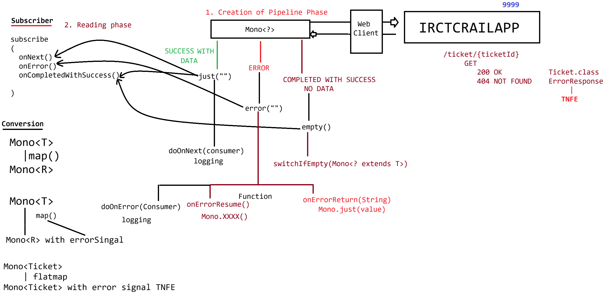

# Day-61 — 24-08-2026 — Mono Object and Its Methods

---

## 🧩 Mono — eg#1 (`Mono.just` + subscribe)

```java
package in.ioi.pw;

import reactor.core.publisher.Mono;

public class TestCode {

	public static void main(String[] args) {

		String name = "sachin";
		/*
		 * public final Disposable subscribe(
		 * 
		 * @Nullable Consumer<? super T> consumer,
		 * 
		 * @Nullable Consumer<? super Throwable> errorConsumer,
		 * 
		 * @Nullable Runnable completeConsumer
		 */

		Mono.just(name).subscribe(TestCode::handleResponse, TestCode::handleErrorResponse,
				() -> System.out.println("COMPLETED"));

	}

	public static void handleResponse(String response) {
		System.out.println("TestCode.handleResponse()");
		System.out.println(response);
	}

	public static void handleErrorResponse(Throwable t) {
		System.out.println("TestCode.handleErrorResponse()");
		System.out.println("The Excpetion information is : " + t.getMessage());
	}

}
```

### Output

```text
TestCode.handleResponse()
sachin
COMPLETED
```

---

## 🧩 eg#2 — `Mono.empty()`

```java
package in.ioi.pw;

import reactor.core.publisher.Mono;

public class TestCode {

	public static void main(String[] args) {

		String name = "sachin";
		/*
		 * public final Disposable subscribe(
		 * 
		 * @Nullable Consumer<? super T> consumer,
		 * 
		 * @Nullable Consumer<? super Throwable> errorConsumer,
		 * 
		 * @Nullable Runnable completeConsumer
		 */

		Mono.empty().subscribe(TestCode::handleResponse, TestCode::handleErrorResponse,
				() -> System.out.println("COMPLETED"));

	}

	public static void handleResponse(Object response) {
		System.out.println("TestCode.handleResponse()");
		System.out.println("VALUE IS  :: " + response);
	}

	public static void handleErrorResponse(Throwable t) {
		System.out.println("TestCode.handleErrorResponse()");
		System.out.println("EXCEPTION: " + t.getMessage());
	}

}
```

### OUTPUT

```text
COMPLETED
```

(No success consumer — empty Mono completes without a value.)

---

## 🧩 eg#3 — `Mono.error`

```java
package in.ioi.pw;

import reactor.core.publisher.Mono;

public class TestCode {

	public static void main(String[] args) {

		String name = "sachin";
		
		Mono.error(new RuntimeException("DATA NOT FOUND"))
				.subscribe(TestCode::handleResponse, 
					   TestCode::handleErrorResponse,
					  () -> System.out.println("COMPLETED"));

	}

	public static void handleResponse(Object response) {
		System.out.println("TestCode.handleResponse()");
		System.out.println("VALUE IS  :: " + response);
	}

	public static void handleErrorResponse(Throwable t) {
		System.out.println("TestCode.handleErrorResponse()");
		System.out.println("EXCEPTION: " + t.getMessage());
	}

}
```

### Output

```text
TestCode.handleErrorResponse()
EXCEPTION::DATA NOT FOUND 
```

---

## 🧩 eg#4 — `doOnNext` (logging without consuming)

```java
package in.ioi.pw;

import reactor.core.publisher.Mono;

public class TestCode {

	public static void main(String[] args) {

		String name = "sachin";
		/*
		 * public final Disposable subscribe(
		 * 
		 * @Nullable Consumer<? super T> consumer,
		 * 
		 * @Nullable Consumer<? super Throwable> errorConsumer,
		 * 
		 * @Nullable Runnable completeConsumer
		 */

		Mono<String> mono = Mono.just(name);
		
		mono.
			doOnNext(data -> System.out.println(data))
			.subscribe(TestCode::handleResponse, TestCode::handleErrorResponse,
				() -> System.out.println("COMPLETED"));

	}

	public static void handleResponse(Object response) {
		System.out.println("TestCode.handleResponse()");
		System.out.println("VALUE IS  :: " + response);
	}

	public static void handleErrorResponse(Throwable t) {
		System.out.println("TestCode.handleErrorResponse()");
		System.out.println("EXCEPTION: " + t.getMessage());
	}

}
```

### Output

```text
sachin//log, not consuming the data from Mono<String>
TestCode.handleResponse()
VALUE IS  :: sachin
COMPLETED
```

---

## 🧩 eg#5 — `doOnNext` + `doOnError`

```java
package in.ioi.pw;

import reactor.core.publisher.Mono;

public class TestCode {

	public static void main(String[] args) {

		String name = "sachin";
		/*
		 * public final Disposable subscribe(
		 * 
		 * @Nullable Consumer<? super T> consumer,
		 * 
		 * @Nullable Consumer<? super Throwable> errorConsumer,
		 * 
		 * @Nullable Runnable completeConsumer
		 */

		Mono<String> mono = Mono.error(new RuntimeException("Ticket Not found for the given id : 10"));
		
		mono.
			doOnNext(data -> System.out.println("Logging the success information :: "+data))
			.doOnError(error->System.out.println("Logging error information : "+error.getMessage()))
			.subscribe(TestCode::handleResponse, TestCode::handleErrorResponse,
				() -> System.out.println("COMPLETED: SUCCESS [ DATA | WITOUT DATA ] "));

	}

	public static void handleResponse(Object response) {
		System.out.println("TestCode.handleResponse()");
		System.out.println("VALUE IS  :: " + response);
	}

	public static void handleErrorResponse(Throwable t) {
		System.out.println("TestCode.handleErrorResponse()");
		System.out.println("EXCEPTION: " + t.getMessage());
	}

}
```

### Output

```text
Logging error information : Ticket Not found for the given id : 10
TestCode.handleErrorResponse()
EXCEPTION: Ticket Not found for the given id : 10
```

---

## 🧩 eg#6 — `onErrorResume` (fallback Mono)

```java
package in.ioi.pw;

import reactor.core.publisher.Mono;

public class TestCode {

	public static void main(String[] args) {

		String name = "sachin";
		/*
		 * public final Disposable subscribe(
		 * 
		 * @Nullable Consumer<? super T> consumer,
		 * 
		 * @Nullable Consumer<? super Throwable> errorConsumer,
		 * 
		 * @Nullable Runnable completeConsumer
		 */

		Mono<String> mono = Mono.error(new RuntimeException("Ticket Not found for the given id : 10"));
		
		mono.
			doOnNext(data -> System.out.println("Logging the success information :: "+data))
			.doOnError(error->System.out.println("Logging error information : "+error.getMessage()))
			.onErrorResume(error->Mono.just("COMING FROM ANOTHER API CALL"))
			.doOnNext(data -> System.out.println("Loggin the information of 2nd api : "+data))
			.doOnError(error->System.out.println("Logging error information : "+error.getMessage()))
			
			//reading the data from Mono<?> based on state of the result
			.subscribe(TestCode::handleResponse, TestCode::handleErrorResponse,
				() -> System.out.println("COMPLETED: SUCCESS [ DATA | WITOUT DATA ] "));

	}

	public static void handleResponse(Object response) {
		System.out.println("TestCode.handleResponse()");
		System.out.println("VALUE IS  :: " + response);
	}

	public static void handleErrorResponse(Throwable t) {
		System.out.println("TestCode.handleErrorResponse()");
		System.out.println("EXCEPTION: " + t.getMessage());
	}

}
```

### Output

```text
Logging error information : Ticket Not found for the given id : 10
Loggin the information of 2nd api : COMING FROM ANOTHER API CALL
TestCode.handleResponse()
VALUE IS  :: COMING FROM ANOTHER API CALL
COMPLETED: SUCCESS [ DATA | WITOUT DATA ] 
```

---

## 🧩 eg#7 — `switchIfEmpty`

```java
package in.ioi.pw;

import reactor.core.publisher.Mono;

public class TestCode {

	public static void main(String[] args) {

		String name = "sachin";
		/*
		 * public final Disposable subscribe(
		 * 
		 * @Nullable Consumer<? super T> consumer,
		 * 
		 * @Nullable Consumer<? super Throwable> errorConsumer,
		 * 
		 * @Nullable Runnable completeConsumer
		 */

		Mono<String> mono = Mono.empty();
		
		mono
			.switchIfEmpty(Mono.just("DATA COMING SOON....."))
			.doOnNext(data -> System.out.println("LOGGING DATA : "+data))
			
			//reading the data from Mono<?> based on state of the result
			.subscribe(TestCode::handleResponse, TestCode::handleErrorResponse,
				() -> System.out.println("COMPLETED: SUCCESS [ DATA | WITOUT DATA ] "));

	}

	public static void handleResponse(Object response) {
		System.out.println("TestCode.handleResponse()");
		System.out.println("VALUE IS  :: " + response);
	}

	public static void handleErrorResponse(Throwable t) {
		System.out.println("TestCode.handleErrorResponse()");
		System.out.println("EXCEPTION: " + t.getMessage());
	}

}
```

### Output

```text
LOGGING DATA : DATA COMING SOON.....
TestCode.handleResponse()
VALUE IS  :: DATA COMING SOON.....
COMPLETED: SUCCESS [ DATA | WITOUT DATA ] 
```

---

## 🛠️ Service — Handling Status Codes with `exchangeToMono`

```text
    send request : GET (/ticket/{ticketId}): 9999
	  Mono<?>
	       |=> 200 OK        --> Ticket.class
	       |=> 404 NOT_FOUND --> ErrorResponse.class
					 |
					TNFE
```

How to handle HttpRequest with different statusCode and working with creation of Mono Object:

```java
   return get()
        .uri(ENDPOINT,uriVariable)
	exchangeToMono( response -> {
				if(response.statusCode().value() == 200) return response.bodyToMono(Ticket.class) //Mono<Ticket>
				else if(response.statusCode().value==404){
					return resposne
					  .bodyToMono(ErrorResponse.class)
					  .flatMap(error-> Mono.error(new TicketNotFoundException(error.getMessage()));
								//Mono<Ticket> with error signal
				}else{
					return response
						.createError()
								//Mono<Ticket> with error signal
						flatMap(error-> Mono.error(new RuntimeException(error.getMessage()));
				}
		}
		

	)
```

---

## 🎮 Controller — Map Mono<Ticket> to Mono<String> View Name

```java
   @GetMapping("/ticket/{ticketId}")
   public Mono<String>  getTicketById(@PathVariable String ticketId,Model model){

			   service
				.findTicketById(ticketId)

				//convert Mono<Ticket> to Mono<String>
				.map(ticket->{

						model.addAttribute("ticket",ticket);
						return Mono.just("ticketDetails");

					     }
				     )
				.onErrorResume( TicketNotFoundExcepition.class, 
						exception -> {
						model.addAttribute("error",excpetion.getMessage());
						return Mono.just("ticketDetails");
				})

   }
```

### Controller summary

Controller sends a request to Service and handles via `Mono<?>` → `Mono<String>`.

**How to consume a Mono object data?** — via `subscribe` (success / error / complete), or operators like `map`, `onErrorResume`, `switchIfEmpty`, then return the reactive type from the controller (or `.block()` in sync MVC).

---

## 🤖 AI Points

1. **Production consideration:** Use `doOnNext`/`doOnError` only for side-effect logging; put recovery in `onErrorResume` / `switchIfEmpty` so fallbacks are explicit and testable.
2. **Industry practice:** Factory trio — `Mono.just`, `Mono.empty`, `Mono.error` — models success, no-content, and failure before any HTTP call exists.
3. **Common mistake:** Treating `subscribe` complete callback as “success with data”—empty Mono still runs complete without calling the value consumer.
4. **Interview insight:** `onErrorResume` replaces an error signal with another Mono (e.g. secondary API); `switchIfEmpty` replaces empty, not errors.
5. **Modern Spring Boot connection:** WebFlux controllers return `Mono<String>` view names and use `onErrorResume(TicketNotFoundException.class, …)` instead of try/catch around `.block()`.

---

## 💻 My Codes


  
## 🖼️ Image


