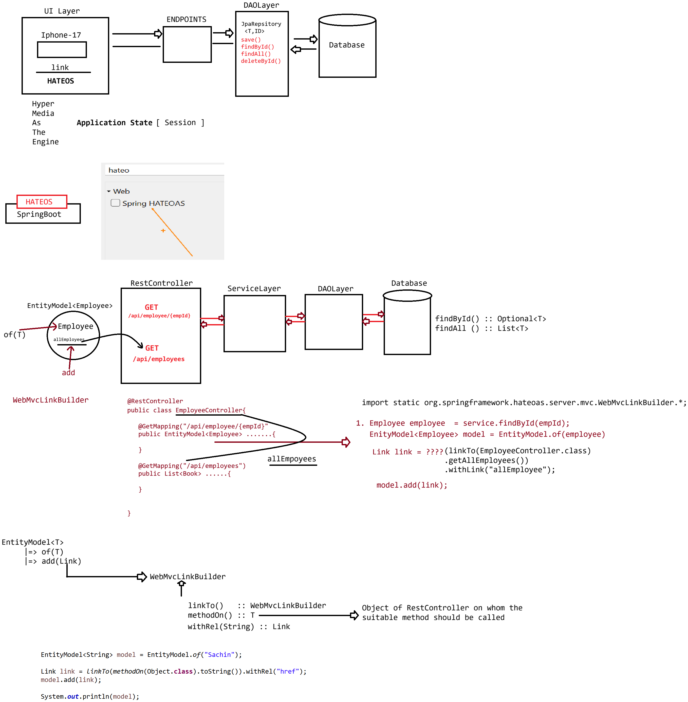

# Day-62 — 07-09-2026 — HATEOAS using Spring Boot

---

## 🧩 HATEOAS

HATEOAS is one of the REST Architecture Principles.

It is used to send a response along with hyperlinks for related data.

### Example

URL: `http://localhost:9999/books/10`

```json
{
	"id" : 101,
	"name" : "John",
	"email" : "john@gmail.com",

	"links" :{
		"url" : "http://localhost:8080/customers"	
	}	
}
```

In Spring Boot we have a HATEOAS starter to develop REST API with the HATEOAS concept:

```xml
		<dependency>
			<groupId>org.springframework.boot</groupId>
			<artifactId>spring-boot-starter-hateoas</artifactId>
		</dependency>
```

### HATEOAS APIs used

```text
EntityModel<?>
    |=> of() to keep the model 
    |=> add(Link link)
			
Link
   |=> WebMvcLinkBuilder
        |=> static linkTo()
        |=> static T methodOn( Class<T> ? )
			
   |=> withRel(String linkName)
```

### Code snippet

```java
EntityModel<Book> model = EntityModel.of(book);
		
//linkTo -> static method of WebMvcLinkBuilder
Link link = linkTo(
			methodOn(BookRestController.class)
			.getAllBooks()
		  ).withRel("all-books");
		
	model.add(link);
```

---

## 🗄️ Repository Layer

```java
package in.ioi.pw.repository;

import org.springframework.data.jpa.repository.JpaRepository;

import in.ioi.pw.model.Book;

public interface IBookRepository extends JpaRepository<Book, Integer> {

}
```

---

## 📦 Model

```java
@Entity
@Table(name = "book_tbl")
@Data
@NoArgsConstructor
@AllArgsConstructor
public class Book {
	@Id
	@GeneratedValue(strategy = GenerationType.IDENTITY)
	
	private Integer bid;
	private String bname;
	private String author;
	private Double price;
}
```

---

## ⚙️ application.properties

```properties
spring.application.name=SpringHateos-01
spring.datasource.url=jdbc:mysql:///practise
spring.datasource.username=root
spring.datasource.password=root123

spring.jpa.hibernate.ddl-auto=update
spring.jpa.show-sql=true
spring.jpa.properties.hibernate.format_sql=true

server.port= 9999
```

---

## 🛠️ Service Layer

```java
package in.ioi.pw.service;

import java.util.List;

import in.ioi.pw.model.Book;

public interface IBookService {
	Book getBook(Integer id);

    List<Book> getAllBooks();
}
```

```java
package in.ioi.pw.service;

import java.util.List;

import org.springframework.stereotype.Service;

import in.ioi.pw.model.Book;
import in.ioi.pw.repository.IBookRepository;

@Service
public class BookServiceImpl implements IBookService {

	private IBookRepository repository;

	public BookServiceImpl(IBookRepository repository) {
		this.repository = repository;
	}

	@Override
	public Book getBook(Integer id) {
		return repository
				   .findById(id)
				   .orElse(null);
	}

	@Override
	public List<Book> getAllBooks() {
		return repository.findAll();
	}

}
```

---

## 🌐 RestController

```java
package in.ioi.pw.rest;

import java.util.List;

import org.springframework.hateoas.EntityModel;
import org.springframework.hateoas.Link;
import static org.springframework.hateoas.server.mvc.WebMvcLinkBuilder.*;//static import is used to avoid using WebMVCLinkBuilder class
import org.springframework.web.bind.annotation.GetMapping;
import org.springframework.web.bind.annotation.PathVariable;
import org.springframework.web.bind.annotation.RequestMapping;
import org.springframework.web.bind.annotation.RestController;

import in.ioi.pw.model.Book;
import in.ioi.pw.service.IBookService;

@RestController
@RequestMapping("/api/books")
public class BookRestController {

	private IBookService service;

	public BookRestController(IBookService service) {
		this.service = service;
	}
	
	@GetMapping("/find/{bookId}")
	public EntityModel<Book> getBookById(@PathVariable Integer bookId){
		Book book = service.getBook(bookId);

		EntityModel<Book> model = EntityModel.of(book);
		
		//linkTo -> static method of WebMvcLinkBuilder
		Link link = linkTo(
					methodOn(BookRestController.class)
					.getAllBooks()
				  )
				  .withRel("all-books");
		model.add(link);
		
		return model;
	}

	
    @GetMapping("/findAll")
    public List<Book> getAllBooks() {

        return service.getAllBooks();
    } 
}
```

Static import of `WebMvcLinkBuilder` avoids repeating the class name for `linkTo` / `methodOn`.

---

## 🤖 AI Points

1. **Production consideration:** Emit stable `rel` names (`all-books`) so clients discover next actions without hard-coded sibling URLs.
2. **Industry practice:** Wrap resources in `EntityModel` and build links with `linkTo(methodOn(...)).withRel(...)` so URI templates stay in sync with controller mappings.
3. **Common mistake:** Returning a bare entity on find-by-id while documenting HATEOAS—clients never see navigational links.
4. **Interview insight:** HATEOAS = Hypermedia as the Engine of Application State—responses carry hyperlinks to related operations.
5. **Modern Spring Boot connection:** `spring-boot-starter-hateoas` integrates with Spring MVC; for collections prefer `CollectionModel` in richer APIs.

---

## 💻 My Codes


  
## 🖼️ Image


