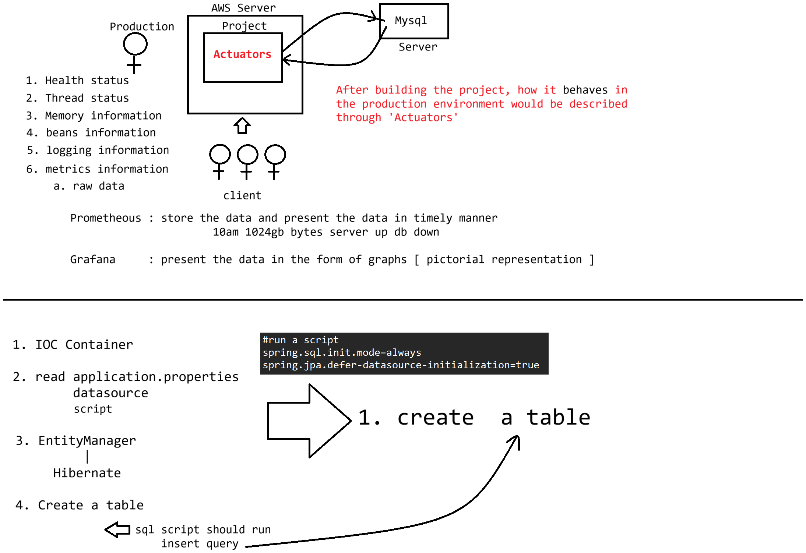

# Day-63 — 08-09-2026 — Spring Data REST Customquery Actuators with Endpoints and Autoloading of Data to Database

---

## 🧩 Spring Data REST Recap

- No need of writing `RestController` — endpoints exposed via Spring Data REST
- Endpoints get accessed via Data JPA methods — GET, POST, PUT, PATCH, DELETE

### Employee entity

- `eid` [pk]
- `ename`
- `eage`
- `eaddress`

```java
public interface EmployeeRepository extends JpaRepository<Employee,Integer>
{
	//use finder methods
}
```

---

## 🔍 Custom Query Endpoint

Writing a custom query and making Spring Data REST provide an endpoint for the custom query:

```java
@RepositoryRestResource(path="emps")
public interface IEmployeeRepository extends JpaRepository<Employee,Integer>
{
	//use finder methods
	List<Employee> findByEnameContaining(@RequestParam("name")String ename)
}
```

```text
GET
 |=> /emps/search/findByEnameContaining?name=sachin
```

---

## 📊 Spring Boot Actuator

### 1. pom.xml

```xml
  		<dependency>
			<groupId>org.springframework.boot</groupId>
			<artifactId>spring-boot-starter-actuator</artifactId>
		</dependency>	
```

### 2. Book repository

(Used with the actuator demo app.)

### 3. data.sql (`src/main/resources`)

```sql
insert into book(name,author) values('Java','James Ghosling');
insert into book(name,author) values('Hibernate','Gavin King');
insert into book(name,author) values('Spring','Rod Johnson');
insert into book(name,author) values('Maven','Java Team');
```

### application.properties

```properties
spring.application.name=SpringBootActuatorApp

# ==========================================
# MySQL Database Connection Settings
# ==========================================
# Replace "your_database_name" with your actual schema name
spring.datasource.url=jdbc:mysql://localhost:3306/ioi_24b2_batch

# Database Credentials
spring.datasource.username=root
spring.datasource.password=root123

# ==========================================
# JPA / Hibernate Settings
# ==========================================
# DDL auto-generation: options include none, update, validate, create, create-drop
spring.jpa.hibernate.ddl-auto=create

# Shows executed SQL queries in the console log
spring.jpa.show-sql=true

# Formats the SQL queries in the console to make them readable
spring.jpa.properties.hibernate.format_sql=true

#actuator end points detailed description
management.endpoint.health.show-details=always


#run a script
spring.sql.init.mode=always
spring.jpa.defer-datasource-initialization=true

server.port=9999
```

Key points for autoloading:

- `spring.sql.init.mode=always` — run `data.sql`
- `spring.jpa.defer-datasource-initialization=true` — run SQL after Hibernate creates schema (`ddl-auto=create`)

---

## 🤖 AI Points

1. **Production consideration:** Expose Actuator health details carefully (`show-details=always` is fine in lab; lock down in prod with security).
2. **Industry practice:** Data REST search resources (`/emps/search/findBy…`) surface Spring Data finder methods without custom controllers.
3. **Common mistake:** Loading `data.sql` without `defer-datasource-initialization=true` when `ddl-auto=create`—inserts fail because tables do not exist yet.
4. **Interview insight:** `@RepositoryRestResource(path="emps")` renames the collection resource; finder methods appear under `/search`.
5. **Modern Spring Boot connection:** Actuator + SQL init properties are standard Boot ops tooling for health checks and seed data in demo environments.

---

## 💻 My Codes


  
## 🖼️ Image


